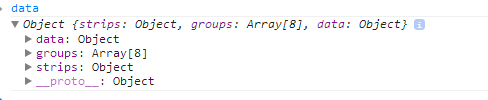

<script src = "http://d3js.org/d3.v3.js" meta-charset = "utf-8"></script>

<a href="https://github.com/timelyportfolio/gridSVG_d3_multline"></a>
  


As another post in the series, I thought I would show an alternate way of using d3 to bind data from a gridSVG exported lattice plot.  This time we will have multiple strips complicating our data bind.  Also, I will use a different set of techniques to send the data from R to Javascript.  I think I prefer how I have done it previous posts though.  No sense in wasting time with the intro.  Let's grab US Treasury Yield Curve data from the [Federal Reserve Bank of St. Louis FRED](http://research.stlouisfed.org/fred2/).

### FRED, Give Us Some Treasury Yield Data
We will get the daily yield series for US Treasuries with 1, 2, 3, 5, 7, 10, 20, and 30 year maturities.


```r
require(quantmod)
require(rCharts)
#now get the US bonds from FRED
USbondssymbols <- paste0("DGS",c(1,2,3,5,7,10,20,30))

ust.xts <- xts()
for (i in 1:length( USbondssymbols ) ) {
  ust.xts <- merge( 
    ust.xts,
    getSymbols( 
      USbondssymbols[i], auto.assign = FALSE,src = "FRED"
    )
  )
}
ust.xts <- na.omit(ust.xts)

xtsMelt <- function(data) {
  require(reshape2)
  
  #translate xts to time series to json with date and data
  #for this behavior will be more generic than the original
  #data will not be transformed, so template.rmd will be changed to reflect
  
  
  #convert to data frame
  data.df <- data.frame(
    cbind(format(index(data),"%Y-%m-%d"),coredata(data))
  )
  colnames(data.df)[1] = "date"
  data.melt <- melt(data.df,id.vars=1,stringsAsFactors=FALSE)
  colnames(data.melt) <- c("date","indexname","value")
  #remove periods from indexnames to prevent javascript confusion
  #these . usually come from spaces in the colnames when melted
  data.melt[,"indexname"] <- apply(
    matrix(data.melt[,"indexname"]),
    2,gsub,pattern="[.]",replacement=""
  )
  return(data.melt)
  #return(df2json(na.omit(data.melt)))
}

ust.melt <- xtsMelt( ust.xts["2012::",] )

ust.melt$date <- as.Date(ust.melt$date)
ust.melt$value <- as.numeric(ust.melt$value)
ust.melt$indexname <- factor(
  ust.melt$indexname, levels = colnames(ust.xts)
)
ust.melt$maturity <- as.numeric(
  substr(
    ust.melt$indexname, 4, length( ust.melt$indexname ) - 4
  )
)
ust.melt$country <- rep( "US", nrow( ust.melt ))
```


### Draw A Graph with Lattice
This graph could be much [prettier](http://timelyportfolio.blogspot.com/2013/05/even-more-jgb-yield-charts-with-r.html), but to limit the amount of code I will settle for this uglier version.


```r
require(latticeExtra)

p1 <- xyplot(
  value ~ date | indexname,
  groups = indexname,
  data =  ust.melt,
  type = "l",
  scales = list(
    x = list(
      at = pretty(ust.melt$date,n=3)[c(1,3)],
      format = "%b %Y"
    )),
  layout = c(8,1)
)
p1
```

 


We will exploit `grid.export()` magic to export our graph to SVG.


```r
p1
require(rjson)
require(gridSVG)

#export our lattice chart
exportlist <- grid.export("", addClasses = TRUE )
```


<div>
<svg xmlns="http://www.w3.org/2000/svg" xmlns:xlink="http://www.w3.org/1999/xlink" width="576px" height="360px" viewBox="0 0 576 360" version="1.1">
  <metadata xmlns:gridsvg="http://www.stat.auckland.ac.nz/~paul/R/gridSVG/">
    <gridsvg:generator name="gridSVG" version="1.3-0" time="2013-08-14 08:46:52"/>
    <gridsvg:argument name="name" value=""/>
    <gridsvg:argument name="exportCoords" value="none"/>
    <gridsvg:argument name="exportMappings" value="none"/>
    <gridsvg:argument name="exportJS" value="none"/>
    <gridsvg:argument name="res" value="72"/>
    <gridsvg:argument name="prefix" value=""/>
    <gridsvg:argument name="addClasses" value="TRUE"/>
    <gridsvg:argument name="indent" value="TRUE"/>
    <gridsvg:argument name="htmlWrapper" value="FALSE"/>
    <gridsvg:argument name="usePaths" value="vpPaths"/>
    <gridsvg:argument name="uniqueNames" value="TRUE"/>
    <gridsvg:separator name="id.sep" value="."/>
    <gridsvg:separator name="gPath.sep" value="::"/>
    <gridsvg:separator name="vpPath.sep" value="::"/>
  </metadata>
  <g transform="translate(0, 360) scale(1, -1)">
    <g id="gridSVG" fill="none" stroke="rgb(0,0,0)" stroke-dasharray="none" stroke-width="0.75" font-size="12" font-family="Helvetica, Arial, FreeSans, Liberation Sans, Nimbus Sans L, sans-serif" opacity="1" stroke-linecap="round" stroke-linejoin="round" stroke-miterlimit="10" stroke-opacity="1" fill-opacity="0" font-weight="normal" font-style="normal">
      <g id="plot_01.background.1" class="rect grob gDesc">
        <rect id="plot_01.background.1.1" x="0" y="0" width="576" height="360" fill="none" stroke="none" stroke-opacity="0" fill-opacity="0"/>
      </g>
      <g id="plot_01.toplevel.vp.1" font-size="12" class="pushedvp viewport">
        <g id="plot_01.toplevel.vp::plot_01.xlab.vp.1" class="pushedvp viewport">
          <g id="plot_01.xlab.1" class="text grob gDesc">
            <g id="plot_01.xlab.1.1" transform="translate(295.09, 16.31)" stroke-width="0.1">
              <g id="plot_01.xlab.1.1.scale" transform="scale(1, -1)">
                <text x="0" y="0" id="plot_01.xlab.1.1.text" text-anchor="middle" opacity="1" stroke="rgb(0,0,0)" fill="rgb(0,0,0)" stroke-opacity="1" fill-opacity="1" font-size="12" font-weight="normal" font-style="normal">
                  <tspan id="plot_01.xlab.1.1.tspan.1" dy="4.31" x="0">date</tspan>
                </text>
              </g>
            </g>
          </g>
        </g>
        <g id="plot_01.toplevel.vp::plot_01.ylab.vp.1" class="pushedvp viewport">
          <g id="plot_01.ylab.1" class="text grob gDesc">
            <g id="plot_01.ylab.1.1" transform="translate(10.31, 177.11)" stroke-width="0.1">
              <g id="plot_01.ylab.1.1.scale" transform="scale(1, -1)">
                <text x="0" y="0" id="plot_01.ylab.1.1.text" transform="rotate(-90)" text-anchor="middle" opacity="1" stroke="rgb(0,0,0)" fill="rgb(0,0,0)" stroke-opacity="1" fill-opacity="1" font-size="12" font-weight="normal" font-style="normal">
                  <tspan id="plot_01.ylab.1.1.tspan.1" dy="4.31" x="0">value</tspan>
                </text>
              </g>
            </g>
          </g>
        </g>
        <g id="plot_01.toplevel.vp::plot_01.figure.vp.1" class="pushedvp viewport"/>
        <defs>
          <clipPath id="plot_01.toplevel.vp::plot_01.panel.1.1.vp.1.clipPath">
            <rect x="43.18" y="50.8" width="62.98" height="252.61" fill="none" stroke="none"/>
          </clipPath>
        </defs>
        <g id="plot_01.toplevel.vp::plot_01.panel.1.1.vp.1" clip-path="url(#plot_01.toplevel.vp::plot_01.panel.1.1.vp.1.clipPath)" class="pushedvp viewport"/>
        <g id="plot_01.toplevel.vp::plot_01.strip.1.1.off.vp.1" class="pushedvp viewport">
          <g id="plot_01.ticks.top.panel.1.1.1" class="segments grob gDesc">
            <polyline id="plot_01.ticks.top.panel.1.1.1.1" points="64.08,317.81 64.08,323.48" stroke="rgb(0,0,0)" opacity="1" stroke-dasharray="none" stroke-width="0.75" stroke-opacity="1" fill="none"/>
            <polyline id="plot_01.ticks.top.panel.1.1.1.2" points="98.43,317.81 98.43,323.48" stroke="rgb(0,0,0)" opacity="1" stroke-dasharray="none" stroke-width="0.75" stroke-opacity="1" fill="none"/>
          </g>
        </g>
        <g id="plot_01.toplevel.vp::plot_01.strip.left.1.1.off.vp.1" class="pushedvp viewport">
          <g id="plot_01.ticks.left.panel.1.1.1" class="segments grob gDesc">
            <polyline id="plot_01.ticks.left.panel.1.1.1.1" points="43.18,60.28 37.51,60.28" stroke="rgb(0,0,0)" opacity="1" stroke-dasharray="none" stroke-width="0.75" stroke-opacity="1" fill="none"/>
            <polyline id="plot_01.ticks.left.panel.1.1.1.2" points="43.18,120.65 37.51,120.65" stroke="rgb(0,0,0)" opacity="1" stroke-dasharray="none" stroke-width="0.75" stroke-opacity="1" fill="none"/>
            <polyline id="plot_01.ticks.left.panel.1.1.1.3" points="43.18,181.03 37.51,181.03" stroke="rgb(0,0,0)" opacity="1" stroke-dasharray="none" stroke-width="0.75" stroke-opacity="1" fill="none"/>
            <polyline id="plot_01.ticks.left.panel.1.1.1.4" points="43.18,241.41 37.51,241.41" stroke="rgb(0,0,0)" opacity="1" stroke-dasharray="none" stroke-width="0.75" stroke-opacity="1" fill="none"/>
            <polyline id="plot_01.ticks.left.panel.1.1.1.5" points="43.18,301.79 37.51,301.79" stroke="rgb(0,0,0)" opacity="1" stroke-dasharray="none" stroke-width="0.75" stroke-opacity="1" fill="none"/>
          </g>
          <g id="plot_01.ticklabels.left.panel.1.1.1" class="text grob gDesc">
            <g id="plot_01.ticklabels.left.panel.1.1.1.1" transform="translate(31.85, 60.28)" stroke-width="0.1">
              <g id="plot_01.ticklabels.left.panel.1.1.1.1.scale" transform="scale(1, -1)">
                <text x="0" y="0" id="plot_01.ticklabels.left.panel.1.1.1.1.text" text-anchor="end" stroke="rgb(0,0,0)" opacity="1" fill="rgb(0,0,0)" stroke-opacity="1" fill-opacity="1" font-size="9.6" font-weight="normal" font-style="normal">
                  <tspan id="plot_01.ticklabels.left.panel.1.1.1.1.tspan.1" dy="3.59" x="0">0</tspan>
                </text>
              </g>
            </g>
            <g id="plot_01.ticklabels.left.panel.1.1.1.2" transform="translate(31.85, 120.65)" stroke-width="0.1">
              <g id="plot_01.ticklabels.left.panel.1.1.1.2.scale" transform="scale(1, -1)">
                <text x="0" y="0" id="plot_01.ticklabels.left.panel.1.1.1.2.text" text-anchor="end" stroke="rgb(0,0,0)" opacity="1" fill="rgb(0,0,0)" stroke-opacity="1" fill-opacity="1" font-size="9.6" font-weight="normal" font-style="normal">
                  <tspan id="plot_01.ticklabels.left.panel.1.1.1.2.tspan.1" dy="3.59" x="0">1</tspan>
                </text>
              </g>
            </g>
            <g id="plot_01.ticklabels.left.panel.1.1.1.3" transform="translate(31.85, 181.03)" stroke-width="0.1">
              <g id="plot_01.ticklabels.left.panel.1.1.1.3.scale" transform="scale(1, -1)">
                <text x="0" y="0" id="plot_01.ticklabels.left.panel.1.1.1.3.text" text-anchor="end" stroke="rgb(0,0,0)" opacity="1" fill="rgb(0,0,0)" stroke-opacity="1" fill-opacity="1" font-size="9.6" font-weight="normal" font-style="normal">
                  <tspan id="plot_01.ticklabels.left.panel.1.1.1.3.tspan.1" dy="3.59" x="0">2</tspan>
                </text>
              </g>
            </g>
            <g id="plot_01.ticklabels.left.panel.1.1.1.4" transform="translate(31.85, 241.41)" stroke-width="0.1">
              <g id="plot_01.ticklabels.left.panel.1.1.1.4.scale" transform="scale(1, -1)">
                <text x="0" y="0" id="plot_01.ticklabels.left.panel.1.1.1.4.text" text-anchor="end" stroke="rgb(0,0,0)" opacity="1" fill="rgb(0,0,0)" stroke-opacity="1" fill-opacity="1" font-size="9.6" font-weight="normal" font-style="normal">
                  <tspan id="plot_01.ticklabels.left.panel.1.1.1.4.tspan.1" dy="3.59" x="0">3</tspan>
                </text>
              </g>
            </g>
          </g>
        </g>
        <g id="plot_01.toplevel.vp::plot_01.panel.1.1.off.vp.1" class="pushedvp viewport">
          <g id="plot_01.ticks.bottom.panel.1.1.1" class="segments grob gDesc">
            <polyline id="plot_01.ticks.bottom.panel.1.1.1.1" points="64.08,50.8 64.08,45.13" stroke="rgb(0,0,0)" opacity="1" stroke-dasharray="none" stroke-width="0.75" stroke-opacity="1" fill="none"/>
            <polyline id="plot_01.ticks.bottom.panel.1.1.1.2" points="98.43,50.8 98.43,45.13" stroke="rgb(0,0,0)" opacity="1" stroke-dasharray="none" stroke-width="0.75" stroke-opacity="1" fill="none"/>
          </g>
          <g id="plot_01.ticklabels.bottom.panel.1.1.1" class="text grob gDesc">
            <g id="plot_01.ticklabels.bottom.panel.1.1.1.1" transform="translate(64.08, 39.47)" stroke-width="0.1">
              <g id="plot_01.ticklabels.bottom.panel.1.1.1.1.scale" transform="scale(1, -1)">
                <text x="0" y="0" id="plot_01.ticklabels.bottom.panel.1.1.1.1.text" text-anchor="middle" stroke="rgb(0,0,0)" opacity="1" fill="rgb(0,0,0)" stroke-opacity="1" fill-opacity="1" font-size="9.6" font-weight="normal" font-style="normal">
                  <tspan id="plot_01.ticklabels.bottom.panel.1.1.1.1.tspan.1" dy="7.18" x="0">Jul 2012</tspan>
                </text>
              </g>
            </g>
            <g id="plot_01.ticklabels.bottom.panel.1.1.1.2" transform="translate(98.43, 39.47)" stroke-width="0.1">
              <g id="plot_01.ticklabels.bottom.panel.1.1.1.2.scale" transform="scale(1, -1)">
                <text x="0" y="0" id="plot_01.ticklabels.bottom.panel.1.1.1.2.text" text-anchor="middle" stroke="rgb(0,0,0)" opacity="1" fill="rgb(0,0,0)" stroke-opacity="1" fill-opacity="1" font-size="9.6" font-weight="normal" font-style="normal">
                  <tspan id="plot_01.ticklabels.bottom.panel.1.1.1.2.tspan.1" dy="7.18" x="0">Jul 2013</tspan>
                </text>
              </g>
            </g>
          </g>
        </g>
        <defs>
          <clipPath id="plot_01.toplevel.vp::plot_01.panel.1.1.vp.2.clipPath">
            <rect x="43.18" y="50.8" width="62.98" height="252.61" fill="none" stroke="none"/>
          </clipPath>
        </defs>
        <g id="plot_01.toplevel.vp::plot_01.panel.1.1.vp.2" clip-path="url(#plot_01.toplevel.vp::plot_01.panel.1.1.vp.2.clipPath)" class="pushedvp viewport">
          <g id="plot_01.xyplot.lines.group.1.panel.1.1.1" class="lines grob gDesc">
            <polyline id="plot_01.xyplot.lines.group.1.panel.1.1.1.1" points="47.05,67.52 47.14,67.52 47.24,66.92 47.33,67.52 47.62,66.92 47.71,66.92 47.8,66.92 47.9,66.92 47.99,66.31 48.37,66.92 48.46,66.92 48.56,66.92 48.65,66.92 48.93,67.52 49.03,67.52 49.12,67.52 49.22,67.52 49.31,67.52 49.59,67.52 49.69,68.13 49.78,68.13 49.87,68.73 49.97,68.73 50.25,68.73 50.34,68.73 50.44,69.33 50.53,69.33 50.63,69.33 50.91,69.33 51,71.15 51.1,71.15 51.19,70.54 51.29,71.15 51.66,70.54 51.76,70.54 51.85,70.54 51.94,71.15 52.23,70.54 52.32,71.15 52.42,71.15 52.51,71.15 52.6,70.54 52.89,70.54 52.98,70.54 53.07,71.15 53.17,71.15 53.26,71.15 53.54,71.15 53.64,72.35 53.73,72.96 53.83,72.96 53.92,72.96 54.2,72.96 54.3,73.56 54.39,72.96 54.49,71.75 54.58,71.75 54.86,71.75 54.96,71.15 55.05,71.15 55.14,71.15 55.24,71.75 55.52,71.15 55.61,72.35 55.71,71.75 55.8,71.75 55.9,71.75 56.18,71.75 56.27,71.75 56.37,71.15 56.46,71.15 56.56,70.54 56.84,71.15 56.93,71.15 57.03,71.15 57.12,70.54 57.21,71.15 57.5,70.54 57.59,71.15 57.69,71.15 57.78,71.15 57.87,71.75 58.16,72.35 58.25,71.75 58.34,71.15 58.44,71.75 58.53,71.15 58.81,71.15 58.91,71.15 59,71.15 59.1,71.15 59.19,71.15 59.47,71.75 59.57,71.75 59.66,72.35 59.76,72.35 59.85,72.35 60.13,72.96 60.23,72.96 60.32,72.35 60.41,72.96 60.51,72.35 60.88,72.35 60.98,71.75 61.07,71.15 61.17,70.54 61.45,71.15 61.54,71.15 61.64,71.15 61.73,71.15 61.83,71.75 62.11,71.15 62.2,71.75 62.3,71.15 62.39,71.15 62.48,71.15 62.77,71.15 62.86,71.15 62.96,72.35 63.05,71.75 63.14,71.75 63.43,71.75 63.52,72.96 63.61,72.96 63.71,73.56 63.8,72.96 64.08,72.96 64.18,72.96 64.37,71.75 64.46,72.35 64.74,72.35 64.84,72.35 64.93,72.35 65.03,72.35 65.12,72.35 65.4,71.15 65.5,71.15 65.59,71.15 65.68,70.54 65.78,70.54 66.06,70.54 66.16,71.15 66.25,70.54 66.34,71.15 66.44,70.54 66.72,71.15 66.81,69.94 66.91,70.54 67,70.54 67.1,69.94 67.38,69.94 67.47,71.75 67.57,71.75 67.66,72.35 67.75,71.15 68.04,71.75 68.13,71.75 68.23,71.75 68.32,72.35 68.41,72.35 68.7,71.75 68.79,72.35 68.88,71.75 68.98,71.75 69.07,71.75 69.35,71.15 69.45,71.15 69.54,71.15 69.64,70.54 69.73,69.94 70.11,69.94 70.2,70.54 70.3,71.15 70.39,71.15 70.67,71.15 70.77,71.15 70.86,71.15 70.95,70.54 71.05,71.15 71.33,71.15 71.43,71.15 71.52,71.15 71.61,71.15 71.71,71.15 71.99,71.15 72.08,71.15 72.18,70.54 72.27,69.94 72.37,70.54 72.65,70.54 72.74,69.94 72.84,69.94 72.93,71.15 73.02,71.15 73.4,71.15 73.5,71.15 73.59,71.15 73.68,71.15 73.97,71.75 74.06,71.15 74.15,71.15 74.25,71.15 74.34,71.15 74.62,71.75 74.72,71.15 74.81,71.15 74.91,71.75 75,71.75 75.28,71.15 75.47,71.15 75.57,71.15 75.66,71.75 75.94,71.75 76.04,71.75 76.13,71.15 76.22,72.35 76.32,71.15 76.7,71.15 76.79,71.15 76.88,70.54 76.98,69.94 77.26,69.94 77.35,69.94 77.45,70.54 77.64,71.75 77.92,70.54 78.01,71.15 78.11,71.15 78.2,71.15 78.3,71.15 78.58,71.15 78.67,71.15 78.77,71.15 78.86,71.15 78.95,71.15 79.24,71.15 79.33,69.94 79.42,68.73 79.52,68.73 79.61,68.13 79.89,68.13 79.99,69.94 80.08,69.33 80.18,69.33 80.27,69.33 80.55,69.94 80.74,69.94 80.84,69.33 80.93,69.33 81.21,69.94 81.4,69.33 81.49,69.33 81.59,69.33 81.87,69.33 81.97,68.73 82.06,68.13 82.15,68.73 82.25,68.73 82.53,68.73 82.62,68.73 82.72,68.73 82.81,68.73 82.91,68.73 83.28,68.73 83.38,69.33 83.47,69.33 83.57,69.33 83.85,69.94 83.94,69.33 84.04,69.33 84.13,69.33 84.22,69.33 84.51,69.33 84.6,69.33 84.69,69.33 84.79,69.33 84.88,68.73 85.17,69.33 85.26,68.73 85.35,69.33 85.45,69.94 85.54,70.54 85.92,70.54 86.01,70.54 86.11,69.94 86.2,69.94 86.48,69.94 86.58,70.54 86.67,70.54 86.76,70.54 86.86,69.94 87.14,69.94 87.24,69.33 87.33,69.33 87.42,69.33 87.52,69.33 87.8,69.33 87.89,69.33 87.99,69.33 88.08,69.33 88.18,68.73 88.46,69.33 88.55,69.33 88.65,69.33 88.74,68.73 88.84,68.73 89.12,68.73 89.21,68.73 89.31,68.73 89.4,68.73 89.78,68.73 89.87,68.73 89.96,68.13 90.06,68.13 90.15,68.13 90.44,68.13 90.53,68.13 90.62,67.52 90.72,67.52 90.81,66.92 91.09,67.52 91.19,68.13 91.28,68.13 91.38,67.52 91.47,67.52 91.75,67.52 91.85,67.52 91.94,68.13 92.04,67.52 92.13,67.52 92.41,67.52 92.51,66.92 92.6,66.92 92.69,66.92 92.79,66.92 93.07,66.92 93.16,66.31 93.26,66.92 93.35,66.92 93.45,66.92 93.73,68.13 93.82,67.52 93.92,67.52 94.01,67.52 94.11,67.52 94.39,67.52 94.48,67.52 94.58,66.92 94.67,67.52 94.76,67.52 95.14,68.13 95.23,68.73 95.33,68.13 95.42,68.73 95.71,68.73 95.8,68.73 95.89,68.73 95.99,68.73 96.08,68.73 96.36,68.73 96.46,68.73 96.55,68.73 96.65,68.73 96.74,68.13 97.02,68.13 97.12,68.13 97.21,68.13 97.31,68.73 97.4,68.13 97.68,69.94 97.78,70.54 97.87,69.94 97.96,69.33 98.06,69.33 98.34,69.33 98.43,68.73 98.53,68.73 98.72,69.33 99,68.73 99.09,68.73 99.19,68.13 99.28,68.13 99.38,67.52 99.66,66.92 99.75,66.31 99.85,66.92 99.94,66.92 100.03,66.92 100.32,66.31 100.41,67.52 100.5,67.52 100.6,67.52 100.69,66.92 100.98,66.92 101.07,66.92 101.16,66.92 101.26,68.13 101.35,66.92 101.63,67.52 101.73,67.52 101.82,67.52 101.92,67.52 102.01,66.92 102.29,67.52" stroke-dasharray="none" stroke="rgb(0,128,255)" stroke-width="0.75" opacity="1" stroke-opacity="1" fill="none"/>
          </g>
        </g>
        <g id="plot_01.toplevel.vp::plot_01.panel.1.1.off.vp.2" class="pushedvp viewport">
          <g id="plot_01.border.panel.1.1.1" class="rect grob gDesc">
            <rect id="plot_01.border.panel.1.1.1.1" x="43.18" y="50.8" width="62.98" height="252.61" stroke="rgb(0,0,0)" stroke-dasharray="none" stroke-width="0.75" opacity="1" fill="none" stroke-opacity="1" fill-opacity="0"/>
          </g>
        </g>
        <g id="plot_01.toplevel.vp::plot_01.strip.1.1.vp.1" class="pushedvp viewport">
          <defs>
            <clipPath id="plot_01.toplevel.vp::plot_01.strip.1.1.vp::plot_01.strip.default.1.1.clipPath">
              <rect x="43.18" y="303.41" width="62.98" height="14.4" fill="none" stroke="none"/>
            </clipPath>
          </defs>
          <g id="plot_01.toplevel.vp::plot_01.strip.1.1.vp::plot_01.strip.default.1.1" clip-path="url(#plot_01.toplevel.vp::plot_01.strip.1.1.vp::plot_01.strip.default.1.1.clipPath)" class="pushedvp viewport">
            <g id="plot_01.bg.strip.1.1.1" class="rect grob gDesc">
              <rect id="plot_01.bg.strip.1.1.1.1" x="43.18" y="303.41" width="62.98" height="14.4" fill="rgb(255,229,204)" stroke="rgb(255,229,204)" stroke-opacity="1" fill-opacity="1"/>
            </g>
            <g id="plot_01.textr.strip.1.1.1" class="text grob gDesc">
              <g id="plot_01.textr.strip.1.1.1.1" transform="translate(58.33, 310.61)" stroke-width="0.1">
                <g id="plot_01.textr.strip.1.1.1.1.scale" transform="scale(1, -1)">
                  <text x="0" y="0" id="plot_01.textr.strip.1.1.1.1.text" text-anchor="start" stroke="rgb(0,0,0)" opacity="1" fill="rgb(0,0,0)" stroke-opacity="1" fill-opacity="1" font-size="12" font-weight="normal" font-style="normal">
                    <tspan id="plot_01.textr.strip.1.1.1.1.tspan.1" dy="4.31" x="0">DGS1</tspan>
                  </text>
                </g>
              </g>
            </g>
          </g>
          <g id="plot_01.toplevel.vp::plot_01.strip.1.1.vp::plot_01.strip.default.off.1.1" class="pushedvp viewport">
            <g id="plot_01.border.strip.1.1.1" class="rect grob gDesc">
              <rect id="plot_01.border.strip.1.1.1.1" x="43.18" y="303.41" width="62.98" height="14.4" stroke="rgb(0,0,0)" stroke-dasharray="none" stroke-width="0.75" opacity="1" fill="none" stroke-opacity="1" fill-opacity="0"/>
            </g>
          </g>
        </g>
        <defs>
          <clipPath id="plot_01.toplevel.vp::plot_01.panel.2.1.vp.1.clipPath">
            <rect x="106.16" y="50.8" width="62.98" height="252.61" fill="none" stroke="none"/>
          </clipPath>
        </defs>
        <g id="plot_01.toplevel.vp::plot_01.panel.2.1.vp.1" clip-path="url(#plot_01.toplevel.vp::plot_01.panel.2.1.vp.1.clipPath)" class="pushedvp viewport"/>
        <g id="plot_01.toplevel.vp::plot_01.strip.2.1.off.vp.1" class="pushedvp viewport">
          <g id="plot_01.ticks.top.panel.2.1.1" class="segments grob gDesc">
            <polyline id="plot_01.ticks.top.panel.2.1.1.1" points="127.06,317.81 127.06,323.48" stroke="rgb(0,0,0)" opacity="1" stroke-dasharray="none" stroke-width="0.75" stroke-opacity="1" fill="none"/>
            <polyline id="plot_01.ticks.top.panel.2.1.1.2" points="161.41,317.81 161.41,323.48" stroke="rgb(0,0,0)" opacity="1" stroke-dasharray="none" stroke-width="0.75" stroke-opacity="1" fill="none"/>
          </g>
          <g id="plot_01.ticklabels.top.panel.2.1.1" class="text grob gDesc">
            <g id="plot_01.ticklabels.top.panel.2.1.1.1" transform="translate(127.06, 329.15)" stroke-width="0.1">
              <g id="plot_01.ticklabels.top.panel.2.1.1.1.scale" transform="scale(1, -1)">
                <text x="0" y="0" id="plot_01.ticklabels.top.panel.2.1.1.1.text" text-anchor="middle" stroke="rgb(0,0,0)" opacity="1" fill="rgb(0,0,0)" stroke-opacity="1" fill-opacity="1" font-size="9.6" font-weight="normal" font-style="normal">
                  <tspan id="plot_01.ticklabels.top.panel.2.1.1.1.tspan.1" dy="0" x="0">Jul 2012</tspan>
                </text>
              </g>
            </g>
            <g id="plot_01.ticklabels.top.panel.2.1.1.2" transform="translate(161.41, 329.15)" stroke-width="0.1">
              <g id="plot_01.ticklabels.top.panel.2.1.1.2.scale" transform="scale(1, -1)">
                <text x="0" y="0" id="plot_01.ticklabels.top.panel.2.1.1.2.text" text-anchor="middle" stroke="rgb(0,0,0)" opacity="1" fill="rgb(0,0,0)" stroke-opacity="1" fill-opacity="1" font-size="9.6" font-weight="normal" font-style="normal">
                  <tspan id="plot_01.ticklabels.top.panel.2.1.1.2.tspan.1" dy="0" x="0">Jul 2013</tspan>
                </text>
              </g>
            </g>
          </g>
        </g>
        <g id="plot_01.toplevel.vp::plot_01.strip.left.2.1.off.vp.1" class="pushedvp viewport"/>
        <g id="plot_01.toplevel.vp::plot_01.panel.2.1.off.vp.1" class="pushedvp viewport">
          <g id="plot_01.ticks.bottom.panel.2.1.1" class="segments grob gDesc">
            <polyline id="plot_01.ticks.bottom.panel.2.1.1.1" points="127.06,50.8 127.06,45.13" stroke="rgb(0,0,0)" opacity="1" stroke-dasharray="none" stroke-width="0.75" stroke-opacity="1" fill="none"/>
            <polyline id="plot_01.ticks.bottom.panel.2.1.1.2" points="161.41,50.8 161.41,45.13" stroke="rgb(0,0,0)" opacity="1" stroke-dasharray="none" stroke-width="0.75" stroke-opacity="1" fill="none"/>
          </g>
        </g>
        <defs>
          <clipPath id="plot_01.toplevel.vp::plot_01.panel.2.1.vp.2.clipPath">
            <rect x="106.16" y="50.8" width="62.98" height="252.61" fill="none" stroke="none"/>
          </clipPath>
        </defs>
        <g id="plot_01.toplevel.vp::plot_01.panel.2.1.vp.2" clip-path="url(#plot_01.toplevel.vp::plot_01.panel.2.1.vp.2.clipPath)" class="pushedvp viewport">
          <g id="plot_01.xyplot.lines.group.2.panel.2.1.1" class="lines grob gDesc">
            <polyline id="plot_01.xyplot.lines.group.2.panel.2.1.1.1" points="110.03,76.58 110.12,75.37 110.22,76.58 110.31,75.37 110.59,75.98 110.69,74.77 110.78,74.77 110.87,73.56 110.97,74.77 111.34,72.96 111.44,74.77 111.53,75.98 111.63,75.98 111.91,75.98 112,74.77 112.1,73.56 112.19,73.56 112.29,73.56 112.57,73.56 112.66,73.56 112.76,74.16 112.85,74.16 112.94,74.16 113.23,74.77 113.32,75.37 113.41,76.58 113.51,76.58 113.6,76.58 113.89,77.79 113.98,77.79 114.07,77.79 114.17,77.79 114.26,77.79 114.64,78.99 114.73,77.79 114.83,78.99 114.92,78.99 115.2,78.39 115.3,78.39 115.39,78.39 115.49,78.39 115.58,77.18 115.86,78.99 115.96,78.39 116.05,78.39 116.14,79.6 116.24,80.2 116.52,80.2 116.61,81.41 116.71,84.43 116.8,82.62 116.9,82.62 117.18,83.82 117.27,85.03 117.37,83.82 117.46,82.62 117.56,82.62 117.84,82.01 117.93,80.2 118.03,80.81 118.12,80.2 118.21,80.2 118.5,80.2 118.59,82.01 118.68,81.41 118.78,81.41 118.87,79.6 119.16,79.6 119.25,77.18 119.34,78.39 119.44,77.79 119.53,76.58 119.81,76.58 119.91,76.58 120,76.58 120.1,76.58 120.19,77.79 120.47,76.58 120.57,76.58 120.66,75.98 120.76,75.98 120.85,75.98 121.13,76.58 121.23,76.58 121.32,76.58 121.41,77.18 121.51,76.58 121.79,76.58 121.88,76.58 121.98,76.58 122.07,76.58 122.17,76.58 122.45,77.79 122.54,77.79 122.64,78.39 122.73,79.6 122.83,79.6 123.11,78.39 123.2,78.39 123.3,77.18 123.39,77.79 123.48,78.39 123.86,78.39 123.96,76.58 124.05,76.58 124.14,75.37 124.43,75.37 124.52,75.37 124.61,75.98 124.71,76.58 124.8,77.18 125.08,76.58 125.18,78.39 125.27,78.39 125.37,78.39 125.46,77.79 125.74,77.79 125.84,78.39 125.93,79.6 126.03,79.6 126.12,78.99 126.4,78.99 126.5,78.99 126.59,78.99 126.68,78.99 126.78,80.2 127.06,78.39 127.15,78.39 127.34,77.18 127.44,76.58 127.72,76.58 127.81,76.58 127.91,76.58 128,75.37 128.1,75.37 128.38,74.77 128.47,75.37 128.57,73.56 128.66,73.56 128.75,73.56 129.04,73.56 129.13,73.56 129.23,73.56 129.32,74.16 129.41,75.37 129.7,74.16 129.79,74.16 129.88,74.77 129.98,74.77 130.07,74.77 130.35,74.77 130.45,76.58 130.54,77.79 130.64,77.79 130.73,76.58 131.01,76.58 131.11,76.58 131.2,76.58 131.3,77.79 131.39,77.79 131.67,77.79 131.77,78.99 131.86,75.98 131.95,75.98 132.05,77.18 132.33,77.18 132.42,76.58 132.52,76.58 132.61,76.58 132.71,73.56 133.08,74.16 133.18,75.37 133.27,76.58 133.37,75.37 133.65,75.37 133.74,75.37 133.84,75.37 133.93,74.77 134.02,76.58 134.31,75.37 134.4,75.37 134.5,76.58 134.59,76.58 134.68,76.58 134.97,76.58 135.06,76.58 135.15,75.98 135.25,75.37 135.34,74.16 135.62,75.37 135.72,74.16 135.81,74.16 135.91,74.16 136,76.58 136.38,75.37 136.47,76.58 136.57,77.18 136.66,76.58 136.94,76.58 137.04,76.58 137.13,78.39 137.22,77.79 137.32,78.39 137.6,79.6 137.69,77.79 137.79,77.79 137.88,78.99 137.98,78.39 138.26,78.39 138.45,78.39 138.54,78.39 138.64,77.18 138.92,77.18 139.01,78.39 139.11,76.58 139.2,76.58 139.29,76.58 139.67,76.58 139.77,75.37 139.86,74.77 139.95,74.77 140.24,75.37 140.33,76.58 140.42,76.58 140.61,77.79 140.89,76.58 140.99,76.58 141.08,76.58 141.18,75.37 141.27,75.37 141.55,75.37 141.65,75.37 141.74,75.37 141.84,75.37 141.93,75.37 142.21,74.77 142.31,74.77 142.4,75.37 142.49,76.58 142.59,74.77 142.87,75.37 142.97,77.18 143.06,77.18 143.15,77.18 143.25,75.98 143.53,75.98 143.72,75.98 143.81,75.98 143.91,76.58 144.19,75.37 144.38,76.58 144.47,76.58 144.56,76.58 144.85,76.58 144.94,75.37 145.04,74.77 145.13,75.98 145.22,75.98 145.51,75.98 145.6,75.98 145.69,75.98 145.79,77.18 145.88,75.98 146.26,75.98 146.35,75.98 146.45,74.16 146.54,77.18 146.82,77.79 146.92,78.39 147.01,76.58 147.11,76.58 147.2,76.58 147.48,75.37 147.58,76.58 147.67,76.58 147.76,75.37 147.86,75.37 148.14,76.58 148.24,77.79 148.33,77.79 148.42,76.58 148.52,77.79 148.89,77.79 148.99,76.58 149.08,75.98 149.18,76.58 149.46,75.37 149.55,75.37 149.65,76.58 149.74,75.37 149.84,75.37 150.12,74.77 150.21,75.37 150.31,75.37 150.4,75.37 150.49,76.58 150.78,76.58 150.87,76.58 150.96,76.58 151.06,76.58 151.15,75.37 151.43,75.98 151.53,74.77 151.62,75.98 151.72,76.58 151.81,75.98 152.09,74.77 152.19,75.37 152.28,75.37 152.38,75.37 152.75,74.16 152.85,75.37 152.94,74.77 153.03,73.56 153.13,74.77 153.41,74.77 153.51,74.77 153.6,74.77 153.69,74.77 153.79,73.56 154.07,73.56 154.16,74.77 154.26,74.77 154.35,74.77 154.45,74.77 154.73,74.77 154.82,74.16 154.92,74.16 155.01,74.16 155.11,73.56 155.39,72.35 155.48,73.56 155.58,72.35 155.67,72.35 155.76,73.56 156.05,73.56 156.14,73.56 156.23,73.56 156.33,73.56 156.42,75.98 156.71,74.77 156.8,75.98 156.89,75.98 156.99,74.16 157.08,75.98 157.36,75.98 157.46,75.98 157.55,75.98 157.65,75.98 157.74,75.98 158.12,77.79 158.21,78.39 158.3,78.99 158.4,78.39 158.68,78.39 158.78,79.6 158.87,78.39 158.96,78.39 159.06,79.6 159.34,79.6 159.43,80.81 159.53,80.81 159.62,79.6 159.72,77.79 160,76.58 160.09,76.58 160.19,78.99 160.28,80.2 160.38,83.22 160.66,85.64 160.75,86.24 160.85,83.82 160.94,82.01 161.03,82.01 161.32,80.81 161.41,80.81 161.5,82.01 161.69,84.43 161.98,82.62 162.07,82.62 162.16,83.22 162.26,80.81 162.35,82.62 162.63,80.81 162.73,80.81 162.82,79.6 162.92,79.6 163.01,79.6 163.29,79.6 163.39,80.2 163.48,80.81 163.58,79.6 163.67,78.99 163.95,80.2 164.05,80.2 164.14,78.99 164.23,81.41 164.33,78.39 164.61,79.6 164.7,79.6 164.8,79.6 164.89,78.39 164.99,79.6 165.27,79.6" stroke-dasharray="none" stroke="rgb(255,0,255)" stroke-width="0.75" opacity="1" stroke-opacity="1" fill="none"/>
          </g>
        </g>
        <g id="plot_01.toplevel.vp::plot_01.panel.2.1.off.vp.2" class="pushedvp viewport">
          <g id="plot_01.border.panel.2.1.1" class="rect grob gDesc">
            <rect id="plot_01.border.panel.2.1.1.1" x="106.16" y="50.8" width="62.98" height="252.61" stroke="rgb(0,0,0)" stroke-dasharray="none" stroke-width="0.75" opacity="1" fill="none" stroke-opacity="1" fill-opacity="0"/>
          </g>
        </g>
        <g id="plot_01.toplevel.vp::plot_01.strip.2.1.vp.1" class="pushedvp viewport">
          <defs>
            <clipPath id="plot_01.toplevel.vp::plot_01.strip.2.1.vp::plot_01.strip.default.1.1.clipPath">
              <rect x="106.16" y="303.41" width="62.98" height="14.4" fill="none" stroke="none"/>
            </clipPath>
          </defs>
          <g id="plot_01.toplevel.vp::plot_01.strip.2.1.vp::plot_01.strip.default.1.1" clip-path="url(#plot_01.toplevel.vp::plot_01.strip.2.1.vp::plot_01.strip.default.1.1.clipPath)" class="pushedvp viewport">
            <g id="plot_01.bg.strip.2.1.1" class="rect grob gDesc">
              <rect id="plot_01.bg.strip.2.1.1.1" x="106.16" y="303.41" width="62.98" height="14.4" fill="rgb(255,229,204)" stroke="rgb(255,229,204)" stroke-opacity="1" fill-opacity="1"/>
            </g>
            <g id="plot_01.textr.strip.2.1.1" class="text grob gDesc">
              <g id="plot_01.textr.strip.2.1.1.1" transform="translate(121.31, 310.61)" stroke-width="0.1">
                <g id="plot_01.textr.strip.2.1.1.1.scale" transform="scale(1, -1)">
                  <text x="0" y="0" id="plot_01.textr.strip.2.1.1.1.text" text-anchor="start" stroke="rgb(0,0,0)" opacity="1" fill="rgb(0,0,0)" stroke-opacity="1" fill-opacity="1" font-size="12" font-weight="normal" font-style="normal">
                    <tspan id="plot_01.textr.strip.2.1.1.1.tspan.1" dy="4.31" x="0">DGS2</tspan>
                  </text>
                </g>
              </g>
            </g>
          </g>
          <g id="plot_01.toplevel.vp::plot_01.strip.2.1.vp::plot_01.strip.default.off.1.1" class="pushedvp viewport">
            <g id="plot_01.border.strip.2.1.1" class="rect grob gDesc">
              <rect id="plot_01.border.strip.2.1.1.1" x="106.16" y="303.41" width="62.98" height="14.4" stroke="rgb(0,0,0)" stroke-dasharray="none" stroke-width="0.75" opacity="1" fill="none" stroke-opacity="1" fill-opacity="0"/>
            </g>
          </g>
        </g>
        <defs>
          <clipPath id="plot_01.toplevel.vp::plot_01.panel.3.1.vp.1.clipPath">
            <rect x="169.14" y="50.8" width="62.98" height="252.61" fill="none" stroke="none"/>
          </clipPath>
        </defs>
        <g id="plot_01.toplevel.vp::plot_01.panel.3.1.vp.1" clip-path="url(#plot_01.toplevel.vp::plot_01.panel.3.1.vp.1.clipPath)" class="pushedvp viewport"/>
        <g id="plot_01.toplevel.vp::plot_01.strip.3.1.off.vp.1" class="pushedvp viewport">
          <g id="plot_01.ticks.top.panel.3.1.1" class="segments grob gDesc">
            <polyline id="plot_01.ticks.top.panel.3.1.1.1" points="190.04,317.81 190.04,323.48" stroke="rgb(0,0,0)" opacity="1" stroke-dasharray="none" stroke-width="0.75" stroke-opacity="1" fill="none"/>
            <polyline id="plot_01.ticks.top.panel.3.1.1.2" points="224.39,317.81 224.39,323.48" stroke="rgb(0,0,0)" opacity="1" stroke-dasharray="none" stroke-width="0.75" stroke-opacity="1" fill="none"/>
          </g>
        </g>
        <g id="plot_01.toplevel.vp::plot_01.strip.left.3.1.off.vp.1" class="pushedvp viewport"/>
        <g id="plot_01.toplevel.vp::plot_01.panel.3.1.off.vp.1" class="pushedvp viewport">
          <g id="plot_01.ticks.bottom.panel.3.1.1" class="segments grob gDesc">
            <polyline id="plot_01.ticks.bottom.panel.3.1.1.1" points="190.04,50.8 190.04,45.13" stroke="rgb(0,0,0)" opacity="1" stroke-dasharray="none" stroke-width="0.75" stroke-opacity="1" fill="none"/>
            <polyline id="plot_01.ticks.bottom.panel.3.1.1.2" points="224.39,50.8 224.39,45.13" stroke="rgb(0,0,0)" opacity="1" stroke-dasharray="none" stroke-width="0.75" stroke-opacity="1" fill="none"/>
          </g>
          <g id="plot_01.ticklabels.bottom.panel.3.1.1" class="text grob gDesc">
            <g id="plot_01.ticklabels.bottom.panel.3.1.1.1" transform="translate(190.04, 39.47)" stroke-width="0.1">
              <g id="plot_01.ticklabels.bottom.panel.3.1.1.1.scale" transform="scale(1, -1)">
                <text x="0" y="0" id="plot_01.ticklabels.bottom.panel.3.1.1.1.text" text-anchor="middle" stroke="rgb(0,0,0)" opacity="1" fill="rgb(0,0,0)" stroke-opacity="1" fill-opacity="1" font-size="9.6" font-weight="normal" font-style="normal">
                  <tspan id="plot_01.ticklabels.bottom.panel.3.1.1.1.tspan.1" dy="7.18" x="0">Jul 2012</tspan>
                </text>
              </g>
            </g>
            <g id="plot_01.ticklabels.bottom.panel.3.1.1.2" transform="translate(224.39, 39.47)" stroke-width="0.1">
              <g id="plot_01.ticklabels.bottom.panel.3.1.1.2.scale" transform="scale(1, -1)">
                <text x="0" y="0" id="plot_01.ticklabels.bottom.panel.3.1.1.2.text" text-anchor="middle" stroke="rgb(0,0,0)" opacity="1" fill="rgb(0,0,0)" stroke-opacity="1" fill-opacity="1" font-size="9.6" font-weight="normal" font-style="normal">
                  <tspan id="plot_01.ticklabels.bottom.panel.3.1.1.2.tspan.1" dy="7.18" x="0">Jul 2013</tspan>
                </text>
              </g>
            </g>
          </g>
        </g>
        <defs>
          <clipPath id="plot_01.toplevel.vp::plot_01.panel.3.1.vp.2.clipPath">
            <rect x="169.14" y="50.8" width="62.98" height="252.61" fill="none" stroke="none"/>
          </clipPath>
        </defs>
        <g id="plot_01.toplevel.vp::plot_01.panel.3.1.vp.2" clip-path="url(#plot_01.toplevel.vp::plot_01.panel.3.1.vp.2.clipPath)" class="pushedvp viewport">
          <g id="plot_01.xyplot.lines.group.3.panel.3.1.1" class="lines grob gDesc">
            <polyline id="plot_01.xyplot.lines.group.3.panel.3.1.1.1" points="173,84.43 173.1,84.43 173.19,84.43 173.29,84.43 173.57,83.22 173.66,82.62 173.76,80.81 173.85,81.41 173.94,80.81 174.32,80.2 174.41,81.41 174.51,82.01 174.6,83.22 174.89,83.82 174.98,83.82 175.07,80.81 175.17,78.99 175.26,79.6 175.54,78.99 175.64,78.39 175.73,78.99 175.83,78.99 175.92,80.2 176.2,79.6 176.3,81.41 176.39,81.41 176.48,83.22 176.58,82.01 176.86,84.43 176.96,84.43 177.05,83.22 177.14,85.64 177.24,85.64 177.61,86.84 177.71,85.64 177.8,86.24 177.9,86.24 178.18,84.43 178.27,85.03 178.37,86.24 178.46,86.24 178.56,85.03 178.84,86.24 178.93,84.43 179.03,85.64 179.12,86.84 179.21,88.05 179.5,88.65 179.59,91.07 179.68,96.5 179.78,94.09 179.87,94.69 180.16,96.5 180.25,97.71 180.34,95.3 180.44,94.09 180.53,93.48 180.81,92.88 180.91,90.47 181,91.07 181.1,90.47 181.19,91.07 181.47,90.47 181.57,94.09 181.66,92.28 181.76,90.47 181.85,87.45 182.13,88.05 182.23,85.64 182.32,86.24 182.41,86.24 182.51,85.03 182.79,85.64 182.88,85.64 182.98,84.43 183.07,84.43 183.17,84.43 183.45,83.82 183.54,84.43 183.64,83.82 183.73,83.82 183.83,83.82 184.11,83.22 184.2,83.82 184.3,83.82 184.39,84.43 184.48,82.62 184.77,82.62 184.86,82.01 184.95,82.01 185.05,82.62 185.14,82.01 185.43,82.62 185.52,83.22 185.61,84.43 185.71,84.43 185.8,85.64 186.08,85.03 186.18,85.03 186.27,84.43 186.37,85.64 186.46,85.03 186.84,85.64 186.93,83.22 187.03,81.41 187.12,80.81 187.4,81.41 187.5,80.81 187.59,82.62 187.68,82.62 187.78,83.82 188.06,82.62 188.15,85.03 188.25,84.43 188.34,85.03 188.44,82.62 188.72,83.22 188.81,83.82 188.91,85.03 189,85.03 189.1,85.64 189.38,83.82 189.47,85.64 189.57,85.64 189.66,84.43 189.75,85.03 190.04,83.82 190.13,83.82 190.32,83.82 190.41,82.62 190.7,82.01 190.79,82.62 190.88,82.01 190.98,81.41 191.07,80.81 191.35,78.99 191.45,79.6 191.54,78.39 191.64,78.99 191.73,77.79 192.01,77.18 192.11,77.18 192.2,77.18 192.3,78.99 192.39,80.81 192.67,78.99 192.77,78.39 192.86,79.6 192.95,78.99 193.05,80.2 193.33,80.2 193.42,82.62 193.52,83.22 193.61,83.22 193.71,82.01 193.99,82.01 194.08,83.82 194.18,85.64 194.27,85.64 194.37,85.64 194.65,85.03 194.74,85.64 194.84,82.62 194.93,82.01 195.02,82.62 195.31,82.62 195.4,82.01 195.49,82.01 195.59,81.41 195.68,78.39 196.06,78.99 196.15,79.6 196.25,80.81 196.34,80.2 196.62,80.2 196.72,80.2 196.81,80.2 196.91,79.6 197,81.41 197.28,82.01 197.38,81.41 197.47,81.41 197.57,82.01 197.66,82.01 197.94,81.41 198.04,81.41 198.13,80.81 198.22,80.81 198.32,78.99 198.6,78.99 198.69,78.99 198.79,78.99 198.88,79.6 198.98,80.81 199.35,81.41 199.45,81.41 199.54,80.81 199.64,80.81 199.92,80.81 200.01,82.01 200.11,85.03 200.2,85.03 200.29,85.03 200.58,85.64 200.67,85.03 200.77,84.43 200.86,86.24 200.95,85.03 201.24,84.43 201.42,83.22 201.52,83.22 201.61,83.22 201.89,83.22 201.99,85.03 202.08,82.01 202.18,81.41 202.27,81.41 202.65,80.2 202.74,80.2 202.84,79.6 202.93,79.6 203.21,80.2 203.31,82.01 203.4,82.62 203.59,82.62 203.87,82.01 203.96,82.01 204.06,81.41 204.15,81.41 204.25,80.81 204.53,80.81 204.62,80.81 204.72,79.6 204.81,79.6 204.91,80.2 205.19,80.2 205.28,79.6 205.38,79.6 205.47,80.81 205.56,80.81 205.85,82.62 205.94,83.82 206.04,83.82 206.13,83.82 206.22,83.22 206.51,83.22 206.69,83.82 206.79,82.62 206.88,82.01 207.16,82.01 207.35,82.62 207.45,84.43 207.54,85.03 207.82,85.03 207.92,83.22 208.01,82.62 208.11,82.62 208.2,82.62 208.48,82.62 208.58,82.01 208.67,82.01 208.76,83.82 208.86,83.22 209.23,83.22 209.33,82.62 209.42,82.62 209.52,85.64 209.8,87.45 209.89,86.24 209.99,85.64 210.08,85.64 210.18,84.43 210.46,83.22 210.55,85.03 210.65,83.82 210.74,83.82 210.83,83.82 211.12,84.43 211.21,85.03 211.31,86.84 211.4,85.64 211.49,85.64 211.87,86.84 211.96,85.64 212.06,84.43 212.15,84.43 212.43,82.62 212.53,82.62 212.62,82.01 212.72,82.01 212.81,81.41 213.09,81.41 213.19,82.01 213.28,83.22 213.38,84.43 213.47,85.64 213.75,86.24 213.85,85.03 213.94,85.64 214.03,85.64 214.13,84.43 214.41,83.22 214.51,82.62 214.6,83.22 214.69,83.22 214.79,83.82 215.07,83.22 215.16,83.22 215.26,82.01 215.35,82.01 215.73,82.01 215.82,82.01 215.92,80.81 216.01,80.2 216.1,80.2 216.39,80.81 216.48,80.81 216.58,82.01 216.67,81.41 216.76,80.2 217.05,79.6 217.14,80.2 217.23,81.41 217.33,81.41 217.42,81.41 217.7,81.41 217.8,81.41 217.89,80.81 217.99,81.41 218.08,79.6 218.36,79.6 218.46,79.6 218.55,78.39 218.65,78.39 218.74,80.81 219.02,80.81 219.12,81.41 219.21,81.41 219.3,81.41 219.4,83.22 219.68,84.43 219.78,85.03 219.87,84.43 219.96,82.62 220.06,84.43 220.34,84.43 220.43,83.82 220.53,85.03 220.62,85.64 220.72,85.03 221.09,89.86 221.19,89.86 221.28,89.86 221.38,91.67 221.66,90.47 221.75,89.26 221.85,89.26 221.94,89.26 222.03,91.67 222.32,93.48 222.41,94.69 222.5,94.69 222.6,93.48 222.69,89.86 222.97,89.86 223.07,89.26 223.16,95.3 223.26,97.71 223.35,102.54 223.63,104.35 223.73,104.96 223.82,101.94 223.92,100.13 224.01,100.13 224.29,99.52 224.39,98.92 224.48,100.73 224.67,106.77 224.95,103.15 225.05,103.15 225.14,104.35 225.23,99.52 225.33,100.13 225.61,100.13 225.7,98.92 225.8,96.5 225.89,97.11 225.99,95.9 226.27,95.9 226.36,96.5 226.46,98.92 226.55,97.71 226.65,95.9 226.93,97.11 227.02,97.71 227.12,97.11 227.21,99.52 227.3,95.9 227.59,97.11 227.68,97.71 227.77,97.11 227.87,97.11 227.96,97.11 228.25,97.71" stroke-dasharray="none" stroke="rgb(0,100,0)" stroke-width="0.75" opacity="1" stroke-opacity="1" fill="none"/>
          </g>
        </g>
        <g id="plot_01.toplevel.vp::plot_01.panel.3.1.off.vp.2" class="pushedvp viewport">
          <g id="plot_01.border.panel.3.1.1" class="rect grob gDesc">
            <rect id="plot_01.border.panel.3.1.1.1" x="169.14" y="50.8" width="62.98" height="252.61" stroke="rgb(0,0,0)" stroke-dasharray="none" stroke-width="0.75" opacity="1" fill="none" stroke-opacity="1" fill-opacity="0"/>
          </g>
        </g>
        <g id="plot_01.toplevel.vp::plot_01.strip.3.1.vp.1" class="pushedvp viewport">
          <defs>
            <clipPath id="plot_01.toplevel.vp::plot_01.strip.3.1.vp::plot_01.strip.default.1.1.clipPath">
              <rect x="169.14" y="303.41" width="62.98" height="14.4" fill="none" stroke="none"/>
            </clipPath>
          </defs>
          <g id="plot_01.toplevel.vp::plot_01.strip.3.1.vp::plot_01.strip.default.1.1" clip-path="url(#plot_01.toplevel.vp::plot_01.strip.3.1.vp::plot_01.strip.default.1.1.clipPath)" class="pushedvp viewport">
            <g id="plot_01.bg.strip.3.1.1" class="rect grob gDesc">
              <rect id="plot_01.bg.strip.3.1.1.1" x="169.14" y="303.41" width="62.98" height="14.4" fill="rgb(255,229,204)" stroke="rgb(255,229,204)" stroke-opacity="1" fill-opacity="1"/>
            </g>
            <g id="plot_01.textr.strip.3.1.1" class="text grob gDesc">
              <g id="plot_01.textr.strip.3.1.1.1" transform="translate(184.29, 310.61)" stroke-width="0.1">
                <g id="plot_01.textr.strip.3.1.1.1.scale" transform="scale(1, -1)">
                  <text x="0" y="0" id="plot_01.textr.strip.3.1.1.1.text" text-anchor="start" stroke="rgb(0,0,0)" opacity="1" fill="rgb(0,0,0)" stroke-opacity="1" fill-opacity="1" font-size="12" font-weight="normal" font-style="normal">
                    <tspan id="plot_01.textr.strip.3.1.1.1.tspan.1" dy="4.31" x="0">DGS3</tspan>
                  </text>
                </g>
              </g>
            </g>
          </g>
          <g id="plot_01.toplevel.vp::plot_01.strip.3.1.vp::plot_01.strip.default.off.1.1" class="pushedvp viewport">
            <g id="plot_01.border.strip.3.1.1" class="rect grob gDesc">
              <rect id="plot_01.border.strip.3.1.1.1" x="169.14" y="303.41" width="62.98" height="14.4" stroke="rgb(0,0,0)" stroke-dasharray="none" stroke-width="0.75" opacity="1" fill="none" stroke-opacity="1" fill-opacity="0"/>
            </g>
          </g>
        </g>
        <defs>
          <clipPath id="plot_01.toplevel.vp::plot_01.panel.4.1.vp.1.clipPath">
            <rect x="232.11" y="50.8" width="62.98" height="252.61" fill="none" stroke="none"/>
          </clipPath>
        </defs>
        <g id="plot_01.toplevel.vp::plot_01.panel.4.1.vp.1" clip-path="url(#plot_01.toplevel.vp::plot_01.panel.4.1.vp.1.clipPath)" class="pushedvp viewport"/>
        <g id="plot_01.toplevel.vp::plot_01.strip.4.1.off.vp.1" class="pushedvp viewport">
          <g id="plot_01.ticks.top.panel.4.1.1" class="segments grob gDesc">
            <polyline id="plot_01.ticks.top.panel.4.1.1.1" points="253.01,317.81 253.01,323.48" stroke="rgb(0,0,0)" opacity="1" stroke-dasharray="none" stroke-width="0.75" stroke-opacity="1" fill="none"/>
            <polyline id="plot_01.ticks.top.panel.4.1.1.2" points="287.36,317.81 287.36,323.48" stroke="rgb(0,0,0)" opacity="1" stroke-dasharray="none" stroke-width="0.75" stroke-opacity="1" fill="none"/>
          </g>
          <g id="plot_01.ticklabels.top.panel.4.1.1" class="text grob gDesc">
            <g id="plot_01.ticklabels.top.panel.4.1.1.1" transform="translate(253.01, 329.15)" stroke-width="0.1">
              <g id="plot_01.ticklabels.top.panel.4.1.1.1.scale" transform="scale(1, -1)">
                <text x="0" y="0" id="plot_01.ticklabels.top.panel.4.1.1.1.text" text-anchor="middle" stroke="rgb(0,0,0)" opacity="1" fill="rgb(0,0,0)" stroke-opacity="1" fill-opacity="1" font-size="9.6" font-weight="normal" font-style="normal">
                  <tspan id="plot_01.ticklabels.top.panel.4.1.1.1.tspan.1" dy="0" x="0">Jul 2012</tspan>
                </text>
              </g>
            </g>
            <g id="plot_01.ticklabels.top.panel.4.1.1.2" transform="translate(287.36, 329.15)" stroke-width="0.1">
              <g id="plot_01.ticklabels.top.panel.4.1.1.2.scale" transform="scale(1, -1)">
                <text x="0" y="0" id="plot_01.ticklabels.top.panel.4.1.1.2.text" text-anchor="middle" stroke="rgb(0,0,0)" opacity="1" fill="rgb(0,0,0)" stroke-opacity="1" fill-opacity="1" font-size="9.6" font-weight="normal" font-style="normal">
                  <tspan id="plot_01.ticklabels.top.panel.4.1.1.2.tspan.1" dy="0" x="0">Jul 2013</tspan>
                </text>
              </g>
            </g>
          </g>
        </g>
        <g id="plot_01.toplevel.vp::plot_01.strip.left.4.1.off.vp.1" class="pushedvp viewport"/>
        <g id="plot_01.toplevel.vp::plot_01.panel.4.1.off.vp.1" class="pushedvp viewport">
          <g id="plot_01.ticks.bottom.panel.4.1.1" class="segments grob gDesc">
            <polyline id="plot_01.ticks.bottom.panel.4.1.1.1" points="253.01,50.8 253.01,45.13" stroke="rgb(0,0,0)" opacity="1" stroke-dasharray="none" stroke-width="0.75" stroke-opacity="1" fill="none"/>
            <polyline id="plot_01.ticks.bottom.panel.4.1.1.2" points="287.36,50.8 287.36,45.13" stroke="rgb(0,0,0)" opacity="1" stroke-dasharray="none" stroke-width="0.75" stroke-opacity="1" fill="none"/>
          </g>
        </g>
        <defs>
          <clipPath id="plot_01.toplevel.vp::plot_01.panel.4.1.vp.2.clipPath">
            <rect x="232.11" y="50.8" width="62.98" height="252.61" fill="none" stroke="none"/>
          </clipPath>
        </defs>
        <g id="plot_01.toplevel.vp::plot_01.panel.4.1.vp.2" clip-path="url(#plot_01.toplevel.vp::plot_01.panel.4.1.vp.2.clipPath)" class="pushedvp viewport">
          <g id="plot_01.xyplot.lines.group.4.panel.4.1.1" class="lines grob gDesc">
            <polyline id="plot_01.xyplot.lines.group.4.panel.4.1.1.1" points="235.98,114.01 236.07,114.01 236.17,113.41 236.26,112.2 236.54,111.6 236.64,112.2 236.73,109.79 236.83,110.99 236.92,108.58 237.3,107.98 237.39,109.79 237.48,112.81 237.58,115.22 237.86,116.43 237.96,115.82 238.05,109.18 238.14,106.77 238.24,105.56 238.52,104.35 238.61,103.15 238.71,103.75 238.8,103.15 238.9,107.37 239.18,106.16 239.27,109.79 239.37,109.79 239.46,112.2 239.56,109.18 239.84,111.6 239.93,109.18 240.03,109.18 240.12,112.81 240.21,113.41 240.59,115.82 240.68,113.41 240.78,113.41 240.87,114.01 241.15,110.99 241.25,110.99 241.34,112.81 241.44,114.01 241.53,110.99 241.81,112.81 241.91,110.39 242,111.6 242.1,114.01 242.19,114.62 242.47,115.82 242.57,120.05 242.66,128.5 242.75,127.3 242.85,128.5 243.13,132.73 243.23,133.94 243.32,129.71 243.41,128.5 243.51,126.69 243.79,126.09 243.88,123.07 243.98,123.67 244.07,121.26 244.17,123.07 244.45,122.47 244.54,126.69 244.64,123.67 244.73,121.26 244.83,114.01 245.11,114.62 245.2,111.6 245.3,114.01 245.39,114.62 245.48,112.2 245.77,111.6 245.86,113.41 245.95,112.2 246.05,110.99 246.14,112.2 246.43,110.39 246.52,112.2 246.61,112.2 246.71,110.39 246.8,109.79 247.08,109.79 247.18,110.99 247.27,109.79 247.37,109.79 247.46,107.37 247.74,107.98 247.84,106.77 247.93,106.77 248.02,107.98 248.12,105.56 248.4,104.35 248.5,104.96 248.59,105.56 248.68,104.96 248.78,105.56 249.06,105.56 249.15,107.37 249.25,104.96 249.34,106.77 249.44,106.16 249.81,106.16 249.91,101.94 250,100.73 250.1,97.71 250.38,101.33 250.47,101.33 250.57,104.35 250.66,103.75 250.75,103.15 251.04,101.94 251.13,105.56 251.22,103.15 251.32,104.35 251.41,101.33 251.7,101.94 251.79,103.15 251.88,104.96 251.98,104.35 252.07,106.16 252.35,103.75 252.45,105.56 252.54,104.35 252.64,101.94 252.73,103.75 253.01,100.73 253.11,101.94 253.3,101.33 253.39,98.92 253.67,98.32 253.77,98.32 253.86,98.92 253.95,98.32 254.05,98.32 254.33,96.5 254.42,97.71 254.52,96.5 254.61,97.71 254.71,95.9 254.99,94.69 255.08,94.69 255.18,94.09 255.27,95.3 255.37,99.52 255.65,97.11 255.74,96.5 255.84,98.32 255.93,97.11 256.02,100.73 256.31,99.52 256.4,103.15 256.49,104.35 256.59,104.96 256.68,103.15 256.97,103.15 257.06,105.56 257.15,108.58 257.25,110.39 257.34,109.18 257.62,108.58 257.72,108.58 257.81,103.15 257.91,103.15 258,103.75 258.28,102.54 258.38,101.94 258.47,101.94 258.57,100.13 258.66,95.9 259.04,97.71 259.13,97.71 259.22,101.33 259.32,98.92 259.6,100.13 259.69,100.73 259.79,102.54 259.88,99.52 259.98,103.75 260.26,104.35 260.35,103.15 260.45,102.54 260.54,102.54 260.64,101.33 260.92,101.33 261.01,100.13 261.11,98.32 261.2,98.92 261.29,97.71 261.58,97.71 261.67,97.11 261.76,97.11 261.86,98.32 261.95,100.73 262.33,100.73 262.42,100.13 262.52,100.73 262.61,100.73 262.89,100.73 262.99,102.54 263.08,107.37 263.18,107.98 263.27,106.77 263.55,107.98 263.65,106.77 263.74,106.16 263.84,109.79 263.93,106.16 264.21,104.96 264.4,103.75 264.49,104.35 264.59,104.35 264.87,102.54 264.96,105.56 265.06,100.73 265.15,99.52 265.25,99.52 265.62,98.32 265.72,98.32 265.81,97.71 265.91,97.71 266.19,98.92 266.28,100.73 266.38,101.94 266.56,102.54 266.85,101.33 266.94,100.13 267.03,98.92 267.13,98.32 267.22,97.11 267.51,98.32 267.6,98.32 267.69,97.11 267.79,96.5 267.88,98.32 268.16,97.71 268.26,98.92 268.35,100.13 268.45,102.54 268.54,102.54 268.82,104.96 268.92,107.37 269.01,106.77 269.11,106.77 269.2,105.56 269.48,106.77 269.67,106.16 269.76,103.75 269.86,103.75 270.14,103.75 270.33,106.16 270.42,109.18 270.52,109.79 270.8,109.79 270.89,107.98 270.99,106.77 271.08,108.58 271.18,107.37 271.46,107.37 271.55,105.56 271.65,105.56 271.74,107.98 271.83,106.77 272.21,106.16 272.31,106.16 272.4,107.37 272.49,112.81 272.78,114.01 272.87,114.62 272.96,113.41 273.06,113.41 273.15,113.41 273.43,111.6 273.53,113.41 273.62,110.99 273.72,110.39 273.81,110.99 274.09,111.6 274.19,113.41 274.28,115.82 274.38,112.2 274.47,112.81 274.85,114.01 274.94,113.41 275.03,112.2 275.13,110.99 275.41,107.37 275.5,107.37 275.6,107.37 275.69,106.77 275.79,105.56 276.07,106.16 276.16,106.77 276.26,109.18 276.35,111.6 276.45,114.62 276.73,114.62 276.82,113.41 276.92,114.01 277.01,113.41 277.1,110.99 277.39,109.18 277.48,107.98 277.58,109.18 277.67,109.18 277.76,108.58 278.05,108.58 278.14,107.98 278.23,106.16 278.33,106.77 278.7,106.16 278.8,107.37 278.89,104.35 278.99,101.94 279.08,101.33 279.36,103.15 279.46,102.54 279.55,104.96 279.65,104.96 279.74,102.54 280.02,101.94 280.12,103.15 280.21,103.15 280.3,103.15 280.4,103.75 280.68,102.54 280.77,103.15 280.87,102.54 280.96,103.15 281.06,101.33 281.34,101.33 281.43,101.33 281.53,99.52 281.62,99.52 281.72,104.35 282,104.96 282.09,105.56 282.19,105.56 282.28,105.56 282.37,109.79 282.66,110.39 282.75,111.6 282.85,110.99 282.94,107.98 283.03,110.99 283.32,111.6 283.41,110.99 283.5,115.22 283.6,115.22 283.69,114.62 284.07,121.86 284.16,121.86 284.26,121.26 284.35,123.67 284.63,122.47 284.73,123.67 284.82,121.86 284.92,121.26 285.01,126.69 285.29,128.5 285.39,127.9 285.48,129.71 285.57,127.3 285.67,123.07 285.95,124.28 286.05,124.88 286.14,135.15 286.23,139.37 286.33,146.01 286.61,149.64 286.7,150.24 286.8,147.82 286.89,143.6 286.99,145.41 287.27,144.2 287.36,143.6 287.46,146.01 287.64,156.88 287.93,151.45 288.02,150.84 288.12,153.26 288.21,144.81 288.3,146.62 288.59,144.81 288.68,143.6 288.77,140.58 288.87,141.79 288.96,139.37 289.24,139.98 289.34,140.58 289.43,144.81 289.53,143.6 289.62,142.39 289.9,142.99 290,144.2 290.09,143.6 290.19,150.24 290.28,142.39 290.56,144.2 290.66,144.2 290.75,143.6 290.84,142.39 290.94,142.39 291.22,144.2" stroke-dasharray="none" stroke="rgb(255,0,0)" stroke-width="0.75" opacity="1" stroke-opacity="1" fill="none"/>
          </g>
        </g>
        <g id="plot_01.toplevel.vp::plot_01.panel.4.1.off.vp.2" class="pushedvp viewport">
          <g id="plot_01.border.panel.4.1.1" class="rect grob gDesc">
            <rect id="plot_01.border.panel.4.1.1.1" x="232.11" y="50.8" width="62.98" height="252.61" stroke="rgb(0,0,0)" stroke-dasharray="none" stroke-width="0.75" opacity="1" fill="none" stroke-opacity="1" fill-opacity="0"/>
          </g>
        </g>
        <g id="plot_01.toplevel.vp::plot_01.strip.4.1.vp.1" class="pushedvp viewport">
          <defs>
            <clipPath id="plot_01.toplevel.vp::plot_01.strip.4.1.vp::plot_01.strip.default.1.1.clipPath">
              <rect x="232.11" y="303.41" width="62.98" height="14.4" fill="none" stroke="none"/>
            </clipPath>
          </defs>
          <g id="plot_01.toplevel.vp::plot_01.strip.4.1.vp::plot_01.strip.default.1.1" clip-path="url(#plot_01.toplevel.vp::plot_01.strip.4.1.vp::plot_01.strip.default.1.1.clipPath)" class="pushedvp viewport">
            <g id="plot_01.bg.strip.4.1.1" class="rect grob gDesc">
              <rect id="plot_01.bg.strip.4.1.1.1" x="232.11" y="303.41" width="62.98" height="14.4" fill="rgb(255,229,204)" stroke="rgb(255,229,204)" stroke-opacity="1" fill-opacity="1"/>
            </g>
            <g id="plot_01.textr.strip.4.1.1" class="text grob gDesc">
              <g id="plot_01.textr.strip.4.1.1.1" transform="translate(247.26, 310.61)" stroke-width="0.1">
                <g id="plot_01.textr.strip.4.1.1.1.scale" transform="scale(1, -1)">
                  <text x="0" y="0" id="plot_01.textr.strip.4.1.1.1.text" text-anchor="start" stroke="rgb(0,0,0)" opacity="1" fill="rgb(0,0,0)" stroke-opacity="1" fill-opacity="1" font-size="12" font-weight="normal" font-style="normal">
                    <tspan id="plot_01.textr.strip.4.1.1.1.tspan.1" dy="4.31" x="0">DGS5</tspan>
                  </text>
                </g>
              </g>
            </g>
          </g>
          <g id="plot_01.toplevel.vp::plot_01.strip.4.1.vp::plot_01.strip.default.off.1.1" class="pushedvp viewport">
            <g id="plot_01.border.strip.4.1.1" class="rect grob gDesc">
              <rect id="plot_01.border.strip.4.1.1.1" x="232.11" y="303.41" width="62.98" height="14.4" stroke="rgb(0,0,0)" stroke-dasharray="none" stroke-width="0.75" opacity="1" fill="none" stroke-opacity="1" fill-opacity="0"/>
            </g>
          </g>
        </g>
        <defs>
          <clipPath id="plot_01.toplevel.vp::plot_01.panel.5.1.vp.1.clipPath">
            <rect x="295.09" y="50.8" width="62.98" height="252.61" fill="none" stroke="none"/>
          </clipPath>
        </defs>
        <g id="plot_01.toplevel.vp::plot_01.panel.5.1.vp.1" clip-path="url(#plot_01.toplevel.vp::plot_01.panel.5.1.vp.1.clipPath)" class="pushedvp viewport"/>
        <g id="plot_01.toplevel.vp::plot_01.strip.5.1.off.vp.1" class="pushedvp viewport">
          <g id="plot_01.ticks.top.panel.5.1.1" class="segments grob gDesc">
            <polyline id="plot_01.ticks.top.panel.5.1.1.1" points="315.99,317.81 315.99,323.48" stroke="rgb(0,0,0)" opacity="1" stroke-dasharray="none" stroke-width="0.75" stroke-opacity="1" fill="none"/>
            <polyline id="plot_01.ticks.top.panel.5.1.1.2" points="350.34,317.81 350.34,323.48" stroke="rgb(0,0,0)" opacity="1" stroke-dasharray="none" stroke-width="0.75" stroke-opacity="1" fill="none"/>
          </g>
        </g>
        <g id="plot_01.toplevel.vp::plot_01.strip.left.5.1.off.vp.1" class="pushedvp viewport"/>
        <g id="plot_01.toplevel.vp::plot_01.panel.5.1.off.vp.1" class="pushedvp viewport">
          <g id="plot_01.ticks.bottom.panel.5.1.1" class="segments grob gDesc">
            <polyline id="plot_01.ticks.bottom.panel.5.1.1.1" points="315.99,50.8 315.99,45.13" stroke="rgb(0,0,0)" opacity="1" stroke-dasharray="none" stroke-width="0.75" stroke-opacity="1" fill="none"/>
            <polyline id="plot_01.ticks.bottom.panel.5.1.1.2" points="350.34,50.8 350.34,45.13" stroke="rgb(0,0,0)" opacity="1" stroke-dasharray="none" stroke-width="0.75" stroke-opacity="1" fill="none"/>
          </g>
          <g id="plot_01.ticklabels.bottom.panel.5.1.1" class="text grob gDesc">
            <g id="plot_01.ticklabels.bottom.panel.5.1.1.1" transform="translate(315.99, 39.47)" stroke-width="0.1">
              <g id="plot_01.ticklabels.bottom.panel.5.1.1.1.scale" transform="scale(1, -1)">
                <text x="0" y="0" id="plot_01.ticklabels.bottom.panel.5.1.1.1.text" text-anchor="middle" stroke="rgb(0,0,0)" opacity="1" fill="rgb(0,0,0)" stroke-opacity="1" fill-opacity="1" font-size="9.6" font-weight="normal" font-style="normal">
                  <tspan id="plot_01.ticklabels.bottom.panel.5.1.1.1.tspan.1" dy="7.18" x="0">Jul 2012</tspan>
                </text>
              </g>
            </g>
            <g id="plot_01.ticklabels.bottom.panel.5.1.1.2" transform="translate(350.34, 39.47)" stroke-width="0.1">
              <g id="plot_01.ticklabels.bottom.panel.5.1.1.2.scale" transform="scale(1, -1)">
                <text x="0" y="0" id="plot_01.ticklabels.bottom.panel.5.1.1.2.text" text-anchor="middle" stroke="rgb(0,0,0)" opacity="1" fill="rgb(0,0,0)" stroke-opacity="1" fill-opacity="1" font-size="9.6" font-weight="normal" font-style="normal">
                  <tspan id="plot_01.ticklabels.bottom.panel.5.1.1.2.tspan.1" dy="7.18" x="0">Jul 2013</tspan>
                </text>
              </g>
            </g>
          </g>
        </g>
        <defs>
          <clipPath id="plot_01.toplevel.vp::plot_01.panel.5.1.vp.2.clipPath">
            <rect x="295.09" y="50.8" width="62.98" height="252.61" fill="none" stroke="none"/>
          </clipPath>
        </defs>
        <g id="plot_01.toplevel.vp::plot_01.panel.5.1.vp.2" clip-path="url(#plot_01.toplevel.vp::plot_01.panel.5.1.vp.2.clipPath)" class="pushedvp viewport">
          <g id="plot_01.xyplot.lines.group.5.panel.5.1.1" class="lines grob gDesc">
            <polyline id="plot_01.xyplot.lines.group.5.panel.5.1.1.1" points="298.95,145.41 299.05,146.62 299.14,146.62 299.24,144.81 299.52,144.2 299.61,145.41 299.71,141.18 299.8,142.99 299.9,139.98 300.27,139.37 300.37,141.18 300.46,146.62 300.55,149.03 300.84,151.45 300.93,150.24 301.03,144.81 301.12,141.18 301.21,139.37 301.5,136.96 301.59,135.15 301.68,136.96 301.78,135.75 301.87,141.79 302.15,139.98 302.25,144.2 302.34,144.2 302.44,146.62 302.53,142.39 302.81,144.81 302.91,141.18 303,141.18 303.1,145.41 303.19,146.62 303.57,149.03 303.66,145.41 303.75,144.81 303.85,145.41 304.13,141.79 304.23,142.39 304.32,144.2 304.41,147.22 304.51,143.6 304.79,144.81 304.88,141.79 304.98,142.99 305.07,145.41 305.17,146.62 305.45,146.62 305.54,152.05 305.64,162.32 305.73,161.11 305.82,162.92 306.11,167.15 306.2,167.75 306.3,163.52 306.39,162.32 306.48,160.5 306.77,159.9 306.86,156.28 306.95,156.88 307.05,155.07 307.14,157.49 307.42,156.88 307.52,161.71 307.61,158.09 307.71,154.47 307.8,146.01 308.08,146.01 308.18,142.99 308.27,145.41 308.37,147.22 308.46,144.2 308.74,142.99 308.84,144.81 308.93,143.6 309.02,142.99 309.12,143.6 309.4,141.18 309.5,142.99 309.59,143.6 309.68,142.39 309.78,141.18 310.06,140.58 310.15,141.79 310.25,140.58 310.34,141.18 310.44,137.56 310.72,138.16 310.81,136.35 310.91,136.35 311,137.56 311.1,135.15 311.38,132.73 311.47,132.13 311.57,132.13 311.66,130.32 311.75,130.32 312.04,131.52 312.13,132.73 312.22,129.71 312.32,132.73 312.41,130.92 312.79,130.92 312.88,124.28 312.98,122.47 313.07,116.43 313.35,121.26 313.45,123.07 313.54,127.3 313.64,126.69 313.73,126.09 314.01,123.67 314.11,127.9 314.2,124.28 314.29,126.69 314.39,124.28 314.67,124.28 314.77,126.09 314.86,127.9 314.95,126.69 315.05,129.71 315.33,126.69 315.42,127.9 315.52,126.69 315.61,124.28 315.71,127.3 315.99,123.07 316.08,125.49 316.27,123.67 316.37,121.26 316.65,119.45 316.74,119.45 316.84,120.05 316.93,119.45 317.02,120.05 317.31,118.84 317.4,120.05 317.49,118.84 317.59,120.05 317.68,117.64 317.97,116.43 318.06,115.22 318.15,115.22 318.25,117.03 318.34,123.07 318.62,120.05 318.72,119.45 318.81,122.47 318.91,119.45 319,124.88 319.28,123.67 319.38,128.5 319.47,129.11 319.56,129.71 319.66,127.3 319.94,127.9 320.04,131.52 320.13,135.75 320.22,137.56 320.32,136.96 320.6,136.35 320.69,135.75 320.79,130.32 320.88,128.5 320.98,129.11 321.26,127.3 321.35,126.69 321.45,127.3 321.54,125.49 321.64,121.26 322.01,122.47 322.11,123.07 322.2,127.9 322.29,126.09 322.58,126.69 322.67,127.9 322.76,130.92 322.86,127.9 322.95,134.54 323.24,133.94 323.33,132.13 323.42,131.52 323.52,131.52 323.61,129.11 323.89,127.9 323.99,125.49 324.08,122.47 324.18,123.67 324.27,123.07 324.55,123.07 324.65,122.47 324.74,121.86 324.83,124.88 324.93,127.9 325.31,127.3 325.4,126.09 325.49,126.09 325.59,126.09 325.87,126.09 325.96,129.71 326.06,135.15 326.15,136.35 326.25,133.33 326.53,135.75 326.62,133.33 326.72,133.33 326.81,137.56 326.91,132.73 327.19,130.32 327.38,129.11 327.47,130.32 327.56,130.32 327.85,128.5 327.94,132.13 328.03,125.49 328.13,123.07 328.22,123.07 328.6,121.86 328.69,122.47 328.79,121.86 328.88,121.26 329.16,123.07 329.26,126.09 329.35,127.3 329.54,127.9 329.82,126.09 329.92,124.88 330.01,123.67 330.11,123.07 330.2,123.07 330.48,123.67 330.58,123.07 330.67,121.86 330.76,120.65 330.86,123.07 331.14,123.07 331.23,124.28 331.33,127.3 331.42,129.71 331.52,129.71 331.8,132.73 331.89,135.75 331.99,135.15 332.08,135.15 332.18,132.73 332.46,133.94 332.65,132.73 332.74,129.71 332.83,129.71 333.12,131.52 333.3,135.75 333.4,139.37 333.49,139.98 333.78,139.37 333.87,137.56 333.96,136.96 334.06,138.77 334.15,137.56 334.43,136.96 334.53,135.15 334.62,134.54 334.72,138.16 334.81,136.35 335.19,135.75 335.28,135.15 335.38,136.35 335.47,142.39 335.75,143.6 335.85,144.81 335.94,144.2 336.03,143.6 336.13,144.81 336.41,142.39 336.5,144.2 336.6,141.79 336.69,141.18 336.79,141.18 337.07,141.79 337.16,143.6 337.26,146.62 337.35,142.99 337.45,143.6 337.82,145.41 337.92,143.6 338.01,142.39 338.1,141.18 338.39,135.75 338.48,135.75 338.57,137.56 338.67,136.35 338.76,134.54 339.05,135.75 339.14,136.96 339.23,139.37 339.33,142.39 339.42,146.62 339.7,146.62 339.8,144.81 339.89,145.41 339.99,144.81 340.08,141.79 340.36,139.37 340.46,137.56 340.55,139.98 340.65,138.77 340.74,138.16 341.02,137.56 341.12,136.96 341.21,133.94 341.3,135.15 341.68,134.54 341.77,136.35 341.87,132.73 341.96,129.71 342.06,127.9 342.34,129.71 342.43,130.32 342.53,133.33 342.62,132.73 342.72,129.11 343,127.9 343.09,129.71 343.19,128.5 343.28,128.5 343.37,129.11 343.66,128.5 343.75,129.11 343.85,128.5 343.94,129.71 344.03,126.69 344.32,126.69 344.41,127.3 344.5,124.88 344.6,124.88 344.69,130.92 344.97,132.13 345.07,133.33 345.16,132.73 345.26,132.73 345.35,137.56 345.63,138.77 345.73,140.58 345.82,139.98 345.92,135.75 346.01,139.98 346.29,140.58 346.39,139.37 346.48,144.81 346.57,144.81 346.67,144.2 347.04,152.66 347.14,151.45 347.23,151.45 347.33,153.86 347.61,152.66 347.7,153.86 347.8,152.05 347.89,150.24 347.99,156.28 348.27,158.09 348.36,157.49 348.46,159.3 348.55,156.88 348.64,152.66 348.93,155.07 349.02,155.67 349.12,166.54 349.21,171.37 349.3,178.01 349.59,182.24 349.68,182.84 349.77,179.82 349.87,175.6 349.96,178.62 350.24,176.81 350.34,176.2 350.43,179.22 350.62,192.5 350.9,187.67 351,185.86 351.09,188.28 351.19,180.43 351.28,181.03 351.56,179.22 351.66,178.01 351.75,175.6 351.84,178.01 351.94,174.99 352.22,174.99 352.31,176.2 352.41,181.03 352.5,181.03 352.6,179.82 352.88,181.03 352.97,182.24 353.07,181.03 353.16,190.09 353.26,181.64 353.54,183.45 353.63,183.45 353.73,181.03 353.82,179.82 353.91,179.82 354.2,181.64" stroke-dasharray="none" stroke="rgb(255,165,0)" stroke-width="0.75" opacity="1" stroke-opacity="1" fill="none"/>
          </g>
        </g>
        <g id="plot_01.toplevel.vp::plot_01.panel.5.1.off.vp.2" class="pushedvp viewport">
          <g id="plot_01.border.panel.5.1.1" class="rect grob gDesc">
            <rect id="plot_01.border.panel.5.1.1.1" x="295.09" y="50.8" width="62.98" height="252.61" stroke="rgb(0,0,0)" stroke-dasharray="none" stroke-width="0.75" opacity="1" fill="none" stroke-opacity="1" fill-opacity="0"/>
          </g>
        </g>
        <g id="plot_01.toplevel.vp::plot_01.strip.5.1.vp.1" class="pushedvp viewport">
          <defs>
            <clipPath id="plot_01.toplevel.vp::plot_01.strip.5.1.vp::plot_01.strip.default.1.1.clipPath">
              <rect x="295.09" y="303.41" width="62.98" height="14.4" fill="none" stroke="none"/>
            </clipPath>
          </defs>
          <g id="plot_01.toplevel.vp::plot_01.strip.5.1.vp::plot_01.strip.default.1.1" clip-path="url(#plot_01.toplevel.vp::plot_01.strip.5.1.vp::plot_01.strip.default.1.1.clipPath)" class="pushedvp viewport">
            <g id="plot_01.bg.strip.5.1.1" class="rect grob gDesc">
              <rect id="plot_01.bg.strip.5.1.1.1" x="295.09" y="303.41" width="62.98" height="14.4" fill="rgb(255,229,204)" stroke="rgb(255,229,204)" stroke-opacity="1" fill-opacity="1"/>
            </g>
            <g id="plot_01.textr.strip.5.1.1" class="text grob gDesc">
              <g id="plot_01.textr.strip.5.1.1.1" transform="translate(310.24, 310.61)" stroke-width="0.1">
                <g id="plot_01.textr.strip.5.1.1.1.scale" transform="scale(1, -1)">
                  <text x="0" y="0" id="plot_01.textr.strip.5.1.1.1.text" text-anchor="start" stroke="rgb(0,0,0)" opacity="1" fill="rgb(0,0,0)" stroke-opacity="1" fill-opacity="1" font-size="12" font-weight="normal" font-style="normal">
                    <tspan id="plot_01.textr.strip.5.1.1.1.tspan.1" dy="4.31" x="0">DGS7</tspan>
                  </text>
                </g>
              </g>
            </g>
          </g>
          <g id="plot_01.toplevel.vp::plot_01.strip.5.1.vp::plot_01.strip.default.off.1.1" class="pushedvp viewport">
            <g id="plot_01.border.strip.5.1.1" class="rect grob gDesc">
              <rect id="plot_01.border.strip.5.1.1.1" x="295.09" y="303.41" width="62.98" height="14.4" stroke="rgb(0,0,0)" stroke-dasharray="none" stroke-width="0.75" opacity="1" fill="none" stroke-opacity="1" fill-opacity="0"/>
            </g>
          </g>
        </g>
        <defs>
          <clipPath id="plot_01.toplevel.vp::plot_01.panel.6.1.vp.1.clipPath">
            <rect x="358.06" y="50.8" width="62.98" height="252.61" fill="none" stroke="none"/>
          </clipPath>
        </defs>
        <g id="plot_01.toplevel.vp::plot_01.panel.6.1.vp.1" clip-path="url(#plot_01.toplevel.vp::plot_01.panel.6.1.vp.1.clipPath)" class="pushedvp viewport"/>
        <g id="plot_01.toplevel.vp::plot_01.strip.6.1.off.vp.1" class="pushedvp viewport">
          <g id="plot_01.ticks.top.panel.6.1.1" class="segments grob gDesc">
            <polyline id="plot_01.ticks.top.panel.6.1.1.1" points="378.96,317.81 378.96,323.48" stroke="rgb(0,0,0)" opacity="1" stroke-dasharray="none" stroke-width="0.75" stroke-opacity="1" fill="none"/>
            <polyline id="plot_01.ticks.top.panel.6.1.1.2" points="413.31,317.81 413.31,323.48" stroke="rgb(0,0,0)" opacity="1" stroke-dasharray="none" stroke-width="0.75" stroke-opacity="1" fill="none"/>
          </g>
          <g id="plot_01.ticklabels.top.panel.6.1.1" class="text grob gDesc">
            <g id="plot_01.ticklabels.top.panel.6.1.1.1" transform="translate(378.96, 329.15)" stroke-width="0.1">
              <g id="plot_01.ticklabels.top.panel.6.1.1.1.scale" transform="scale(1, -1)">
                <text x="0" y="0" id="plot_01.ticklabels.top.panel.6.1.1.1.text" text-anchor="middle" stroke="rgb(0,0,0)" opacity="1" fill="rgb(0,0,0)" stroke-opacity="1" fill-opacity="1" font-size="9.6" font-weight="normal" font-style="normal">
                  <tspan id="plot_01.ticklabels.top.panel.6.1.1.1.tspan.1" dy="0" x="0">Jul 2012</tspan>
                </text>
              </g>
            </g>
            <g id="plot_01.ticklabels.top.panel.6.1.1.2" transform="translate(413.31, 329.15)" stroke-width="0.1">
              <g id="plot_01.ticklabels.top.panel.6.1.1.2.scale" transform="scale(1, -1)">
                <text x="0" y="0" id="plot_01.ticklabels.top.panel.6.1.1.2.text" text-anchor="middle" stroke="rgb(0,0,0)" opacity="1" fill="rgb(0,0,0)" stroke-opacity="1" fill-opacity="1" font-size="9.6" font-weight="normal" font-style="normal">
                  <tspan id="plot_01.ticklabels.top.panel.6.1.1.2.tspan.1" dy="0" x="0">Jul 2013</tspan>
                </text>
              </g>
            </g>
          </g>
        </g>
        <g id="plot_01.toplevel.vp::plot_01.strip.left.6.1.off.vp.1" class="pushedvp viewport"/>
        <g id="plot_01.toplevel.vp::plot_01.panel.6.1.off.vp.1" class="pushedvp viewport">
          <g id="plot_01.ticks.bottom.panel.6.1.1" class="segments grob gDesc">
            <polyline id="plot_01.ticks.bottom.panel.6.1.1.1" points="378.96,50.8 378.96,45.13" stroke="rgb(0,0,0)" opacity="1" stroke-dasharray="none" stroke-width="0.75" stroke-opacity="1" fill="none"/>
            <polyline id="plot_01.ticks.bottom.panel.6.1.1.2" points="413.31,50.8 413.31,45.13" stroke="rgb(0,0,0)" opacity="1" stroke-dasharray="none" stroke-width="0.75" stroke-opacity="1" fill="none"/>
          </g>
        </g>
        <defs>
          <clipPath id="plot_01.toplevel.vp::plot_01.panel.6.1.vp.2.clipPath">
            <rect x="358.06" y="50.8" width="62.98" height="252.61" fill="none" stroke="none"/>
          </clipPath>
        </defs>
        <g id="plot_01.toplevel.vp::plot_01.panel.6.1.vp.2" clip-path="url(#plot_01.toplevel.vp::plot_01.panel.6.1.vp.2.clipPath)" class="pushedvp viewport">
          <g id="plot_01.xyplot.lines.group.6.panel.6.1.1" class="lines grob gDesc">
            <polyline id="plot_01.xyplot.lines.group.6.panel.6.1.1.1" points="361.93,179.22 362.03,181.03 362.12,182.24 362.21,179.82 362.5,179.82 362.59,181.03 362.68,176.81 362.78,177.41 362.87,174.39 363.25,173.18 363.34,176.2 363.44,181.64 363.53,184.05 363.81,186.47 363.91,185.86 364,181.64 364.1,178.62 364.19,176.81 364.47,173.18 364.57,170.77 364.66,173.18 364.75,172.58 364.85,179.22 365.13,176.81 365.22,181.03 365.32,181.64 365.41,183.45 365.51,178.62 365.79,180.43 365.88,176.2 365.98,176.81 366.07,180.43 366.17,181.64 366.54,184.05 366.64,181.64 366.73,180.43 366.82,179.82 367.11,176.2 367.2,177.41 367.3,179.82 367.39,182.84 367.48,180.43 367.77,181.03 367.86,178.62 367.95,179.82 368.05,182.84 368.14,183.45 368.42,183.45 368.52,189.49 368.61,198.54 368.71,198.54 368.8,199.75 369.08,204.58 369.18,203.98 369.27,199.75 369.37,198.54 369.46,196.13 369.74,196.73 369.84,193.11 369.93,193.71 370.02,191.9 370.12,194.92 370.4,194.32 370.49,199.15 370.59,196.13 370.68,192.5 370.78,185.26 371.06,184.66 371.15,181.64 371.25,184.05 371.34,185.86 371.44,182.24 371.72,181.03 371.81,182.84 371.91,181.03 372,179.82 372.09,180.43 372.38,178.62 372.47,181.03 372.57,181.64 372.66,179.82 372.75,178.62 373.04,178.01 373.13,179.82 373.22,178.62 373.32,178.62 373.41,175.6 373.69,176.2 373.79,173.79 373.88,173.18 373.98,174.39 374.07,171.37 374.35,167.75 374.45,166.54 374.54,166.54 374.64,162.92 374.73,163.52 375.01,165.94 375.11,168.35 375.2,164.73 375.29,167.15 375.39,165.94 375.77,165.33 375.86,158.69 375.95,156.28 376.05,149.03 376.33,152.66 376.42,155.07 376.52,160.5 376.61,160.5 376.71,159.9 376.99,156.88 377.08,161.11 377.18,157.49 377.27,159.3 377.36,156.88 377.65,156.28 377.74,159.3 377.84,159.9 377.93,158.69 378.02,162.32 378.31,158.69 378.4,160.5 378.49,159.9 378.59,156.88 378.68,161.11 378.96,157.49 379.06,159.9 379.25,158.09 379.34,155.07 379.62,152.66 379.72,152.66 379.81,153.26 379.91,150.84 380,152.05 380.28,150.84 380.38,152.66 380.47,152.05 380.56,153.26 380.66,150.24 380.94,149.03 381.04,147.22 381.13,146.62 381.22,147.82 381.32,155.67 381.6,152.66 381.69,151.45 381.79,154.47 381.88,151.45 381.98,156.88 382.26,156.28 382.35,160.5 382.45,161.71 382.54,162.32 382.64,159.9 382.92,159.9 383.01,164.73 383.11,168.96 383.2,170.77 383.29,169.56 383.58,170.16 383.67,168.96 383.76,163.52 383.86,161.71 383.95,161.71 384.23,159.9 384.33,159.3 384.42,160.5 384.52,158.69 384.61,155.07 384.99,156.28 385.08,156.88 385.18,161.71 385.27,161.11 385.55,161.71 385.65,162.92 385.74,167.15 385.83,165.94 385.93,173.79 386.21,171.98 386.31,170.16 386.4,168.35 386.49,168.96 386.59,167.15 386.87,165.33 386.96,162.92 387.06,159.3 387.15,160.5 387.25,159.9 387.53,159.3 387.62,159.3 387.72,159.3 387.81,162.92 387.91,165.94 388.28,165.33 388.38,164.13 388.47,162.92 388.56,162.32 388.85,162.92 388.94,165.94 389.03,170.77 389.13,172.58 389.22,168.35 389.5,170.77 389.6,168.35 389.69,168.96 389.79,172.58 389.88,167.75 390.16,165.33 390.35,164.13 390.45,165.94 390.54,165.94 390.82,164.13 390.92,167.75 391.01,161.71 391.1,158.09 391.2,157.49 391.58,156.28 391.67,156.28 391.76,155.67 391.86,155.67 392.14,157.49 392.23,160.5 392.33,162.32 392.52,162.92 392.8,160.5 392.89,159.3 392.99,158.69 393.08,158.09 393.18,158.09 393.46,158.69 393.55,158.09 393.65,156.88 393.74,156.28 393.83,159.3 394.12,158.69 394.21,160.5 394.3,164.13 394.4,165.33 394.49,164.13 394.78,167.75 394.87,171.37 394.96,170.16 395.06,169.56 395.15,167.15 395.43,168.35 395.62,167.15 395.72,165.33 395.81,164.73 396.09,167.75 396.28,172.58 396.37,176.2 396.47,176.81 396.75,176.2 396.85,174.39 396.94,173.79 397.03,175.6 397.13,174.39 397.41,174.39 397.5,172.58 397.6,171.37 397.69,174.39 397.79,173.18 398.16,172.58 398.26,172.58 398.35,173.79 398.45,179.82 398.73,181.03 398.82,182.84 398.92,182.84 399.01,182.24 399.1,183.45 399.39,181.03 399.48,183.45 399.57,181.03 399.67,180.43 399.76,180.43 400.05,180.43 400.14,182.24 400.23,184.05 400.33,181.03 400.42,181.64 400.8,182.84 400.89,182.24 400.99,180.43 401.08,179.22 401.36,173.79 401.46,173.79 401.55,175.6 401.65,174.39 401.74,172.58 402.02,173.79 402.12,174.99 402.21,178.01 402.3,181.03 402.4,184.66 402.68,185.26 402.77,182.84 402.87,183.45 402.96,183.45 403.06,181.64 403.34,178.62 403.43,176.2 403.53,178.62 403.62,178.01 403.72,176.81 404,176.81 404.09,176.2 404.19,173.18 404.28,173.18 404.66,172.58 404.75,173.79 404.84,170.77 404.94,167.75 405.03,164.13 405.32,166.54 405.41,167.75 405.5,171.37 405.6,170.16 405.69,165.94 405.97,164.13 406.07,165.94 406.16,164.73 406.26,164.13 406.35,164.73 406.63,164.13 406.73,165.33 406.82,164.73 406.92,165.33 407.01,162.92 407.29,162.92 407.39,162.92 407.48,160.5 407.57,160.5 407.67,167.75 407.95,168.96 408.04,170.16 408.14,169.56 408.23,169.56 408.33,174.99 408.61,176.2 408.7,178.62 408.8,177.41 408.89,173.18 408.99,178.01 409.27,179.22 409.36,177.41 409.46,182.84 409.55,182.24 409.64,181.64 410.02,190.09 410.11,188.88 410.21,188.88 410.3,190.69 410.59,188.88 410.68,189.49 410.77,187.07 410.87,185.86 410.96,191.3 411.24,194.32 411.34,193.11 411.43,196.13 411.53,192.5 411.62,189.49 411.9,192.5 412,193.11 412.09,200.96 412.19,205.79 412.28,212.43 412.56,215.45 412.66,217.26 412.75,214.24 412.84,210.62 412.94,212.43 413.22,211.22 413.31,210.01 413.41,212.43 413.6,225.11 413.88,220.28 413.97,220.28 414.07,223.3 414.16,217.26 414.26,217.86 414.54,215.45 414.63,214.24 414.73,212.43 414.82,214.84 414.91,211.22 415.2,211.22 415.29,213.03 415.39,217.86 415.48,217.86 415.57,216.05 415.86,217.86 415.95,219.07 416.04,217.26 416.14,225.71 416.23,219.07 416.51,221.49 416.61,221.49 416.7,217.86 416.8,216.05 416.89,215.45 417.17,217.86" stroke-dasharray="none" stroke="rgb(0,255,0)" stroke-width="0.75" opacity="1" stroke-opacity="1" fill="none"/>
          </g>
        </g>
        <g id="plot_01.toplevel.vp::plot_01.panel.6.1.off.vp.2" class="pushedvp viewport">
          <g id="plot_01.border.panel.6.1.1" class="rect grob gDesc">
            <rect id="plot_01.border.panel.6.1.1.1" x="358.06" y="50.8" width="62.98" height="252.61" stroke="rgb(0,0,0)" stroke-dasharray="none" stroke-width="0.75" opacity="1" fill="none" stroke-opacity="1" fill-opacity="0"/>
          </g>
        </g>
        <g id="plot_01.toplevel.vp::plot_01.strip.6.1.vp.1" class="pushedvp viewport">
          <defs>
            <clipPath id="plot_01.toplevel.vp::plot_01.strip.6.1.vp::plot_01.strip.default.1.1.clipPath">
              <rect x="358.06" y="303.41" width="62.98" height="14.4" fill="none" stroke="none"/>
            </clipPath>
          </defs>
          <g id="plot_01.toplevel.vp::plot_01.strip.6.1.vp::plot_01.strip.default.1.1" clip-path="url(#plot_01.toplevel.vp::plot_01.strip.6.1.vp::plot_01.strip.default.1.1.clipPath)" class="pushedvp viewport">
            <g id="plot_01.bg.strip.6.1.1" class="rect grob gDesc">
              <rect id="plot_01.bg.strip.6.1.1.1" x="358.06" y="303.41" width="62.98" height="14.4" fill="rgb(255,229,204)" stroke="rgb(255,229,204)" stroke-opacity="1" fill-opacity="1"/>
            </g>
            <g id="plot_01.textr.strip.6.1.1" class="text grob gDesc">
              <g id="plot_01.textr.strip.6.1.1.1" transform="translate(369.88, 310.61)" stroke-width="0.1">
                <g id="plot_01.textr.strip.6.1.1.1.scale" transform="scale(1, -1)">
                  <text x="0" y="0" id="plot_01.textr.strip.6.1.1.1.text" text-anchor="start" stroke="rgb(0,0,0)" opacity="1" fill="rgb(0,0,0)" stroke-opacity="1" fill-opacity="1" font-size="12" font-weight="normal" font-style="normal">
                    <tspan id="plot_01.textr.strip.6.1.1.1.tspan.1" dy="4.31" x="0">DGS10</tspan>
                  </text>
                </g>
              </g>
            </g>
          </g>
          <g id="plot_01.toplevel.vp::plot_01.strip.6.1.vp::plot_01.strip.default.off.1.1" class="pushedvp viewport">
            <g id="plot_01.border.strip.6.1.1" class="rect grob gDesc">
              <rect id="plot_01.border.strip.6.1.1.1" x="358.06" y="303.41" width="62.98" height="14.4" stroke="rgb(0,0,0)" stroke-dasharray="none" stroke-width="0.75" opacity="1" fill="none" stroke-opacity="1" fill-opacity="0"/>
            </g>
          </g>
        </g>
        <defs>
          <clipPath id="plot_01.toplevel.vp::plot_01.panel.7.1.vp.1.clipPath">
            <rect x="421.04" y="50.8" width="62.98" height="252.61" fill="none" stroke="none"/>
          </clipPath>
        </defs>
        <g id="plot_01.toplevel.vp::plot_01.panel.7.1.vp.1" clip-path="url(#plot_01.toplevel.vp::plot_01.panel.7.1.vp.1.clipPath)" class="pushedvp viewport"/>
        <g id="plot_01.toplevel.vp::plot_01.strip.7.1.off.vp.1" class="pushedvp viewport">
          <g id="plot_01.ticks.top.panel.7.1.1" class="segments grob gDesc">
            <polyline id="plot_01.ticks.top.panel.7.1.1.1" points="441.94,317.81 441.94,323.48" stroke="rgb(0,0,0)" opacity="1" stroke-dasharray="none" stroke-width="0.75" stroke-opacity="1" fill="none"/>
            <polyline id="plot_01.ticks.top.panel.7.1.1.2" points="476.29,317.81 476.29,323.48" stroke="rgb(0,0,0)" opacity="1" stroke-dasharray="none" stroke-width="0.75" stroke-opacity="1" fill="none"/>
          </g>
        </g>
        <g id="plot_01.toplevel.vp::plot_01.strip.left.7.1.off.vp.1" class="pushedvp viewport"/>
        <g id="plot_01.toplevel.vp::plot_01.panel.7.1.off.vp.1" class="pushedvp viewport">
          <g id="plot_01.ticks.bottom.panel.7.1.1" class="segments grob gDesc">
            <polyline id="plot_01.ticks.bottom.panel.7.1.1.1" points="441.94,50.8 441.94,45.13" stroke="rgb(0,0,0)" opacity="1" stroke-dasharray="none" stroke-width="0.75" stroke-opacity="1" fill="none"/>
            <polyline id="plot_01.ticks.bottom.panel.7.1.1.2" points="476.29,50.8 476.29,45.13" stroke="rgb(0,0,0)" opacity="1" stroke-dasharray="none" stroke-width="0.75" stroke-opacity="1" fill="none"/>
          </g>
          <g id="plot_01.ticklabels.bottom.panel.7.1.1" class="text grob gDesc">
            <g id="plot_01.ticklabels.bottom.panel.7.1.1.1" transform="translate(441.94, 39.47)" stroke-width="0.1">
              <g id="plot_01.ticklabels.bottom.panel.7.1.1.1.scale" transform="scale(1, -1)">
                <text x="0" y="0" id="plot_01.ticklabels.bottom.panel.7.1.1.1.text" text-anchor="middle" stroke="rgb(0,0,0)" opacity="1" fill="rgb(0,0,0)" stroke-opacity="1" fill-opacity="1" font-size="9.6" font-weight="normal" font-style="normal">
                  <tspan id="plot_01.ticklabels.bottom.panel.7.1.1.1.tspan.1" dy="7.18" x="0">Jul 2012</tspan>
                </text>
              </g>
            </g>
            <g id="plot_01.ticklabels.bottom.panel.7.1.1.2" transform="translate(476.29, 39.47)" stroke-width="0.1">
              <g id="plot_01.ticklabels.bottom.panel.7.1.1.2.scale" transform="scale(1, -1)">
                <text x="0" y="0" id="plot_01.ticklabels.bottom.panel.7.1.1.2.text" text-anchor="middle" stroke="rgb(0,0,0)" opacity="1" fill="rgb(0,0,0)" stroke-opacity="1" fill-opacity="1" font-size="9.6" font-weight="normal" font-style="normal">
                  <tspan id="plot_01.ticklabels.bottom.panel.7.1.1.2.tspan.1" dy="7.18" x="0">Jul 2013</tspan>
                </text>
              </g>
            </g>
          </g>
        </g>
        <defs>
          <clipPath id="plot_01.toplevel.vp::plot_01.panel.7.1.vp.2.clipPath">
            <rect x="421.04" y="50.8" width="62.98" height="252.61" fill="none" stroke="none"/>
          </clipPath>
        </defs>
        <g id="plot_01.toplevel.vp::plot_01.panel.7.1.vp.2" clip-path="url(#plot_01.toplevel.vp::plot_01.panel.7.1.vp.2.clipPath)" class="pushedvp viewport">
          <g id="plot_01.xyplot.lines.group.7.panel.7.1.1" class="lines grob gDesc">
            <polyline id="plot_01.xyplot.lines.group.7.panel.7.1.1.1" points="424.91,221.49 425,223.9 425.1,225.71 425.19,223.3 425.47,223.3 425.57,223.9 425.66,219.07 425.75,220.28 425.85,216.66 426.22,215.45 426.32,219.07 426.41,224.5 426.51,228.13 426.79,230.54 426.88,230.54 426.98,228.13 427.07,225.71 427.17,223.9 427.45,219.67 427.54,216.66 427.64,220.28 427.73,219.67 427.82,226.92 428.11,223.9 428.2,228.13 428.29,228.13 428.39,231.15 428.48,226.32 428.77,228.13 428.86,223.3 428.95,224.5 429.05,228.13 429.14,229.33 429.52,231.75 429.61,228.73 429.71,227.52 429.8,226.32 430.08,222.69 430.18,223.9 430.27,225.11 430.37,229.33 430.46,227.52 430.74,228.13 430.84,225.11 430.93,226.92 431.02,230.54 431.12,231.15 431.4,230.54 431.49,236.58 431.59,246.24 431.68,246.24 431.78,246.24 432.06,249.86 432.15,249.26 432.25,245.03 432.34,243.83 432.44,240.81 432.72,241.41 432.81,239 432.91,239.6 433,237.18 433.09,241.41 433.38,241.41 433.47,245.64 433.57,242.62 433.66,239.6 433.75,232.35 434.04,230.54 434.13,227.52 434.22,230.54 434.32,232.35 434.41,227.52 434.69,226.32 434.79,228.73 434.88,226.92 434.98,225.71 435.07,226.32 435.35,223.9 435.45,226.32 435.54,226.92 435.64,225.71 435.73,225.11 436.01,225.11 436.11,226.92 436.2,224.5 436.29,224.5 436.39,221.49 436.67,221.49 436.76,219.07 436.86,219.07 436.95,219.67 437.05,216.66 437.33,213.03 437.42,211.22 437.52,210.01 437.61,204.58 437.71,205.18 437.99,206.39 438.08,210.01 438.18,205.79 438.27,208.81 438.36,207.6 438.74,207.6 438.84,200.35 438.93,197.33 439.02,188.88 439.31,191.3 439.4,194.92 439.49,201.56 439.59,202.16 439.68,202.77 439.96,199.15 440.06,203.37 440.15,199.15 440.25,200.96 440.34,199.15 440.62,197.94 440.72,200.96 440.81,201.56 440.91,199.15 441,203.37 441.28,199.75 441.38,201.56 441.47,200.35 441.56,197.94 441.66,203.98 441.94,199.15 442.03,202.77 442.22,201.56 442.32,197.94 442.6,195.52 442.69,194.32 442.79,194.32 442.88,191.9 442.98,193.11 443.26,191.9 443.35,194.32 443.45,193.71 443.54,195.52 443.63,191.3 443.92,190.09 444.01,187.67 444.11,187.67 444.2,188.88 444.29,197.33 444.58,194.32 444.67,193.71 444.76,196.13 444.86,193.11 444.95,199.15 445.23,198.54 445.33,203.37 445.42,204.58 445.52,205.18 445.61,203.37 445.89,203.37 445.99,208.2 446.08,213.03 446.18,215.45 446.27,214.24 446.55,214.24 446.65,213.03 446.74,207.6 446.83,205.79 446.93,205.79 447.21,203.98 447.31,202.77 447.4,203.98 447.49,202.77 447.59,198.54 447.96,199.15 448.06,200.35 448.15,205.79 448.25,206.39 448.53,206.99 448.62,207.6 448.72,212.43 448.81,213.03 448.9,222.09 449.19,219.67 449.28,217.86 449.38,216.05 449.47,216.05 449.56,215.45 449.85,213.03 449.94,209.41 450.03,205.18 450.13,206.99 450.22,206.39 450.5,205.79 450.6,205.79 450.69,206.39 450.79,210.01 450.88,214.24 451.26,212.43 451.35,210.01 451.45,208.2 451.54,207.6 451.82,208.2 451.92,211.83 452.01,217.26 452.1,219.07 452.2,214.24 452.48,215.45 452.58,213.03 452.67,214.24 452.76,217.26 452.86,213.03 453.14,210.01 453.33,208.81 453.42,211.22 453.52,211.83 453.8,209.41 453.89,212.43 453.99,206.39 454.08,202.16 454.17,201.56 454.55,199.75 454.65,199.75 454.74,199.15 454.83,199.75 455.12,201.56 455.21,205.18 455.3,206.39 455.49,206.39 455.77,204.58 455.87,203.98 455.96,202.77 456.06,203.37 456.15,203.37 456.43,203.37 456.53,202.77 456.62,202.16 456.72,200.96 456.81,204.58 457.09,203.98 457.19,205.79 457.28,210.01 457.37,210.62 457.47,208.81 457.75,213.03 457.85,216.66 457.94,216.05 458.03,215.45 458.13,212.43 458.41,213.03 458.6,212.43 458.69,210.01 458.79,209.41 459.07,213.64 459.26,219.07 459.35,223.3 459.45,223.3 459.73,223.3 459.82,220.88 459.92,220.28 460.01,222.09 460.1,220.28 460.39,220.28 460.48,218.47 460.57,217.86 460.67,220.88 460.76,219.07 461.14,218.47 461.23,218.47 461.33,219.67 461.42,226.32 461.7,226.92 461.8,228.73 461.89,229.33 461.99,228.73 462.08,231.15 462.36,228.73 462.46,231.15 462.55,228.73 462.64,228.13 462.74,228.73 463.02,228.13 463.12,229.94 463.21,232.96 463.3,228.73 463.4,229.33 463.77,231.15 463.87,230.54 463.96,228.73 464.06,227.52 464.34,222.69 464.43,222.69 464.53,224.5 464.62,223.9 464.72,222.09 465,223.3 465.09,224.5 465.19,227.52 465.28,230.54 465.37,234.77 465.66,234.77 465.75,232.35 465.84,232.35 465.94,233.56 466.03,232.35 466.32,228.73 466.41,226.32 466.5,229.33 466.6,227.52 466.69,226.32 466.97,226.92 467.07,226.32 467.16,223.9 467.26,223.9 467.63,223.3 467.73,224.5 467.82,220.88 467.91,217.26 468.01,211.22 468.29,213.64 468.39,215.45 468.48,219.07 468.57,218.47 468.67,213.64 468.95,211.22 469.04,213.03 469.14,211.83 469.23,210.62 469.33,211.22 469.61,211.22 469.7,212.43 469.8,211.22 469.89,212.43 469.99,209.41 470.27,210.62 470.36,210.62 470.46,207.6 470.55,207.6 470.64,216.05 470.93,217.26 471.02,218.47 471.11,217.86 471.21,217.26 471.3,223.3 471.59,225.11 471.68,227.52 471.77,226.92 471.87,222.69 471.96,227.52 472.24,228.73 472.34,226.32 472.43,231.15 472.53,230.54 472.62,229.33 473,238.39 473.09,235.98 473.19,236.58 473.28,238.39 473.56,236.58 473.66,238.39 473.75,235.37 473.84,234.77 473.94,240.2 474.22,243.22 474.31,241.41 474.41,243.83 474.5,240.81 474.6,238.39 474.88,242.01 474.97,241.41 475.07,246.84 475.16,252.28 475.26,257.11 475.54,257.71 475.63,260.13 475.73,257.71 475.82,254.69 475.91,254.69 476.2,252.88 476.29,252.28 476.38,254.69 476.57,266.17 476.86,262.54 476.95,263.15 477.04,265.56 477.14,261.33 477.23,261.94 477.51,259.52 477.61,258.32 477.7,257.71 477.8,260.73 477.89,256.5 478.17,256.5 478.27,257.71 478.36,261.94 478.46,261.94 478.55,260.13 478.83,262.54 478.93,263.15 479.02,261.94 479.11,270.39 479.21,264.96 479.49,266.77 479.58,266.77 479.68,263.75 479.77,263.75 479.87,263.15 480.15,264.96" stroke-dasharray="none" stroke="rgb(165,42,42)" stroke-width="0.75" opacity="1" stroke-opacity="1" fill="none"/>
          </g>
        </g>
        <g id="plot_01.toplevel.vp::plot_01.panel.7.1.off.vp.2" class="pushedvp viewport">
          <g id="plot_01.border.panel.7.1.1" class="rect grob gDesc">
            <rect id="plot_01.border.panel.7.1.1.1" x="421.04" y="50.8" width="62.98" height="252.61" stroke="rgb(0,0,0)" stroke-dasharray="none" stroke-width="0.75" opacity="1" fill="none" stroke-opacity="1" fill-opacity="0"/>
          </g>
        </g>
        <g id="plot_01.toplevel.vp::plot_01.strip.7.1.vp.1" class="pushedvp viewport">
          <defs>
            <clipPath id="plot_01.toplevel.vp::plot_01.strip.7.1.vp::plot_01.strip.default.1.1.clipPath">
              <rect x="421.04" y="303.41" width="62.98" height="14.4" fill="none" stroke="none"/>
            </clipPath>
          </defs>
          <g id="plot_01.toplevel.vp::plot_01.strip.7.1.vp::plot_01.strip.default.1.1" clip-path="url(#plot_01.toplevel.vp::plot_01.strip.7.1.vp::plot_01.strip.default.1.1.clipPath)" class="pushedvp viewport">
            <g id="plot_01.bg.strip.7.1.1" class="rect grob gDesc">
              <rect id="plot_01.bg.strip.7.1.1.1" x="421.04" y="303.41" width="62.98" height="14.4" fill="rgb(255,229,204)" stroke="rgb(255,229,204)" stroke-opacity="1" fill-opacity="1"/>
            </g>
            <g id="plot_01.textr.strip.7.1.1" class="text grob gDesc">
              <g id="plot_01.textr.strip.7.1.1.1" transform="translate(432.85, 310.61)" stroke-width="0.1">
                <g id="plot_01.textr.strip.7.1.1.1.scale" transform="scale(1, -1)">
                  <text x="0" y="0" id="plot_01.textr.strip.7.1.1.1.text" text-anchor="start" stroke="rgb(0,0,0)" opacity="1" fill="rgb(0,0,0)" stroke-opacity="1" fill-opacity="1" font-size="12" font-weight="normal" font-style="normal">
                    <tspan id="plot_01.textr.strip.7.1.1.1.tspan.1" dy="4.31" x="0">DGS20</tspan>
                  </text>
                </g>
              </g>
            </g>
          </g>
          <g id="plot_01.toplevel.vp::plot_01.strip.7.1.vp::plot_01.strip.default.off.1.1" class="pushedvp viewport">
            <g id="plot_01.border.strip.7.1.1" class="rect grob gDesc">
              <rect id="plot_01.border.strip.7.1.1.1" x="421.04" y="303.41" width="62.98" height="14.4" stroke="rgb(0,0,0)" stroke-dasharray="none" stroke-width="0.75" opacity="1" fill="none" stroke-opacity="1" fill-opacity="0"/>
            </g>
          </g>
        </g>
        <defs>
          <clipPath id="plot_01.toplevel.vp::plot_01.panel.8.1.vp.1.clipPath">
            <rect x="484.02" y="50.8" width="62.98" height="252.61" fill="none" stroke="none"/>
          </clipPath>
        </defs>
        <g id="plot_01.toplevel.vp::plot_01.panel.8.1.vp.1" clip-path="url(#plot_01.toplevel.vp::plot_01.panel.8.1.vp.1.clipPath)" class="pushedvp viewport"/>
        <g id="plot_01.toplevel.vp::plot_01.strip.8.1.off.vp.1" class="pushedvp viewport">
          <g id="plot_01.ticks.top.panel.8.1.1" class="segments grob gDesc">
            <polyline id="plot_01.ticks.top.panel.8.1.1.1" points="504.92,317.81 504.92,323.48" stroke="rgb(0,0,0)" opacity="1" stroke-dasharray="none" stroke-width="0.75" stroke-opacity="1" fill="none"/>
            <polyline id="plot_01.ticks.top.panel.8.1.1.2" points="539.27,317.81 539.27,323.48" stroke="rgb(0,0,0)" opacity="1" stroke-dasharray="none" stroke-width="0.75" stroke-opacity="1" fill="none"/>
          </g>
          <g id="plot_01.ticklabels.top.panel.8.1.1" class="text grob gDesc">
            <g id="plot_01.ticklabels.top.panel.8.1.1.1" transform="translate(504.92, 329.15)" stroke-width="0.1">
              <g id="plot_01.ticklabels.top.panel.8.1.1.1.scale" transform="scale(1, -1)">
                <text x="0" y="0" id="plot_01.ticklabels.top.panel.8.1.1.1.text" text-anchor="middle" stroke="rgb(0,0,0)" opacity="1" fill="rgb(0,0,0)" stroke-opacity="1" fill-opacity="1" font-size="9.6" font-weight="normal" font-style="normal">
                  <tspan id="plot_01.ticklabels.top.panel.8.1.1.1.tspan.1" dy="0" x="0">Jul 2012</tspan>
                </text>
              </g>
            </g>
            <g id="plot_01.ticklabels.top.panel.8.1.1.2" transform="translate(539.27, 329.15)" stroke-width="0.1">
              <g id="plot_01.ticklabels.top.panel.8.1.1.2.scale" transform="scale(1, -1)">
                <text x="0" y="0" id="plot_01.ticklabels.top.panel.8.1.1.2.text" text-anchor="middle" stroke="rgb(0,0,0)" opacity="1" fill="rgb(0,0,0)" stroke-opacity="1" fill-opacity="1" font-size="9.6" font-weight="normal" font-style="normal">
                  <tspan id="plot_01.ticklabels.top.panel.8.1.1.2.tspan.1" dy="0" x="0">Jul 2013</tspan>
                </text>
              </g>
            </g>
          </g>
        </g>
        <g id="plot_01.toplevel.vp::plot_01.strip.left.8.1.off.vp.1" class="pushedvp viewport"/>
        <g id="plot_01.toplevel.vp::plot_01.panel.8.1.off.vp.1" class="pushedvp viewport">
          <g id="plot_01.ticks.bottom.panel.8.1.1" class="segments grob gDesc">
            <polyline id="plot_01.ticks.bottom.panel.8.1.1.1" points="504.92,50.8 504.92,45.13" stroke="rgb(0,0,0)" opacity="1" stroke-dasharray="none" stroke-width="0.75" stroke-opacity="1" fill="none"/>
            <polyline id="plot_01.ticks.bottom.panel.8.1.1.2" points="539.27,50.8 539.27,45.13" stroke="rgb(0,0,0)" opacity="1" stroke-dasharray="none" stroke-width="0.75" stroke-opacity="1" fill="none"/>
          </g>
          <g id="plot_01.ticks.right.panel.8.1.1" class="segments grob gDesc">
            <polyline id="plot_01.ticks.right.panel.8.1.1.1" points="546.99,60.28 552.66,60.28" stroke="rgb(0,0,0)" opacity="1" stroke-dasharray="none" stroke-width="0.75" stroke-opacity="1" fill="none"/>
            <polyline id="plot_01.ticks.right.panel.8.1.1.2" points="546.99,120.65 552.66,120.65" stroke="rgb(0,0,0)" opacity="1" stroke-dasharray="none" stroke-width="0.75" stroke-opacity="1" fill="none"/>
            <polyline id="plot_01.ticks.right.panel.8.1.1.3" points="546.99,181.03 552.66,181.03" stroke="rgb(0,0,0)" opacity="1" stroke-dasharray="none" stroke-width="0.75" stroke-opacity="1" fill="none"/>
            <polyline id="plot_01.ticks.right.panel.8.1.1.4" points="546.99,241.41 552.66,241.41" stroke="rgb(0,0,0)" opacity="1" stroke-dasharray="none" stroke-width="0.75" stroke-opacity="1" fill="none"/>
            <polyline id="plot_01.ticks.right.panel.8.1.1.5" points="546.99,301.79 552.66,301.79" stroke="rgb(0,0,0)" opacity="1" stroke-dasharray="none" stroke-width="0.75" stroke-opacity="1" fill="none"/>
          </g>
        </g>
        <defs>
          <clipPath id="plot_01.toplevel.vp::plot_01.panel.8.1.vp.2.clipPath">
            <rect x="484.02" y="50.8" width="62.98" height="252.61" fill="none" stroke="none"/>
          </clipPath>
        </defs>
        <g id="plot_01.toplevel.vp::plot_01.panel.8.1.vp.2" clip-path="url(#plot_01.toplevel.vp::plot_01.panel.8.1.vp.2.clipPath)" class="pushedvp viewport">
          <g id="plot_01.xyplot.lines.group.8.panel.8.1.1" class="lines grob gDesc">
            <polyline id="plot_01.xyplot.lines.group.8.panel.8.1.1.1" points="487.88,240.2 487.98,243.22 488.07,245.03 488.17,242.62 488.45,242.62 488.54,243.83 488.64,239 488.73,239.6 488.82,235.98 489.2,234.77 489.29,239 489.39,244.43 489.48,247.45 489.77,250.47 489.86,250.47 489.95,249.26 490.05,247.45 490.14,245.64 490.42,240.81 490.52,237.79 490.61,242.01 490.71,242.01 490.8,249.26 491.08,246.24 491.18,249.86 491.27,249.86 491.37,253.49 491.46,248.05 491.74,249.86 491.84,245.03 491.93,246.84 492.02,249.86 492.12,251.07 492.49,253.49 492.59,250.47 492.68,249.26 492.78,247.45 493.06,243.83 493.15,245.64 493.25,246.24 493.34,250.47 493.44,248.05 493.72,249.26 493.81,246.24 493.91,248.66 494,252.28 494.09,252.88 494.38,251.67 494.47,257.11 494.56,267.37 494.66,266.17 494.75,266.17 495.04,270.39 495.13,269.18 495.22,264.35 495.32,263.75 495.41,260.13 495.69,261.33 495.79,258.92 495.88,260.13 495.98,257.71 496.07,262.54 496.35,262.54 496.45,266.17 496.54,263.75 496.64,260.73 496.73,254.09 497.01,252.28 497.11,249.26 497.2,252.28 497.29,254.69 497.39,249.86 497.67,248.66 497.76,250.47 497.86,249.26 497.95,248.66 498.05,248.66 498.33,246.24 498.42,248.66 498.52,250.47 498.61,249.26 498.71,248.66 498.99,248.66 499.08,251.07 499.18,248.05 499.27,248.66 499.36,245.64 499.65,245.64 499.74,243.22 499.83,243.22 499.93,245.64 500.02,242.62 500.31,238.39 500.4,235.98 500.49,235.37 500.59,229.33 500.68,229.33 500.96,229.33 501.06,234.16 501.15,229.94 501.25,232.96 501.34,232.35 501.72,232.35 501.81,224.5 501.91,221.49 502,213.03 502.28,214.84 502.38,219.07 502.47,225.11 502.56,226.32 502.66,227.52 502.94,223.9 503.03,227.52 503.13,223.3 503.22,225.11 503.32,223.3 503.6,221.49 503.69,225.11 503.79,224.5 503.88,222.09 503.98,226.32 504.26,222.69 504.35,223.9 504.45,223.3 504.54,221.49 504.63,226.92 504.92,222.69 505.01,225.71 505.2,224.5 505.29,220.88 505.58,218.47 505.67,217.26 505.76,217.26 505.86,215.45 505.95,216.05 506.23,214.84 506.33,216.66 506.42,216.66 506.52,217.86 506.61,214.24 506.89,212.43 506.99,209.41 507.08,208.81 507.18,210.62 507.27,219.07 507.55,216.05 507.65,214.84 507.74,217.26 507.83,214.24 507.93,220.28 508.21,220.28 508.3,224.5 508.4,226.32 508.49,228.13 508.59,225.71 508.87,225.71 508.96,230.54 509.06,235.37 509.15,239 509.25,237.18 509.53,237.18 509.62,235.37 509.72,230.54 509.81,228.73 509.9,228.73 510.19,226.92 510.28,226.32 510.38,227.52 510.47,226.32 510.56,222.09 510.94,222.69 511.03,223.3 511.13,229.33 511.22,229.94 511.5,231.15 511.6,231.75 511.69,236.58 511.79,238.39 511.88,246.84 512.16,243.22 512.26,241.41 512.35,239.6 512.45,239 512.54,238.39 512.82,235.98 512.92,232.96 513.01,228.73 513.1,231.15 513.2,230.54 513.48,229.94 513.57,229.94 513.67,230.54 513.76,234.77 513.86,239 514.23,237.18 514.33,234.77 514.42,232.96 514.52,231.15 514.8,232.35 514.89,235.98 514.99,240.2 515.08,242.62 515.17,237.79 515.46,238.39 515.55,235.98 515.65,237.18 515.74,240.2 515.83,236.58 516.12,233.56 516.3,232.35 516.4,234.77 516.49,235.98 516.77,234.16 516.87,236.58 516.96,231.15 517.06,227.52 517.15,226.32 517.53,224.5 517.62,225.11 517.72,224.5 517.81,225.11 518.09,226.92 518.19,230.54 518.28,231.15 518.47,231.15 518.75,229.33 518.84,228.73 518.94,228.73 519.03,228.73 519.13,229.94 519.41,229.33 519.5,228.13 519.6,228.13 519.69,226.92 519.79,229.94 520.07,229.33 520.16,231.15 520.26,235.37 520.35,235.37 520.44,233.56 520.73,237.79 520.82,241.41 520.92,240.81 521.01,240.2 521.1,237.18 521.39,237.79 521.57,237.79 521.67,234.77 521.76,234.16 522.04,238.39 522.23,243.83 522.33,248.66 522.42,247.45 522.7,247.45 522.8,245.03 522.89,245.03 522.99,246.24 523.08,244.43 523.36,244.43 523.46,242.62 523.55,242.01 523.64,245.03 523.74,243.22 524.12,242.62 524.21,242.62 524.3,243.83 524.4,249.86 524.68,250.47 524.77,252.28 524.87,252.88 524.96,251.67 525.06,254.09 525.34,251.67 525.43,254.09 525.53,252.28 525.62,251.67 525.71,251.67 526,251.07 526.09,252.88 526.19,255.3 526.28,251.67 526.37,252.28 526.75,254.09 526.84,253.49 526.94,251.67 527.03,250.47 527.31,246.24 527.41,246.24 527.5,248.05 527.6,247.45 527.69,245.03 527.97,246.24 528.07,247.45 528.16,250.47 528.26,253.49 528.35,256.5 528.63,257.11 528.73,254.69 528.82,254.69 528.91,256.5 529.01,254.69 529.29,252.28 529.39,249.26 529.48,252.88 529.57,250.47 529.67,249.26 529.95,249.86 530.04,249.26 530.14,246.84 530.23,247.45 530.61,246.24 530.7,247.45 530.8,244.43 530.89,240.81 530.99,233.56 531.27,235.98 531.36,237.79 531.46,242.01 531.55,242.01 531.64,236.58 531.93,234.16 532.02,235.98 532.11,234.77 532.21,233.56 532.3,234.16 532.58,234.16 532.68,235.37 532.77,234.77 532.87,235.98 532.96,233.56 533.24,234.16 533.34,234.16 533.43,231.15 533.53,230.54 533.62,239 533.9,240.2 534,241.41 534.09,240.81 534.18,242.01 534.28,247.45 534.56,249.26 534.66,251.67 534.75,251.07 534.84,246.84 534.94,251.67 535.22,252.28 535.31,249.86 535.41,254.09 535.5,253.49 535.6,252.28 535.97,260.13 536.07,257.71 536.16,258.32 536.26,259.52 536.54,257.71 536.63,259.52 536.73,256.5 536.82,255.3 536.91,261.33 537.2,263.15 537.29,261.33 537.38,263.75 537.48,261.33 537.57,258.32 537.86,262.54 537.95,261.94 538.04,266.17 538.14,271 538.23,275.22 538.51,275.22 538.61,277.64 538.7,276.43 538.8,274.01 538.89,272.81 539.17,270.39 539.27,269.79 539.36,271 539.55,282.47 539.83,279.45 539.93,280.05 540.02,282.47 540.11,280.05 540.21,280.05 540.49,278.24 540.58,276.43 540.68,275.83 540.77,279.45 540.87,275.22 541.15,274.62 541.24,276.43 541.34,280.66 541.43,280.66 541.53,278.24 541.81,281.26 541.9,281.86 542,280.05 542.09,287.9 542.18,283.07 542.47,285.49 542.56,285.49 542.65,282.47 542.75,280.66 542.84,279.45 543.13,281.86" stroke-dasharray="none" stroke="rgb(0,128,255)" stroke-width="0.75" opacity="1" stroke-opacity="1" fill="none"/>
          </g>
        </g>
        <g id="plot_01.toplevel.vp::plot_01.panel.8.1.off.vp.2" class="pushedvp viewport">
          <g id="plot_01.border.panel.8.1.1" class="rect grob gDesc">
            <rect id="plot_01.border.panel.8.1.1.1" x="484.02" y="50.8" width="62.98" height="252.61" stroke="rgb(0,0,0)" stroke-dasharray="none" stroke-width="0.75" opacity="1" fill="none" stroke-opacity="1" fill-opacity="0"/>
          </g>
        </g>
        <g id="plot_01.toplevel.vp::plot_01.strip.8.1.vp.1" class="pushedvp viewport">
          <defs>
            <clipPath id="plot_01.toplevel.vp::plot_01.strip.8.1.vp::plot_01.strip.default.1.1.clipPath">
              <rect x="484.02" y="303.41" width="62.98" height="14.4" fill="none" stroke="none"/>
            </clipPath>
          </defs>
          <g id="plot_01.toplevel.vp::plot_01.strip.8.1.vp::plot_01.strip.default.1.1" clip-path="url(#plot_01.toplevel.vp::plot_01.strip.8.1.vp::plot_01.strip.default.1.1.clipPath)" class="pushedvp viewport">
            <g id="plot_01.bg.strip.8.1.1" class="rect grob gDesc">
              <rect id="plot_01.bg.strip.8.1.1.1" x="484.02" y="303.41" width="62.98" height="14.4" fill="rgb(255,229,204)" stroke="rgb(255,229,204)" stroke-opacity="1" fill-opacity="1"/>
            </g>
            <g id="plot_01.textr.strip.8.1.1" class="text grob gDesc">
              <g id="plot_01.textr.strip.8.1.1.1" transform="translate(495.83, 310.61)" stroke-width="0.1">
                <g id="plot_01.textr.strip.8.1.1.1.scale" transform="scale(1, -1)">
                  <text x="0" y="0" id="plot_01.textr.strip.8.1.1.1.text" text-anchor="start" stroke="rgb(0,0,0)" opacity="1" fill="rgb(0,0,0)" stroke-opacity="1" fill-opacity="1" font-size="12" font-weight="normal" font-style="normal">
                    <tspan id="plot_01.textr.strip.8.1.1.1.tspan.1" dy="4.31" x="0">DGS30</tspan>
                  </text>
                </g>
              </g>
            </g>
          </g>
          <g id="plot_01.toplevel.vp::plot_01.strip.8.1.vp::plot_01.strip.default.off.1.1" class="pushedvp viewport">
            <g id="plot_01.border.strip.8.1.1" class="rect grob gDesc">
              <rect id="plot_01.border.strip.8.1.1.1" x="484.02" y="303.41" width="62.98" height="14.4" stroke="rgb(0,0,0)" stroke-dasharray="none" stroke-width="0.75" opacity="1" fill="none" stroke-opacity="1" fill-opacity="0"/>
            </g>
          </g>
        </g>
        <g id="plot_01.toplevel.vp::plot_01..1" class="pushedvp viewport"/>
      </g>
    </g>
  </g>
</svg>

</div>

### d3 Reverse Data Bind

Even though I don't like it as much, here is my original solution to sending data from R to javascript.  You will probably notice that it requires much more R and javascript code to tidy and bind.  This will result in data that looks something like this.




```r
#set up a function to pull the groups
#which lattice calls subscripts
#use with lapply
#l is the 
getgroup <- function(l,p) {
  return(p$panel.args.common$groups[l$subscripts])
}

#set up a function to get the data and add groups
#in one list so we can pass as json
#accepts a trellis object as p
getlist <- function(p) {
  data <- p$panel.args
  
  #use the getgroup function to get groups
  #lattice places the groups in subscripts
  #in the panel.args.common list
  groups <- lapply(
    data,
    FUN=getgroup,
    p=p
  )
  
  for ( i in 1:length(data) ) {
    data[[i]]$groups <- groups[[i]]
  }
  
  names(data) <- unlist(p$condlevels)
  
  return(
    list(
      strips = p$condlevels,
      groups = unique(unlist(groups)),
      data = data
    )
  )
}

#use our fancy function from above to get
#all the data we will need to reverse data bind with d3
data <- rjson::toJSON( getlist( p1 ) )
cat('
<script>
data = 
', data)
```


<script>
data = 
 {"strips":{"indexname":["DGS1","DGS2","DGS3","DGS5","DGS7","DGS10","DGS20","DGS30"]},"groups":["DGS1","DGS2","DGS3","DGS5","DGS7","DGS10","DGS20","DGS30"],"data":{"DGS1":{"x":[15341,15342,15343,15344,15347,15348,15349,15350,15351,15355,15356,15357,15358,15361,15362,15363,15364,15365,15368,15369,15370,15371,15372,15375,15376,15377,15378,15379,15382,15383,15384,15385,15386,15390,15391,15392,15393,15396,15397,15398,15399,15400,15403,15404,15405,15406,15407,15410,15411,15412,15413,15414,15417,15418,15419,15420,15421,15424,15425,15426,15427,15428,15431,15432,15433,15434,15435,15438,15439,15440,15441,15442,15445,15446,15447,15448,15449,15452,15453,15454,15455,15456,15459,15460,15461,15462,15463,15466,15467,15468,15469,15470,15473,15474,15475,15476,15477,15480,15481,15482,15483,15484,15488,15489,15490,15491,15494,15495,15496,15497,15498,15501,15502,15503,15504,15505,15508,15509,15510,15511,15512,15515,15516,15517,15518,15519,15522,15523,15525,15526,15529,15530,15531,15532,15533,15536,15537,15538,15539,15540,15543,15544,15545,15546,15547,15550,15551,15552,15553,15554,15557,15558,15559,15560,15561,15564,15565,15566,15567,15568,15571,15572,15573,15574,15575,15578,15579,15580,15581,15582,15586,15587,15588,15589,15592,15593,15594,15595,15596,15599,15600,15601,15602,15603,15606,15607,15608,15609,15610,15613,15614,15615,15616,15617,15621,15622,15623,15624,15627,15628,15629,15630,15631,15634,15635,15636,15637,15638,15641,15643,15644,15645,15648,15649,15650,15651,15652,15656,15657,15658,15659,15662,15663,15664,15666,15669,15670,15671,15672,15673,15676,15677,15678,15679,15680,15683,15684,15685,15686,15687,15690,15691,15692,15693,15694,15697,15699,15700,15701,15704,15706,15707,15708,15711,15712,15713,15714,15715,15718,15719,15720,15721,15722,15726,15727,15728,15729,15732,15733,15734,15735,15736,15739,15740,15741,15742,15743,15746,15747,15748,15749,15750,15754,15755,15756,15757,15760,15761,15762,15763,15764,15767,15768,15769,15770,15771,15774,15775,15776,15777,15778,15781,15782,15783,15784,15785,15788,15789,15790,15791,15795,15796,15797,15798,15799,15802,15803,15804,15805,15806,15809,15810,15811,15812,15813,15816,15817,15818,15819,15820,15823,15824,15825,15826,15827,15830,15831,15832,15833,15834,15837,15838,15839,15840,15841,15844,15845,15846,15847,15848,15852,15853,15854,15855,15858,15859,15860,15861,15862,15865,15866,15867,15868,15869,15872,15873,15874,15875,15876,15879,15880,15881,15882,15883,15886,15887,15888,15890,15893,15894,15895,15896,15897,15900,15901,15902,15903,15904,15907,15908,15909,15910,15911,15914,15915,15916,15917,15918,15921,15922,15923,15924,15925,15928],"y":[0.12,0.12,0.11,0.12,0.11,0.11,0.11,0.11,0.1,0.11,0.11,0.11,0.11,0.12,0.12,0.12,0.12,0.12,0.12,0.13,0.13,0.14,0.14,0.14,0.14,0.15,0.15,0.15,0.15,0.18,0.18,0.17,0.18,0.17,0.17,0.17,0.18,0.17,0.18,0.18,0.18,0.17,0.17,0.17,0.18,0.18,0.18,0.18,0.2,0.21,0.21,0.21,0.21,0.22,0.21,0.19,0.19,0.19,0.18,0.18,0.18,0.19,0.18,0.2,0.19,0.19,0.19,0.19,0.19,0.18,0.18,0.17,0.18,0.18,0.18,0.17,0.18,0.17,0.18,0.18,0.18,0.19,0.2,0.19,0.18,0.19,0.18,0.18,0.18,0.18,0.18,0.18,0.19,0.19,0.2,0.2,0.2,0.21,0.21,0.2,0.21,0.2,0.2,0.19,0.18,0.17,0.18,0.18,0.18,0.18,0.19,0.18,0.19,0.18,0.18,0.18,0.18,0.18,0.2,0.19,0.19,0.19,0.21,0.21,0.22,0.21,0.21,0.21,0.19,0.2,0.2,0.2,0.2,0.2,0.2,0.18,0.18,0.18,0.17,0.17,0.17,0.18,0.17,0.18,0.17,0.18,0.16,0.17,0.17,0.16,0.16,0.19,0.19,0.2,0.18,0.19,0.19,0.19,0.2,0.2,0.19,0.2,0.19,0.19,0.19,0.18,0.18,0.18,0.17,0.16,0.16,0.17,0.18,0.18,0.18,0.18,0.18,0.17,0.18,0.18,0.18,0.18,0.18,0.18,0.18,0.18,0.17,0.16,0.17,0.17,0.16,0.16,0.18,0.18,0.18,0.18,0.18,0.18,0.19,0.18,0.18,0.18,0.18,0.19,0.18,0.18,0.19,0.19,0.18,0.18,0.18,0.19,0.19,0.19,0.18,0.2,0.18,0.18,0.18,0.17,0.16,0.16,0.16,0.17,0.19,0.17,0.18,0.18,0.18,0.18,0.18,0.18,0.18,0.18,0.18,0.18,0.16,0.14,0.14,0.13,0.13,0.16,0.15,0.15,0.15,0.16,0.16,0.15,0.15,0.16,0.15,0.15,0.15,0.15,0.14,0.13,0.14,0.14,0.14,0.14,0.14,0.14,0.14,0.14,0.15,0.15,0.15,0.16,0.15,0.15,0.15,0.15,0.15,0.15,0.15,0.15,0.14,0.15,0.14,0.15,0.16,0.17,0.17,0.17,0.16,0.16,0.16,0.17,0.17,0.17,0.16,0.16,0.15,0.15,0.15,0.15,0.15,0.15,0.15,0.15,0.14,0.15,0.15,0.15,0.14,0.14,0.14,0.14,0.14,0.14,0.14,0.14,0.13,0.13,0.13,0.13,0.13,0.12,0.12,0.11,0.12,0.13,0.13,0.12,0.12,0.12,0.12,0.13,0.12,0.12,0.12,0.11,0.11,0.11,0.11,0.11,0.1,0.11,0.11,0.11,0.13,0.12,0.12,0.12,0.12,0.12,0.12,0.11,0.12,0.12,0.13,0.14,0.13,0.14,0.14,0.14,0.14,0.14,0.14,0.14,0.14,0.14,0.14,0.13,0.13,0.13,0.13,0.14,0.13,0.16,0.17,0.16,0.15,0.15,0.15,0.14,0.14,0.15,0.14,0.14,0.13,0.13,0.12,0.11,0.1,0.11,0.11,0.11,0.1,0.12,0.12,0.12,0.11,0.11,0.11,0.11,0.13,0.11,0.12,0.12,0.12,0.12,0.11,0.12],"subscripts":[1,2,3,4,5,6,7,8,9,10,11,12,13,14,15,16,17,18,19,20,21,22,23,24,25,26,27,28,29,30,31,32,33,34,35,36,37,38,39,40,41,42,43,44,45,46,47,48,49,50,51,52,53,54,55,56,57,58,59,60,61,62,63,64,65,66,67,68,69,70,71,72,73,74,75,76,77,78,79,80,81,82,83,84,85,86,87,88,89,90,91,92,93,94,95,96,97,98,99,100,101,102,103,104,105,106,107,108,109,110,111,112,113,114,115,116,117,118,119,120,121,122,123,124,125,126,127,128,129,130,131,132,133,134,135,136,137,138,139,140,141,142,143,144,145,146,147,148,149,150,151,152,153,154,155,156,157,158,159,160,161,162,163,164,165,166,167,168,169,170,171,172,173,174,175,176,177,178,179,180,181,182,183,184,185,186,187,188,189,190,191,192,193,194,195,196,197,198,199,200,201,202,203,204,205,206,207,208,209,210,211,212,213,214,215,216,217,218,219,220,221,222,223,224,225,226,227,228,229,230,231,232,233,234,235,236,237,238,239,240,241,242,243,244,245,246,247,248,249,250,251,252,253,254,255,256,257,258,259,260,261,262,263,264,265,266,267,268,269,270,271,272,273,274,275,276,277,278,279,280,281,282,283,284,285,286,287,288,289,290,291,292,293,294,295,296,297,298,299,300,301,302,303,304,305,306,307,308,309,310,311,312,313,314,315,316,317,318,319,320,321,322,323,324,325,326,327,328,329,330,331,332,333,334,335,336,337,338,339,340,341,342,343,344,345,346,347,348,349,350,351,352,353,354,355,356,357,358,359,360,361,362,363,364,365,366,367,368,369,370,371,372,373,374,375,376,377,378,379,380,381,382,383,384,385,386,387,388,389,390,391,392,393,394,395,396,397,398,399,400,401,402,403,404],"groups":["DGS1","DGS1","DGS1","DGS1","DGS1","DGS1","DGS1","DGS1","DGS1","DGS1","DGS1","DGS1","DGS1","DGS1","DGS1","DGS1","DGS1","DGS1","DGS1","DGS1","DGS1","DGS1","DGS1","DGS1","DGS1","DGS1","DGS1","DGS1","DGS1","DGS1","DGS1","DGS1","DGS1","DGS1","DGS1","DGS1","DGS1","DGS1","DGS1","DGS1","DGS1","DGS1","DGS1","DGS1","DGS1","DGS1","DGS1","DGS1","DGS1","DGS1","DGS1","DGS1","DGS1","DGS1","DGS1","DGS1","DGS1","DGS1","DGS1","DGS1","DGS1","DGS1","DGS1","DGS1","DGS1","DGS1","DGS1","DGS1","DGS1","DGS1","DGS1","DGS1","DGS1","DGS1","DGS1","DGS1","DGS1","DGS1","DGS1","DGS1","DGS1","DGS1","DGS1","DGS1","DGS1","DGS1","DGS1","DGS1","DGS1","DGS1","DGS1","DGS1","DGS1","DGS1","DGS1","DGS1","DGS1","DGS1","DGS1","DGS1","DGS1","DGS1","DGS1","DGS1","DGS1","DGS1","DGS1","DGS1","DGS1","DGS1","DGS1","DGS1","DGS1","DGS1","DGS1","DGS1","DGS1","DGS1","DGS1","DGS1","DGS1","DGS1","DGS1","DGS1","DGS1","DGS1","DGS1","DGS1","DGS1","DGS1","DGS1","DGS1","DGS1","DGS1","DGS1","DGS1","DGS1","DGS1","DGS1","DGS1","DGS1","DGS1","DGS1","DGS1","DGS1","DGS1","DGS1","DGS1","DGS1","DGS1","DGS1","DGS1","DGS1","DGS1","DGS1","DGS1","DGS1","DGS1","DGS1","DGS1","DGS1","DGS1","DGS1","DGS1","DGS1","DGS1","DGS1","DGS1","DGS1","DGS1","DGS1","DGS1","DGS1","DGS1","DGS1","DGS1","DGS1","DGS1","DGS1","DGS1","DGS1","DGS1","DGS1","DGS1","DGS1","DGS1","DGS1","DGS1","DGS1","DGS1","DGS1","DGS1","DGS1","DGS1","DGS1","DGS1","DGS1","DGS1","DGS1","DGS1","DGS1","DGS1","DGS1","DGS1","DGS1","DGS1","DGS1","DGS1","DGS1","DGS1","DGS1","DGS1","DGS1","DGS1","DGS1","DGS1","DGS1","DGS1","DGS1","DGS1","DGS1","DGS1","DGS1","DGS1","DGS1","DGS1","DGS1","DGS1","DGS1","DGS1","DGS1","DGS1","DGS1","DGS1","DGS1","DGS1","DGS1","DGS1","DGS1","DGS1","DGS1","DGS1","DGS1","DGS1","DGS1","DGS1","DGS1","DGS1","DGS1","DGS1","DGS1","DGS1","DGS1","DGS1","DGS1","DGS1","DGS1","DGS1","DGS1","DGS1","DGS1","DGS1","DGS1","DGS1","DGS1","DGS1","DGS1","DGS1","DGS1","DGS1","DGS1","DGS1","DGS1","DGS1","DGS1","DGS1","DGS1","DGS1","DGS1","DGS1","DGS1","DGS1","DGS1","DGS1","DGS1","DGS1","DGS1","DGS1","DGS1","DGS1","DGS1","DGS1","DGS1","DGS1","DGS1","DGS1","DGS1","DGS1","DGS1","DGS1","DGS1","DGS1","DGS1","DGS1","DGS1","DGS1","DGS1","DGS1","DGS1","DGS1","DGS1","DGS1","DGS1","DGS1","DGS1","DGS1","DGS1","DGS1","DGS1","DGS1","DGS1","DGS1","DGS1","DGS1","DGS1","DGS1","DGS1","DGS1","DGS1","DGS1","DGS1","DGS1","DGS1","DGS1","DGS1","DGS1","DGS1","DGS1","DGS1","DGS1","DGS1","DGS1","DGS1","DGS1","DGS1","DGS1","DGS1","DGS1","DGS1","DGS1","DGS1","DGS1","DGS1","DGS1","DGS1","DGS1","DGS1","DGS1","DGS1","DGS1","DGS1","DGS1","DGS1","DGS1","DGS1","DGS1","DGS1","DGS1","DGS1","DGS1","DGS1","DGS1","DGS1","DGS1","DGS1","DGS1","DGS1","DGS1","DGS1","DGS1","DGS1","DGS1","DGS1","DGS1","DGS1","DGS1","DGS1","DGS1","DGS1","DGS1","DGS1","DGS1","DGS1","DGS1","DGS1","DGS1","DGS1","DGS1","DGS1","DGS1","DGS1","DGS1","DGS1","DGS1"]},"DGS2":{"x":[15341,15342,15343,15344,15347,15348,15349,15350,15351,15355,15356,15357,15358,15361,15362,15363,15364,15365,15368,15369,15370,15371,15372,15375,15376,15377,15378,15379,15382,15383,15384,15385,15386,15390,15391,15392,15393,15396,15397,15398,15399,15400,15403,15404,15405,15406,15407,15410,15411,15412,15413,15414,15417,15418,15419,15420,15421,15424,15425,15426,15427,15428,15431,15432,15433,15434,15435,15438,15439,15440,15441,15442,15445,15446,15447,15448,15449,15452,15453,15454,15455,15456,15459,15460,15461,15462,15463,15466,15467,15468,15469,15470,15473,15474,15475,15476,15477,15480,15481,15482,15483,15484,15488,15489,15490,15491,15494,15495,15496,15497,15498,15501,15502,15503,15504,15505,15508,15509,15510,15511,15512,15515,15516,15517,15518,15519,15522,15523,15525,15526,15529,15530,15531,15532,15533,15536,15537,15538,15539,15540,15543,15544,15545,15546,15547,15550,15551,15552,15553,15554,15557,15558,15559,15560,15561,15564,15565,15566,15567,15568,15571,15572,15573,15574,15575,15578,15579,15580,15581,15582,15586,15587,15588,15589,15592,15593,15594,15595,15596,15599,15600,15601,15602,15603,15606,15607,15608,15609,15610,15613,15614,15615,15616,15617,15621,15622,15623,15624,15627,15628,15629,15630,15631,15634,15635,15636,15637,15638,15641,15643,15644,15645,15648,15649,15650,15651,15652,15656,15657,15658,15659,15662,15663,15664,15666,15669,15670,15671,15672,15673,15676,15677,15678,15679,15680,15683,15684,15685,15686,15687,15690,15691,15692,15693,15694,15697,15699,15700,15701,15704,15706,15707,15708,15711,15712,15713,15714,15715,15718,15719,15720,15721,15722,15726,15727,15728,15729,15732,15733,15734,15735,15736,15739,15740,15741,15742,15743,15746,15747,15748,15749,15750,15754,15755,15756,15757,15760,15761,15762,15763,15764,15767,15768,15769,15770,15771,15774,15775,15776,15777,15778,15781,15782,15783,15784,15785,15788,15789,15790,15791,15795,15796,15797,15798,15799,15802,15803,15804,15805,15806,15809,15810,15811,15812,15813,15816,15817,15818,15819,15820,15823,15824,15825,15826,15827,15830,15831,15832,15833,15834,15837,15838,15839,15840,15841,15844,15845,15846,15847,15848,15852,15853,15854,15855,15858,15859,15860,15861,15862,15865,15866,15867,15868,15869,15872,15873,15874,15875,15876,15879,15880,15881,15882,15883,15886,15887,15888,15890,15893,15894,15895,15896,15897,15900,15901,15902,15903,15904,15907,15908,15909,15910,15911,15914,15915,15916,15917,15918,15921,15922,15923,15924,15925,15928],"y":[0.27,0.25,0.27,0.25,0.26,0.24,0.24,0.22,0.24,0.21,0.24,0.26,0.26,0.26,0.24,0.22,0.22,0.22,0.22,0.22,0.23,0.23,0.23,0.24,0.25,0.27,0.27,0.27,0.29,0.29,0.29,0.29,0.29,0.31,0.29,0.31,0.31,0.3,0.3,0.3,0.3,0.28,0.31,0.3,0.3,0.32,0.33,0.33,0.35,0.4,0.37,0.37,0.39,0.41,0.39,0.37,0.37,0.36,0.33,0.34,0.33,0.33,0.33,0.36,0.35,0.35,0.32,0.32,0.28,0.3,0.29,0.27,0.27,0.27,0.27,0.27,0.29,0.27,0.27,0.26,0.26,0.26,0.27,0.27,0.27,0.28,0.27,0.27,0.27,0.27,0.27,0.27,0.29,0.29,0.3,0.32,0.32,0.3,0.3,0.28,0.29,0.3,0.3,0.27,0.27,0.25,0.25,0.25,0.26,0.27,0.28,0.27,0.3,0.3,0.3,0.29,0.29,0.3,0.32,0.32,0.31,0.31,0.31,0.31,0.31,0.33,0.3,0.3,0.28,0.27,0.27,0.27,0.27,0.25,0.25,0.24,0.25,0.22,0.22,0.22,0.22,0.22,0.22,0.23,0.25,0.23,0.23,0.24,0.24,0.24,0.24,0.27,0.29,0.29,0.27,0.27,0.27,0.27,0.29,0.29,0.29,0.31,0.26,0.26,0.28,0.28,0.27,0.27,0.27,0.22,0.23,0.25,0.27,0.25,0.25,0.25,0.25,0.24,0.27,0.25,0.25,0.27,0.27,0.27,0.27,0.27,0.26,0.25,0.23,0.25,0.23,0.23,0.23,0.27,0.25,0.27,0.28,0.27,0.27,0.27,0.3,0.29,0.3,0.32,0.29,0.29,0.31,0.3,0.3,0.3,0.3,0.28,0.28,0.3,0.27,0.27,0.27,0.27,0.25,0.24,0.24,0.25,0.27,0.27,0.29,0.27,0.27,0.27,0.25,0.25,0.25,0.25,0.25,0.25,0.25,0.24,0.24,0.25,0.27,0.24,0.25,0.28,0.28,0.28,0.26,0.26,0.26,0.26,0.27,0.25,0.27,0.27,0.27,0.27,0.25,0.24,0.26,0.26,0.26,0.26,0.26,0.28,0.26,0.26,0.26,0.23,0.28,0.29,0.3,0.27,0.27,0.27,0.25,0.27,0.27,0.25,0.25,0.27,0.29,0.29,0.27,0.29,0.29,0.27,0.26,0.27,0.25,0.25,0.27,0.25,0.25,0.24,0.25,0.25,0.25,0.27,0.27,0.27,0.27,0.27,0.25,0.26,0.24,0.26,0.27,0.26,0.24,0.25,0.25,0.25,0.23,0.25,0.24,0.22,0.24,0.24,0.24,0.24,0.24,0.22,0.22,0.24,0.24,0.24,0.24,0.24,0.23,0.23,0.23,0.22,0.2,0.22,0.2,0.2,0.22,0.22,0.22,0.22,0.22,0.26,0.24,0.26,0.26,0.23,0.26,0.26,0.26,0.26,0.26,0.26,0.29,0.3,0.31,0.3,0.3,0.32,0.3,0.3,0.32,0.32,0.34,0.34,0.32,0.29,0.27,0.27,0.31,0.33,0.38,0.42,0.43,0.39,0.36,0.36,0.34,0.34,0.36,0.4,0.37,0.37,0.38,0.34,0.37,0.34,0.34,0.32,0.32,0.32,0.32,0.33,0.34,0.32,0.31,0.33,0.33,0.31,0.35,0.3,0.32,0.32,0.32,0.3,0.32,0.32],"subscripts":[405,406,407,408,409,410,411,412,413,414,415,416,417,418,419,420,421,422,423,424,425,426,427,428,429,430,431,432,433,434,435,436,437,438,439,440,441,442,443,444,445,446,447,448,449,450,451,452,453,454,455,456,457,458,459,460,461,462,463,464,465,466,467,468,469,470,471,472,473,474,475,476,477,478,479,480,481,482,483,484,485,486,487,488,489,490,491,492,493,494,495,496,497,498,499,500,501,502,503,504,505,506,507,508,509,510,511,512,513,514,515,516,517,518,519,520,521,522,523,524,525,526,527,528,529,530,531,532,533,534,535,536,537,538,539,540,541,542,543,544,545,546,547,548,549,550,551,552,553,554,555,556,557,558,559,560,561,562,563,564,565,566,567,568,569,570,571,572,573,574,575,576,577,578,579,580,581,582,583,584,585,586,587,588,589,590,591,592,593,594,595,596,597,598,599,600,601,602,603,604,605,606,607,608,609,610,611,612,613,614,615,616,617,618,619,620,621,622,623,624,625,626,627,628,629,630,631,632,633,634,635,636,637,638,639,640,641,642,643,644,645,646,647,648,649,650,651,652,653,654,655,656,657,658,659,660,661,662,663,664,665,666,667,668,669,670,671,672,673,674,675,676,677,678,679,680,681,682,683,684,685,686,687,688,689,690,691,692,693,694,695,696,697,698,699,700,701,702,703,704,705,706,707,708,709,710,711,712,713,714,715,716,717,718,719,720,721,722,723,724,725,726,727,728,729,730,731,732,733,734,735,736,737,738,739,740,741,742,743,744,745,746,747,748,749,750,751,752,753,754,755,756,757,758,759,760,761,762,763,764,765,766,767,768,769,770,771,772,773,774,775,776,777,778,779,780,781,782,783,784,785,786,787,788,789,790,791,792,793,794,795,796,797,798,799,800,801,802,803,804,805,806,807,808],"groups":["DGS2","DGS2","DGS2","DGS2","DGS2","DGS2","DGS2","DGS2","DGS2","DGS2","DGS2","DGS2","DGS2","DGS2","DGS2","DGS2","DGS2","DGS2","DGS2","DGS2","DGS2","DGS2","DGS2","DGS2","DGS2","DGS2","DGS2","DGS2","DGS2","DGS2","DGS2","DGS2","DGS2","DGS2","DGS2","DGS2","DGS2","DGS2","DGS2","DGS2","DGS2","DGS2","DGS2","DGS2","DGS2","DGS2","DGS2","DGS2","DGS2","DGS2","DGS2","DGS2","DGS2","DGS2","DGS2","DGS2","DGS2","DGS2","DGS2","DGS2","DGS2","DGS2","DGS2","DGS2","DGS2","DGS2","DGS2","DGS2","DGS2","DGS2","DGS2","DGS2","DGS2","DGS2","DGS2","DGS2","DGS2","DGS2","DGS2","DGS2","DGS2","DGS2","DGS2","DGS2","DGS2","DGS2","DGS2","DGS2","DGS2","DGS2","DGS2","DGS2","DGS2","DGS2","DGS2","DGS2","DGS2","DGS2","DGS2","DGS2","DGS2","DGS2","DGS2","DGS2","DGS2","DGS2","DGS2","DGS2","DGS2","DGS2","DGS2","DGS2","DGS2","DGS2","DGS2","DGS2","DGS2","DGS2","DGS2","DGS2","DGS2","DGS2","DGS2","DGS2","DGS2","DGS2","DGS2","DGS2","DGS2","DGS2","DGS2","DGS2","DGS2","DGS2","DGS2","DGS2","DGS2","DGS2","DGS2","DGS2","DGS2","DGS2","DGS2","DGS2","DGS2","DGS2","DGS2","DGS2","DGS2","DGS2","DGS2","DGS2","DGS2","DGS2","DGS2","DGS2","DGS2","DGS2","DGS2","DGS2","DGS2","DGS2","DGS2","DGS2","DGS2","DGS2","DGS2","DGS2","DGS2","DGS2","DGS2","DGS2","DGS2","DGS2","DGS2","DGS2","DGS2","DGS2","DGS2","DGS2","DGS2","DGS2","DGS2","DGS2","DGS2","DGS2","DGS2","DGS2","DGS2","DGS2","DGS2","DGS2","DGS2","DGS2","DGS2","DGS2","DGS2","DGS2","DGS2","DGS2","DGS2","DGS2","DGS2","DGS2","DGS2","DGS2","DGS2","DGS2","DGS2","DGS2","DGS2","DGS2","DGS2","DGS2","DGS2","DGS2","DGS2","DGS2","DGS2","DGS2","DGS2","DGS2","DGS2","DGS2","DGS2","DGS2","DGS2","DGS2","DGS2","DGS2","DGS2","DGS2","DGS2","DGS2","DGS2","DGS2","DGS2","DGS2","DGS2","DGS2","DGS2","DGS2","DGS2","DGS2","DGS2","DGS2","DGS2","DGS2","DGS2","DGS2","DGS2","DGS2","DGS2","DGS2","DGS2","DGS2","DGS2","DGS2","DGS2","DGS2","DGS2","DGS2","DGS2","DGS2","DGS2","DGS2","DGS2","DGS2","DGS2","DGS2","DGS2","DGS2","DGS2","DGS2","DGS2","DGS2","DGS2","DGS2","DGS2","DGS2","DGS2","DGS2","DGS2","DGS2","DGS2","DGS2","DGS2","DGS2","DGS2","DGS2","DGS2","DGS2","DGS2","DGS2","DGS2","DGS2","DGS2","DGS2","DGS2","DGS2","DGS2","DGS2","DGS2","DGS2","DGS2","DGS2","DGS2","DGS2","DGS2","DGS2","DGS2","DGS2","DGS2","DGS2","DGS2","DGS2","DGS2","DGS2","DGS2","DGS2","DGS2","DGS2","DGS2","DGS2","DGS2","DGS2","DGS2","DGS2","DGS2","DGS2","DGS2","DGS2","DGS2","DGS2","DGS2","DGS2","DGS2","DGS2","DGS2","DGS2","DGS2","DGS2","DGS2","DGS2","DGS2","DGS2","DGS2","DGS2","DGS2","DGS2","DGS2","DGS2","DGS2","DGS2","DGS2","DGS2","DGS2","DGS2","DGS2","DGS2","DGS2","DGS2","DGS2","DGS2","DGS2","DGS2","DGS2","DGS2","DGS2","DGS2","DGS2","DGS2","DGS2","DGS2","DGS2","DGS2","DGS2","DGS2","DGS2","DGS2","DGS2","DGS2","DGS2","DGS2","DGS2","DGS2","DGS2","DGS2","DGS2","DGS2","DGS2","DGS2","DGS2","DGS2","DGS2","DGS2","DGS2","DGS2","DGS2","DGS2","DGS2","DGS2","DGS2","DGS2"]},"DGS3":{"x":[15341,15342,15343,15344,15347,15348,15349,15350,15351,15355,15356,15357,15358,15361,15362,15363,15364,15365,15368,15369,15370,15371,15372,15375,15376,15377,15378,15379,15382,15383,15384,15385,15386,15390,15391,15392,15393,15396,15397,15398,15399,15400,15403,15404,15405,15406,15407,15410,15411,15412,15413,15414,15417,15418,15419,15420,15421,15424,15425,15426,15427,15428,15431,15432,15433,15434,15435,15438,15439,15440,15441,15442,15445,15446,15447,15448,15449,15452,15453,15454,15455,15456,15459,15460,15461,15462,15463,15466,15467,15468,15469,15470,15473,15474,15475,15476,15477,15480,15481,15482,15483,15484,15488,15489,15490,15491,15494,15495,15496,15497,15498,15501,15502,15503,15504,15505,15508,15509,15510,15511,15512,15515,15516,15517,15518,15519,15522,15523,15525,15526,15529,15530,15531,15532,15533,15536,15537,15538,15539,15540,15543,15544,15545,15546,15547,15550,15551,15552,15553,15554,15557,15558,15559,15560,15561,15564,15565,15566,15567,15568,15571,15572,15573,15574,15575,15578,15579,15580,15581,15582,15586,15587,15588,15589,15592,15593,15594,15595,15596,15599,15600,15601,15602,15603,15606,15607,15608,15609,15610,15613,15614,15615,15616,15617,15621,15622,15623,15624,15627,15628,15629,15630,15631,15634,15635,15636,15637,15638,15641,15643,15644,15645,15648,15649,15650,15651,15652,15656,15657,15658,15659,15662,15663,15664,15666,15669,15670,15671,15672,15673,15676,15677,15678,15679,15680,15683,15684,15685,15686,15687,15690,15691,15692,15693,15694,15697,15699,15700,15701,15704,15706,15707,15708,15711,15712,15713,15714,15715,15718,15719,15720,15721,15722,15726,15727,15728,15729,15732,15733,15734,15735,15736,15739,15740,15741,15742,15743,15746,15747,15748,15749,15750,15754,15755,15756,15757,15760,15761,15762,15763,15764,15767,15768,15769,15770,15771,15774,15775,15776,15777,15778,15781,15782,15783,15784,15785,15788,15789,15790,15791,15795,15796,15797,15798,15799,15802,15803,15804,15805,15806,15809,15810,15811,15812,15813,15816,15817,15818,15819,15820,15823,15824,15825,15826,15827,15830,15831,15832,15833,15834,15837,15838,15839,15840,15841,15844,15845,15846,15847,15848,15852,15853,15854,15855,15858,15859,15860,15861,15862,15865,15866,15867,15868,15869,15872,15873,15874,15875,15876,15879,15880,15881,15882,15883,15886,15887,15888,15890,15893,15894,15895,15896,15897,15900,15901,15902,15903,15904,15907,15908,15909,15910,15911,15914,15915,15916,15917,15918,15921,15922,15923,15924,15925,15928],"y":[0.4,0.4,0.4,0.4,0.38,0.37,0.34,0.35,0.34,0.33,0.35,0.36,0.38,0.39,0.39,0.34,0.31,0.32,0.31,0.3,0.31,0.31,0.33,0.32,0.35,0.35,0.38,0.36,0.4,0.4,0.38,0.42,0.42,0.44,0.42,0.43,0.43,0.4,0.41,0.43,0.43,0.41,0.43,0.4,0.42,0.44,0.46,0.47,0.51,0.6,0.56,0.57,0.6,0.62,0.58,0.56,0.55,0.54,0.5,0.51,0.5,0.51,0.5,0.56,0.53,0.5,0.45,0.46,0.42,0.43,0.43,0.41,0.42,0.42,0.4,0.4,0.4,0.39,0.4,0.39,0.39,0.39,0.38,0.39,0.39,0.4,0.37,0.37,0.36,0.36,0.37,0.36,0.37,0.38,0.4,0.4,0.42,0.41,0.41,0.4,0.42,0.41,0.42,0.38,0.35,0.34,0.35,0.34,0.37,0.37,0.39,0.37,0.41,0.4,0.41,0.37,0.38,0.39,0.41,0.41,0.42,0.39,0.42,0.42,0.4,0.41,0.39,0.39,0.39,0.37,0.36,0.37,0.36,0.35,0.34,0.31,0.32,0.3,0.31,0.29,0.28,0.28,0.28,0.31,0.34,0.31,0.3,0.32,0.31,0.33,0.33,0.37,0.38,0.38,0.36,0.36,0.39,0.42,0.42,0.42,0.41,0.42,0.37,0.36,0.37,0.37,0.36,0.36,0.35,0.3,0.31,0.32,0.34,0.33,0.33,0.33,0.33,0.32,0.35,0.36,0.35,0.35,0.36,0.36,0.35,0.35,0.34,0.34,0.31,0.31,0.31,0.31,0.32,0.34,0.35,0.35,0.34,0.34,0.34,0.36,0.41,0.41,0.41,0.42,0.41,0.4,0.43,0.41,0.4,0.38,0.38,0.38,0.38,0.41,0.36,0.35,0.35,0.33,0.33,0.32,0.32,0.33,0.36,0.37,0.37,0.36,0.36,0.35,0.35,0.34,0.34,0.34,0.32,0.32,0.33,0.33,0.32,0.32,0.34,0.34,0.37,0.39,0.39,0.39,0.38,0.38,0.39,0.37,0.36,0.36,0.37,0.4,0.41,0.41,0.38,0.37,0.37,0.37,0.37,0.36,0.36,0.39,0.38,0.38,0.37,0.37,0.42,0.45,0.43,0.42,0.42,0.4,0.38,0.41,0.39,0.39,0.39,0.4,0.41,0.44,0.42,0.42,0.44,0.42,0.4,0.4,0.37,0.37,0.36,0.36,0.35,0.35,0.36,0.38,0.4,0.42,0.43,0.41,0.42,0.42,0.4,0.38,0.37,0.38,0.38,0.39,0.38,0.38,0.36,0.36,0.36,0.36,0.34,0.33,0.33,0.34,0.34,0.36,0.35,0.33,0.32,0.33,0.35,0.35,0.35,0.35,0.35,0.34,0.35,0.32,0.32,0.32,0.3,0.3,0.34,0.34,0.35,0.35,0.35,0.38,0.4,0.41,0.4,0.37,0.4,0.4,0.39,0.41,0.42,0.41,0.49,0.49,0.49,0.52,0.5,0.48,0.48,0.48,0.52,0.55,0.57,0.57,0.55,0.49,0.49,0.48,0.58,0.62,0.7,0.73,0.74,0.69,0.66,0.66,0.65,0.64,0.67,0.77,0.71,0.71,0.73,0.65,0.66,0.66,0.64,0.6,0.61,0.59,0.59,0.6,0.64,0.62,0.59,0.61,0.62,0.61,0.65,0.59,0.61,0.62,0.61,0.61,0.61,0.62],"subscripts":[809,810,811,812,813,814,815,816,817,818,819,820,821,822,823,824,825,826,827,828,829,830,831,832,833,834,835,836,837,838,839,840,841,842,843,844,845,846,847,848,849,850,851,852,853,854,855,856,857,858,859,860,861,862,863,864,865,866,867,868,869,870,871,872,873,874,875,876,877,878,879,880,881,882,883,884,885,886,887,888,889,890,891,892,893,894,895,896,897,898,899,900,901,902,903,904,905,906,907,908,909,910,911,912,913,914,915,916,917,918,919,920,921,922,923,924,925,926,927,928,929,930,931,932,933,934,935,936,937,938,939,940,941,942,943,944,945,946,947,948,949,950,951,952,953,954,955,956,957,958,959,960,961,962,963,964,965,966,967,968,969,970,971,972,973,974,975,976,977,978,979,980,981,982,983,984,985,986,987,988,989,990,991,992,993,994,995,996,997,998,999,1000,1001,1002,1003,1004,1005,1006,1007,1008,1009,1010,1011,1012,1013,1014,1015,1016,1017,1018,1019,1020,1021,1022,1023,1024,1025,1026,1027,1028,1029,1030,1031,1032,1033,1034,1035,1036,1037,1038,1039,1040,1041,1042,1043,1044,1045,1046,1047,1048,1049,1050,1051,1052,1053,1054,1055,1056,1057,1058,1059,1060,1061,1062,1063,1064,1065,1066,1067,1068,1069,1070,1071,1072,1073,1074,1075,1076,1077,1078,1079,1080,1081,1082,1083,1084,1085,1086,1087,1088,1089,1090,1091,1092,1093,1094,1095,1096,1097,1098,1099,1100,1101,1102,1103,1104,1105,1106,1107,1108,1109,1110,1111,1112,1113,1114,1115,1116,1117,1118,1119,1120,1121,1122,1123,1124,1125,1126,1127,1128,1129,1130,1131,1132,1133,1134,1135,1136,1137,1138,1139,1140,1141,1142,1143,1144,1145,1146,1147,1148,1149,1150,1151,1152,1153,1154,1155,1156,1157,1158,1159,1160,1161,1162,1163,1164,1165,1166,1167,1168,1169,1170,1171,1172,1173,1174,1175,1176,1177,1178,1179,1180,1181,1182,1183,1184,1185,1186,1187,1188,1189,1190,1191,1192,1193,1194,1195,1196,1197,1198,1199,1200,1201,1202,1203,1204,1205,1206,1207,1208,1209,1210,1211,1212],"groups":["DGS3","DGS3","DGS3","DGS3","DGS3","DGS3","DGS3","DGS3","DGS3","DGS3","DGS3","DGS3","DGS3","DGS3","DGS3","DGS3","DGS3","DGS3","DGS3","DGS3","DGS3","DGS3","DGS3","DGS3","DGS3","DGS3","DGS3","DGS3","DGS3","DGS3","DGS3","DGS3","DGS3","DGS3","DGS3","DGS3","DGS3","DGS3","DGS3","DGS3","DGS3","DGS3","DGS3","DGS3","DGS3","DGS3","DGS3","DGS3","DGS3","DGS3","DGS3","DGS3","DGS3","DGS3","DGS3","DGS3","DGS3","DGS3","DGS3","DGS3","DGS3","DGS3","DGS3","DGS3","DGS3","DGS3","DGS3","DGS3","DGS3","DGS3","DGS3","DGS3","DGS3","DGS3","DGS3","DGS3","DGS3","DGS3","DGS3","DGS3","DGS3","DGS3","DGS3","DGS3","DGS3","DGS3","DGS3","DGS3","DGS3","DGS3","DGS3","DGS3","DGS3","DGS3","DGS3","DGS3","DGS3","DGS3","DGS3","DGS3","DGS3","DGS3","DGS3","DGS3","DGS3","DGS3","DGS3","DGS3","DGS3","DGS3","DGS3","DGS3","DGS3","DGS3","DGS3","DGS3","DGS3","DGS3","DGS3","DGS3","DGS3","DGS3","DGS3","DGS3","DGS3","DGS3","DGS3","DGS3","DGS3","DGS3","DGS3","DGS3","DGS3","DGS3","DGS3","DGS3","DGS3","DGS3","DGS3","DGS3","DGS3","DGS3","DGS3","DGS3","DGS3","DGS3","DGS3","DGS3","DGS3","DGS3","DGS3","DGS3","DGS3","DGS3","DGS3","DGS3","DGS3","DGS3","DGS3","DGS3","DGS3","DGS3","DGS3","DGS3","DGS3","DGS3","DGS3","DGS3","DGS3","DGS3","DGS3","DGS3","DGS3","DGS3","DGS3","DGS3","DGS3","DGS3","DGS3","DGS3","DGS3","DGS3","DGS3","DGS3","DGS3","DGS3","DGS3","DGS3","DGS3","DGS3","DGS3","DGS3","DGS3","DGS3","DGS3","DGS3","DGS3","DGS3","DGS3","DGS3","DGS3","DGS3","DGS3","DGS3","DGS3","DGS3","DGS3","DGS3","DGS3","DGS3","DGS3","DGS3","DGS3","DGS3","DGS3","DGS3","DGS3","DGS3","DGS3","DGS3","DGS3","DGS3","DGS3","DGS3","DGS3","DGS3","DGS3","DGS3","DGS3","DGS3","DGS3","DGS3","DGS3","DGS3","DGS3","DGS3","DGS3","DGS3","DGS3","DGS3","DGS3","DGS3","DGS3","DGS3","DGS3","DGS3","DGS3","DGS3","DGS3","DGS3","DGS3","DGS3","DGS3","DGS3","DGS3","DGS3","DGS3","DGS3","DGS3","DGS3","DGS3","DGS3","DGS3","DGS3","DGS3","DGS3","DGS3","DGS3","DGS3","DGS3","DGS3","DGS3","DGS3","DGS3","DGS3","DGS3","DGS3","DGS3","DGS3","DGS3","DGS3","DGS3","DGS3","DGS3","DGS3","DGS3","DGS3","DGS3","DGS3","DGS3","DGS3","DGS3","DGS3","DGS3","DGS3","DGS3","DGS3","DGS3","DGS3","DGS3","DGS3","DGS3","DGS3","DGS3","DGS3","DGS3","DGS3","DGS3","DGS3","DGS3","DGS3","DGS3","DGS3","DGS3","DGS3","DGS3","DGS3","DGS3","DGS3","DGS3","DGS3","DGS3","DGS3","DGS3","DGS3","DGS3","DGS3","DGS3","DGS3","DGS3","DGS3","DGS3","DGS3","DGS3","DGS3","DGS3","DGS3","DGS3","DGS3","DGS3","DGS3","DGS3","DGS3","DGS3","DGS3","DGS3","DGS3","DGS3","DGS3","DGS3","DGS3","DGS3","DGS3","DGS3","DGS3","DGS3","DGS3","DGS3","DGS3","DGS3","DGS3","DGS3","DGS3","DGS3","DGS3","DGS3","DGS3","DGS3","DGS3","DGS3","DGS3","DGS3","DGS3","DGS3","DGS3","DGS3","DGS3","DGS3","DGS3","DGS3","DGS3","DGS3","DGS3","DGS3","DGS3","DGS3","DGS3","DGS3","DGS3","DGS3","DGS3","DGS3","DGS3","DGS3","DGS3","DGS3","DGS3","DGS3","DGS3","DGS3","DGS3","DGS3","DGS3","DGS3"]},"DGS5":{"x":[15341,15342,15343,15344,15347,15348,15349,15350,15351,15355,15356,15357,15358,15361,15362,15363,15364,15365,15368,15369,15370,15371,15372,15375,15376,15377,15378,15379,15382,15383,15384,15385,15386,15390,15391,15392,15393,15396,15397,15398,15399,15400,15403,15404,15405,15406,15407,15410,15411,15412,15413,15414,15417,15418,15419,15420,15421,15424,15425,15426,15427,15428,15431,15432,15433,15434,15435,15438,15439,15440,15441,15442,15445,15446,15447,15448,15449,15452,15453,15454,15455,15456,15459,15460,15461,15462,15463,15466,15467,15468,15469,15470,15473,15474,15475,15476,15477,15480,15481,15482,15483,15484,15488,15489,15490,15491,15494,15495,15496,15497,15498,15501,15502,15503,15504,15505,15508,15509,15510,15511,15512,15515,15516,15517,15518,15519,15522,15523,15525,15526,15529,15530,15531,15532,15533,15536,15537,15538,15539,15540,15543,15544,15545,15546,15547,15550,15551,15552,15553,15554,15557,15558,15559,15560,15561,15564,15565,15566,15567,15568,15571,15572,15573,15574,15575,15578,15579,15580,15581,15582,15586,15587,15588,15589,15592,15593,15594,15595,15596,15599,15600,15601,15602,15603,15606,15607,15608,15609,15610,15613,15614,15615,15616,15617,15621,15622,15623,15624,15627,15628,15629,15630,15631,15634,15635,15636,15637,15638,15641,15643,15644,15645,15648,15649,15650,15651,15652,15656,15657,15658,15659,15662,15663,15664,15666,15669,15670,15671,15672,15673,15676,15677,15678,15679,15680,15683,15684,15685,15686,15687,15690,15691,15692,15693,15694,15697,15699,15700,15701,15704,15706,15707,15708,15711,15712,15713,15714,15715,15718,15719,15720,15721,15722,15726,15727,15728,15729,15732,15733,15734,15735,15736,15739,15740,15741,15742,15743,15746,15747,15748,15749,15750,15754,15755,15756,15757,15760,15761,15762,15763,15764,15767,15768,15769,15770,15771,15774,15775,15776,15777,15778,15781,15782,15783,15784,15785,15788,15789,15790,15791,15795,15796,15797,15798,15799,15802,15803,15804,15805,15806,15809,15810,15811,15812,15813,15816,15817,15818,15819,15820,15823,15824,15825,15826,15827,15830,15831,15832,15833,15834,15837,15838,15839,15840,15841,15844,15845,15846,15847,15848,15852,15853,15854,15855,15858,15859,15860,15861,15862,15865,15866,15867,15868,15869,15872,15873,15874,15875,15876,15879,15880,15881,15882,15883,15886,15887,15888,15890,15893,15894,15895,15896,15897,15900,15901,15902,15903,15904,15907,15908,15909,15910,15911,15914,15915,15916,15917,15918,15921,15922,15923,15924,15925,15928],"y":[0.89,0.89,0.88,0.86,0.85,0.86,0.82,0.84,0.8,0.79,0.82,0.87,0.91,0.93,0.92,0.81,0.77,0.75,0.73,0.71,0.72,0.71,0.78,0.76,0.82,0.82,0.86,0.81,0.85,0.81,0.81,0.87,0.88,0.92,0.88,0.88,0.89,0.84,0.84,0.87,0.89,0.84,0.87,0.83,0.85,0.89,0.9,0.92,0.99,1.13,1.11,1.13,1.2,1.22,1.15,1.13,1.1,1.09,1.04,1.05,1.01,1.04,1.03,1.1,1.05,1.01,0.89,0.9,0.85,0.89,0.9,0.86,0.85,0.88,0.86,0.84,0.86,0.83,0.86,0.86,0.83,0.82,0.82,0.84,0.82,0.82,0.78,0.79,0.77,0.77,0.79,0.75,0.73,0.74,0.75,0.74,0.75,0.75,0.78,0.74,0.77,0.76,0.76,0.69,0.67,0.62,0.68,0.68,0.73,0.72,0.71,0.69,0.75,0.71,0.73,0.68,0.69,0.71,0.74,0.73,0.76,0.72,0.75,0.73,0.69,0.72,0.67,0.69,0.68,0.64,0.63,0.63,0.64,0.63,0.63,0.6,0.62,0.6,0.62,0.59,0.57,0.57,0.56,0.58,0.65,0.61,0.6,0.63,0.61,0.67,0.65,0.71,0.73,0.74,0.71,0.71,0.75,0.8,0.83,0.81,0.8,0.8,0.71,0.71,0.72,0.7,0.69,0.69,0.66,0.59,0.62,0.62,0.68,0.64,0.66,0.67,0.7,0.65,0.72,0.73,0.71,0.7,0.7,0.68,0.68,0.66,0.63,0.64,0.62,0.62,0.61,0.61,0.63,0.67,0.67,0.66,0.67,0.67,0.67,0.7,0.78,0.79,0.77,0.79,0.77,0.76,0.82,0.76,0.74,0.72,0.73,0.73,0.7,0.75,0.67,0.65,0.65,0.63,0.63,0.62,0.62,0.64,0.67,0.69,0.7,0.68,0.66,0.64,0.63,0.61,0.63,0.63,0.61,0.6,0.63,0.62,0.64,0.66,0.7,0.7,0.74,0.78,0.77,0.77,0.75,0.77,0.76,0.72,0.72,0.72,0.76,0.81,0.82,0.82,0.79,0.77,0.8,0.78,0.78,0.75,0.75,0.79,0.77,0.76,0.76,0.78,0.87,0.89,0.9,0.88,0.88,0.88,0.85,0.88,0.84,0.83,0.84,0.85,0.88,0.92,0.86,0.87,0.89,0.88,0.86,0.84,0.78,0.78,0.78,0.77,0.75,0.76,0.77,0.81,0.85,0.9,0.9,0.88,0.89,0.88,0.84,0.81,0.79,0.81,0.81,0.8,0.8,0.79,0.76,0.77,0.76,0.78,0.73,0.69,0.68,0.71,0.7,0.74,0.74,0.7,0.69,0.71,0.71,0.71,0.72,0.7,0.71,0.7,0.71,0.68,0.68,0.68,0.65,0.65,0.73,0.74,0.75,0.75,0.75,0.82,0.83,0.85,0.84,0.79,0.84,0.85,0.84,0.91,0.91,0.9,1.02,1.02,1.01,1.05,1.03,1.05,1.02,1.01,1.1,1.13,1.12,1.15,1.11,1.04,1.06,1.07,1.24,1.31,1.42,1.48,1.49,1.45,1.38,1.41,1.39,1.38,1.42,1.6,1.51,1.5,1.54,1.4,1.43,1.4,1.38,1.33,1.35,1.31,1.32,1.33,1.4,1.38,1.36,1.37,1.39,1.38,1.49,1.36,1.39,1.39,1.38,1.36,1.36,1.39],"subscripts":[1213,1214,1215,1216,1217,1218,1219,1220,1221,1222,1223,1224,1225,1226,1227,1228,1229,1230,1231,1232,1233,1234,1235,1236,1237,1238,1239,1240,1241,1242,1243,1244,1245,1246,1247,1248,1249,1250,1251,1252,1253,1254,1255,1256,1257,1258,1259,1260,1261,1262,1263,1264,1265,1266,1267,1268,1269,1270,1271,1272,1273,1274,1275,1276,1277,1278,1279,1280,1281,1282,1283,1284,1285,1286,1287,1288,1289,1290,1291,1292,1293,1294,1295,1296,1297,1298,1299,1300,1301,1302,1303,1304,1305,1306,1307,1308,1309,1310,1311,1312,1313,1314,1315,1316,1317,1318,1319,1320,1321,1322,1323,1324,1325,1326,1327,1328,1329,1330,1331,1332,1333,1334,1335,1336,1337,1338,1339,1340,1341,1342,1343,1344,1345,1346,1347,1348,1349,1350,1351,1352,1353,1354,1355,1356,1357,1358,1359,1360,1361,1362,1363,1364,1365,1366,1367,1368,1369,1370,1371,1372,1373,1374,1375,1376,1377,1378,1379,1380,1381,1382,1383,1384,1385,1386,1387,1388,1389,1390,1391,1392,1393,1394,1395,1396,1397,1398,1399,1400,1401,1402,1403,1404,1405,1406,1407,1408,1409,1410,1411,1412,1413,1414,1415,1416,1417,1418,1419,1420,1421,1422,1423,1424,1425,1426,1427,1428,1429,1430,1431,1432,1433,1434,1435,1436,1437,1438,1439,1440,1441,1442,1443,1444,1445,1446,1447,1448,1449,1450,1451,1452,1453,1454,1455,1456,1457,1458,1459,1460,1461,1462,1463,1464,1465,1466,1467,1468,1469,1470,1471,1472,1473,1474,1475,1476,1477,1478,1479,1480,1481,1482,1483,1484,1485,1486,1487,1488,1489,1490,1491,1492,1493,1494,1495,1496,1497,1498,1499,1500,1501,1502,1503,1504,1505,1506,1507,1508,1509,1510,1511,1512,1513,1514,1515,1516,1517,1518,1519,1520,1521,1522,1523,1524,1525,1526,1527,1528,1529,1530,1531,1532,1533,1534,1535,1536,1537,1538,1539,1540,1541,1542,1543,1544,1545,1546,1547,1548,1549,1550,1551,1552,1553,1554,1555,1556,1557,1558,1559,1560,1561,1562,1563,1564,1565,1566,1567,1568,1569,1570,1571,1572,1573,1574,1575,1576,1577,1578,1579,1580,1581,1582,1583,1584,1585,1586,1587,1588,1589,1590,1591,1592,1593,1594,1595,1596,1597,1598,1599,1600,1601,1602,1603,1604,1605,1606,1607,1608,1609,1610,1611,1612,1613,1614,1615,1616],"groups":["DGS5","DGS5","DGS5","DGS5","DGS5","DGS5","DGS5","DGS5","DGS5","DGS5","DGS5","DGS5","DGS5","DGS5","DGS5","DGS5","DGS5","DGS5","DGS5","DGS5","DGS5","DGS5","DGS5","DGS5","DGS5","DGS5","DGS5","DGS5","DGS5","DGS5","DGS5","DGS5","DGS5","DGS5","DGS5","DGS5","DGS5","DGS5","DGS5","DGS5","DGS5","DGS5","DGS5","DGS5","DGS5","DGS5","DGS5","DGS5","DGS5","DGS5","DGS5","DGS5","DGS5","DGS5","DGS5","DGS5","DGS5","DGS5","DGS5","DGS5","DGS5","DGS5","DGS5","DGS5","DGS5","DGS5","DGS5","DGS5","DGS5","DGS5","DGS5","DGS5","DGS5","DGS5","DGS5","DGS5","DGS5","DGS5","DGS5","DGS5","DGS5","DGS5","DGS5","DGS5","DGS5","DGS5","DGS5","DGS5","DGS5","DGS5","DGS5","DGS5","DGS5","DGS5","DGS5","DGS5","DGS5","DGS5","DGS5","DGS5","DGS5","DGS5","DGS5","DGS5","DGS5","DGS5","DGS5","DGS5","DGS5","DGS5","DGS5","DGS5","DGS5","DGS5","DGS5","DGS5","DGS5","DGS5","DGS5","DGS5","DGS5","DGS5","DGS5","DGS5","DGS5","DGS5","DGS5","DGS5","DGS5","DGS5","DGS5","DGS5","DGS5","DGS5","DGS5","DGS5","DGS5","DGS5","DGS5","DGS5","DGS5","DGS5","DGS5","DGS5","DGS5","DGS5","DGS5","DGS5","DGS5","DGS5","DGS5","DGS5","DGS5","DGS5","DGS5","DGS5","DGS5","DGS5","DGS5","DGS5","DGS5","DGS5","DGS5","DGS5","DGS5","DGS5","DGS5","DGS5","DGS5","DGS5","DGS5","DGS5","DGS5","DGS5","DGS5","DGS5","DGS5","DGS5","DGS5","DGS5","DGS5","DGS5","DGS5","DGS5","DGS5","DGS5","DGS5","DGS5","DGS5","DGS5","DGS5","DGS5","DGS5","DGS5","DGS5","DGS5","DGS5","DGS5","DGS5","DGS5","DGS5","DGS5","DGS5","DGS5","DGS5","DGS5","DGS5","DGS5","DGS5","DGS5","DGS5","DGS5","DGS5","DGS5","DGS5","DGS5","DGS5","DGS5","DGS5","DGS5","DGS5","DGS5","DGS5","DGS5","DGS5","DGS5","DGS5","DGS5","DGS5","DGS5","DGS5","DGS5","DGS5","DGS5","DGS5","DGS5","DGS5","DGS5","DGS5","DGS5","DGS5","DGS5","DGS5","DGS5","DGS5","DGS5","DGS5","DGS5","DGS5","DGS5","DGS5","DGS5","DGS5","DGS5","DGS5","DGS5","DGS5","DGS5","DGS5","DGS5","DGS5","DGS5","DGS5","DGS5","DGS5","DGS5","DGS5","DGS5","DGS5","DGS5","DGS5","DGS5","DGS5","DGS5","DGS5","DGS5","DGS5","DGS5","DGS5","DGS5","DGS5","DGS5","DGS5","DGS5","DGS5","DGS5","DGS5","DGS5","DGS5","DGS5","DGS5","DGS5","DGS5","DGS5","DGS5","DGS5","DGS5","DGS5","DGS5","DGS5","DGS5","DGS5","DGS5","DGS5","DGS5","DGS5","DGS5","DGS5","DGS5","DGS5","DGS5","DGS5","DGS5","DGS5","DGS5","DGS5","DGS5","DGS5","DGS5","DGS5","DGS5","DGS5","DGS5","DGS5","DGS5","DGS5","DGS5","DGS5","DGS5","DGS5","DGS5","DGS5","DGS5","DGS5","DGS5","DGS5","DGS5","DGS5","DGS5","DGS5","DGS5","DGS5","DGS5","DGS5","DGS5","DGS5","DGS5","DGS5","DGS5","DGS5","DGS5","DGS5","DGS5","DGS5","DGS5","DGS5","DGS5","DGS5","DGS5","DGS5","DGS5","DGS5","DGS5","DGS5","DGS5","DGS5","DGS5","DGS5","DGS5","DGS5","DGS5","DGS5","DGS5","DGS5","DGS5","DGS5","DGS5","DGS5","DGS5","DGS5","DGS5","DGS5","DGS5","DGS5","DGS5","DGS5","DGS5","DGS5","DGS5","DGS5","DGS5","DGS5","DGS5","DGS5","DGS5","DGS5","DGS5","DGS5","DGS5","DGS5","DGS5","DGS5","DGS5","DGS5"]},"DGS7":{"x":[15341,15342,15343,15344,15347,15348,15349,15350,15351,15355,15356,15357,15358,15361,15362,15363,15364,15365,15368,15369,15370,15371,15372,15375,15376,15377,15378,15379,15382,15383,15384,15385,15386,15390,15391,15392,15393,15396,15397,15398,15399,15400,15403,15404,15405,15406,15407,15410,15411,15412,15413,15414,15417,15418,15419,15420,15421,15424,15425,15426,15427,15428,15431,15432,15433,15434,15435,15438,15439,15440,15441,15442,15445,15446,15447,15448,15449,15452,15453,15454,15455,15456,15459,15460,15461,15462,15463,15466,15467,15468,15469,15470,15473,15474,15475,15476,15477,15480,15481,15482,15483,15484,15488,15489,15490,15491,15494,15495,15496,15497,15498,15501,15502,15503,15504,15505,15508,15509,15510,15511,15512,15515,15516,15517,15518,15519,15522,15523,15525,15526,15529,15530,15531,15532,15533,15536,15537,15538,15539,15540,15543,15544,15545,15546,15547,15550,15551,15552,15553,15554,15557,15558,15559,15560,15561,15564,15565,15566,15567,15568,15571,15572,15573,15574,15575,15578,15579,15580,15581,15582,15586,15587,15588,15589,15592,15593,15594,15595,15596,15599,15600,15601,15602,15603,15606,15607,15608,15609,15610,15613,15614,15615,15616,15617,15621,15622,15623,15624,15627,15628,15629,15630,15631,15634,15635,15636,15637,15638,15641,15643,15644,15645,15648,15649,15650,15651,15652,15656,15657,15658,15659,15662,15663,15664,15666,15669,15670,15671,15672,15673,15676,15677,15678,15679,15680,15683,15684,15685,15686,15687,15690,15691,15692,15693,15694,15697,15699,15700,15701,15704,15706,15707,15708,15711,15712,15713,15714,15715,15718,15719,15720,15721,15722,15726,15727,15728,15729,15732,15733,15734,15735,15736,15739,15740,15741,15742,15743,15746,15747,15748,15749,15750,15754,15755,15756,15757,15760,15761,15762,15763,15764,15767,15768,15769,15770,15771,15774,15775,15776,15777,15778,15781,15782,15783,15784,15785,15788,15789,15790,15791,15795,15796,15797,15798,15799,15802,15803,15804,15805,15806,15809,15810,15811,15812,15813,15816,15817,15818,15819,15820,15823,15824,15825,15826,15827,15830,15831,15832,15833,15834,15837,15838,15839,15840,15841,15844,15845,15846,15847,15848,15852,15853,15854,15855,15858,15859,15860,15861,15862,15865,15866,15867,15868,15869,15872,15873,15874,15875,15876,15879,15880,15881,15882,15883,15886,15887,15888,15890,15893,15894,15895,15896,15897,15900,15901,15902,15903,15904,15907,15908,15909,15910,15911,15914,15915,15916,15917,15918,15921,15922,15923,15924,15925,15928],"y":[1.41,1.43,1.43,1.4,1.39,1.41,1.34,1.37,1.32,1.31,1.34,1.43,1.47,1.51,1.49,1.4,1.34,1.31,1.27,1.24,1.27,1.25,1.35,1.32,1.39,1.39,1.43,1.36,1.4,1.34,1.34,1.41,1.43,1.47,1.41,1.4,1.41,1.35,1.36,1.39,1.44,1.38,1.4,1.35,1.37,1.41,1.43,1.43,1.52,1.69,1.67,1.7,1.77,1.78,1.71,1.69,1.66,1.65,1.59,1.6,1.57,1.61,1.6,1.68,1.62,1.56,1.42,1.42,1.37,1.41,1.44,1.39,1.37,1.4,1.38,1.37,1.38,1.34,1.37,1.38,1.36,1.34,1.33,1.35,1.33,1.34,1.28,1.29,1.26,1.26,1.28,1.24,1.2,1.19,1.19,1.16,1.16,1.18,1.2,1.15,1.2,1.17,1.17,1.06,1.03,0.93,1.01,1.04,1.11,1.1,1.09,1.05,1.12,1.06,1.1,1.06,1.06,1.09,1.12,1.1,1.15,1.1,1.12,1.1,1.06,1.11,1.04,1.08,1.05,1.01,0.98,0.98,0.99,0.98,0.99,0.97,0.99,0.97,0.99,0.95,0.93,0.91,0.91,0.94,1.04,0.99,0.98,1.03,0.98,1.07,1.05,1.13,1.14,1.15,1.11,1.12,1.18,1.25,1.28,1.27,1.26,1.25,1.16,1.13,1.14,1.11,1.1,1.11,1.08,1.01,1.03,1.04,1.12,1.09,1.1,1.12,1.17,1.12,1.23,1.22,1.19,1.18,1.18,1.14,1.12,1.08,1.03,1.05,1.04,1.04,1.03,1.02,1.07,1.12,1.11,1.09,1.09,1.09,1.09,1.15,1.24,1.26,1.21,1.25,1.21,1.21,1.28,1.2,1.16,1.14,1.16,1.16,1.13,1.19,1.08,1.04,1.04,1.02,1.03,1.02,1.01,1.04,1.09,1.11,1.12,1.09,1.07,1.05,1.04,1.04,1.05,1.04,1.02,1,1.04,1.04,1.06,1.11,1.15,1.15,1.2,1.25,1.24,1.24,1.2,1.22,1.2,1.15,1.15,1.18,1.25,1.31,1.32,1.31,1.28,1.27,1.3,1.28,1.27,1.24,1.23,1.29,1.26,1.25,1.24,1.26,1.36,1.38,1.4,1.39,1.38,1.4,1.36,1.39,1.35,1.34,1.34,1.35,1.38,1.43,1.37,1.38,1.41,1.38,1.36,1.34,1.25,1.25,1.28,1.26,1.23,1.25,1.27,1.31,1.36,1.43,1.43,1.4,1.41,1.4,1.35,1.31,1.28,1.32,1.3,1.29,1.28,1.27,1.22,1.24,1.23,1.26,1.2,1.15,1.12,1.15,1.16,1.21,1.2,1.14,1.12,1.15,1.13,1.13,1.14,1.13,1.14,1.13,1.15,1.1,1.1,1.11,1.07,1.07,1.17,1.19,1.21,1.2,1.2,1.28,1.3,1.33,1.32,1.25,1.32,1.33,1.31,1.4,1.4,1.39,1.53,1.51,1.51,1.55,1.53,1.55,1.52,1.49,1.59,1.62,1.61,1.64,1.6,1.53,1.57,1.58,1.76,1.84,1.95,2.02,2.03,1.98,1.91,1.96,1.93,1.92,1.97,2.19,2.11,2.08,2.12,1.99,2,1.97,1.95,1.91,1.95,1.9,1.9,1.92,2,2,1.98,2,2.02,2,2.15,2.01,2.04,2.04,2,1.98,1.98,2.01],"subscripts":[1617,1618,1619,1620,1621,1622,1623,1624,1625,1626,1627,1628,1629,1630,1631,1632,1633,1634,1635,1636,1637,1638,1639,1640,1641,1642,1643,1644,1645,1646,1647,1648,1649,1650,1651,1652,1653,1654,1655,1656,1657,1658,1659,1660,1661,1662,1663,1664,1665,1666,1667,1668,1669,1670,1671,1672,1673,1674,1675,1676,1677,1678,1679,1680,1681,1682,1683,1684,1685,1686,1687,1688,1689,1690,1691,1692,1693,1694,1695,1696,1697,1698,1699,1700,1701,1702,1703,1704,1705,1706,1707,1708,1709,1710,1711,1712,1713,1714,1715,1716,1717,1718,1719,1720,1721,1722,1723,1724,1725,1726,1727,1728,1729,1730,1731,1732,1733,1734,1735,1736,1737,1738,1739,1740,1741,1742,1743,1744,1745,1746,1747,1748,1749,1750,1751,1752,1753,1754,1755,1756,1757,1758,1759,1760,1761,1762,1763,1764,1765,1766,1767,1768,1769,1770,1771,1772,1773,1774,1775,1776,1777,1778,1779,1780,1781,1782,1783,1784,1785,1786,1787,1788,1789,1790,1791,1792,1793,1794,1795,1796,1797,1798,1799,1800,1801,1802,1803,1804,1805,1806,1807,1808,1809,1810,1811,1812,1813,1814,1815,1816,1817,1818,1819,1820,1821,1822,1823,1824,1825,1826,1827,1828,1829,1830,1831,1832,1833,1834,1835,1836,1837,1838,1839,1840,1841,1842,1843,1844,1845,1846,1847,1848,1849,1850,1851,1852,1853,1854,1855,1856,1857,1858,1859,1860,1861,1862,1863,1864,1865,1866,1867,1868,1869,1870,1871,1872,1873,1874,1875,1876,1877,1878,1879,1880,1881,1882,1883,1884,1885,1886,1887,1888,1889,1890,1891,1892,1893,1894,1895,1896,1897,1898,1899,1900,1901,1902,1903,1904,1905,1906,1907,1908,1909,1910,1911,1912,1913,1914,1915,1916,1917,1918,1919,1920,1921,1922,1923,1924,1925,1926,1927,1928,1929,1930,1931,1932,1933,1934,1935,1936,1937,1938,1939,1940,1941,1942,1943,1944,1945,1946,1947,1948,1949,1950,1951,1952,1953,1954,1955,1956,1957,1958,1959,1960,1961,1962,1963,1964,1965,1966,1967,1968,1969,1970,1971,1972,1973,1974,1975,1976,1977,1978,1979,1980,1981,1982,1983,1984,1985,1986,1987,1988,1989,1990,1991,1992,1993,1994,1995,1996,1997,1998,1999,2000,2001,2002,2003,2004,2005,2006,2007,2008,2009,2010,2011,2012,2013,2014,2015,2016,2017,2018,2019,2020],"groups":["DGS7","DGS7","DGS7","DGS7","DGS7","DGS7","DGS7","DGS7","DGS7","DGS7","DGS7","DGS7","DGS7","DGS7","DGS7","DGS7","DGS7","DGS7","DGS7","DGS7","DGS7","DGS7","DGS7","DGS7","DGS7","DGS7","DGS7","DGS7","DGS7","DGS7","DGS7","DGS7","DGS7","DGS7","DGS7","DGS7","DGS7","DGS7","DGS7","DGS7","DGS7","DGS7","DGS7","DGS7","DGS7","DGS7","DGS7","DGS7","DGS7","DGS7","DGS7","DGS7","DGS7","DGS7","DGS7","DGS7","DGS7","DGS7","DGS7","DGS7","DGS7","DGS7","DGS7","DGS7","DGS7","DGS7","DGS7","DGS7","DGS7","DGS7","DGS7","DGS7","DGS7","DGS7","DGS7","DGS7","DGS7","DGS7","DGS7","DGS7","DGS7","DGS7","DGS7","DGS7","DGS7","DGS7","DGS7","DGS7","DGS7","DGS7","DGS7","DGS7","DGS7","DGS7","DGS7","DGS7","DGS7","DGS7","DGS7","DGS7","DGS7","DGS7","DGS7","DGS7","DGS7","DGS7","DGS7","DGS7","DGS7","DGS7","DGS7","DGS7","DGS7","DGS7","DGS7","DGS7","DGS7","DGS7","DGS7","DGS7","DGS7","DGS7","DGS7","DGS7","DGS7","DGS7","DGS7","DGS7","DGS7","DGS7","DGS7","DGS7","DGS7","DGS7","DGS7","DGS7","DGS7","DGS7","DGS7","DGS7","DGS7","DGS7","DGS7","DGS7","DGS7","DGS7","DGS7","DGS7","DGS7","DGS7","DGS7","DGS7","DGS7","DGS7","DGS7","DGS7","DGS7","DGS7","DGS7","DGS7","DGS7","DGS7","DGS7","DGS7","DGS7","DGS7","DGS7","DGS7","DGS7","DGS7","DGS7","DGS7","DGS7","DGS7","DGS7","DGS7","DGS7","DGS7","DGS7","DGS7","DGS7","DGS7","DGS7","DGS7","DGS7","DGS7","DGS7","DGS7","DGS7","DGS7","DGS7","DGS7","DGS7","DGS7","DGS7","DGS7","DGS7","DGS7","DGS7","DGS7","DGS7","DGS7","DGS7","DGS7","DGS7","DGS7","DGS7","DGS7","DGS7","DGS7","DGS7","DGS7","DGS7","DGS7","DGS7","DGS7","DGS7","DGS7","DGS7","DGS7","DGS7","DGS7","DGS7","DGS7","DGS7","DGS7","DGS7","DGS7","DGS7","DGS7","DGS7","DGS7","DGS7","DGS7","DGS7","DGS7","DGS7","DGS7","DGS7","DGS7","DGS7","DGS7","DGS7","DGS7","DGS7","DGS7","DGS7","DGS7","DGS7","DGS7","DGS7","DGS7","DGS7","DGS7","DGS7","DGS7","DGS7","DGS7","DGS7","DGS7","DGS7","DGS7","DGS7","DGS7","DGS7","DGS7","DGS7","DGS7","DGS7","DGS7","DGS7","DGS7","DGS7","DGS7","DGS7","DGS7","DGS7","DGS7","DGS7","DGS7","DGS7","DGS7","DGS7","DGS7","DGS7","DGS7","DGS7","DGS7","DGS7","DGS7","DGS7","DGS7","DGS7","DGS7","DGS7","DGS7","DGS7","DGS7","DGS7","DGS7","DGS7","DGS7","DGS7","DGS7","DGS7","DGS7","DGS7","DGS7","DGS7","DGS7","DGS7","DGS7","DGS7","DGS7","DGS7","DGS7","DGS7","DGS7","DGS7","DGS7","DGS7","DGS7","DGS7","DGS7","DGS7","DGS7","DGS7","DGS7","DGS7","DGS7","DGS7","DGS7","DGS7","DGS7","DGS7","DGS7","DGS7","DGS7","DGS7","DGS7","DGS7","DGS7","DGS7","DGS7","DGS7","DGS7","DGS7","DGS7","DGS7","DGS7","DGS7","DGS7","DGS7","DGS7","DGS7","DGS7","DGS7","DGS7","DGS7","DGS7","DGS7","DGS7","DGS7","DGS7","DGS7","DGS7","DGS7","DGS7","DGS7","DGS7","DGS7","DGS7","DGS7","DGS7","DGS7","DGS7","DGS7","DGS7","DGS7","DGS7","DGS7","DGS7","DGS7","DGS7","DGS7","DGS7","DGS7","DGS7","DGS7","DGS7","DGS7","DGS7","DGS7","DGS7","DGS7","DGS7","DGS7","DGS7","DGS7","DGS7","DGS7","DGS7","DGS7","DGS7"]},"DGS10":{"x":[15341,15342,15343,15344,15347,15348,15349,15350,15351,15355,15356,15357,15358,15361,15362,15363,15364,15365,15368,15369,15370,15371,15372,15375,15376,15377,15378,15379,15382,15383,15384,15385,15386,15390,15391,15392,15393,15396,15397,15398,15399,15400,15403,15404,15405,15406,15407,15410,15411,15412,15413,15414,15417,15418,15419,15420,15421,15424,15425,15426,15427,15428,15431,15432,15433,15434,15435,15438,15439,15440,15441,15442,15445,15446,15447,15448,15449,15452,15453,15454,15455,15456,15459,15460,15461,15462,15463,15466,15467,15468,15469,15470,15473,15474,15475,15476,15477,15480,15481,15482,15483,15484,15488,15489,15490,15491,15494,15495,15496,15497,15498,15501,15502,15503,15504,15505,15508,15509,15510,15511,15512,15515,15516,15517,15518,15519,15522,15523,15525,15526,15529,15530,15531,15532,15533,15536,15537,15538,15539,15540,15543,15544,15545,15546,15547,15550,15551,15552,15553,15554,15557,15558,15559,15560,15561,15564,15565,15566,15567,15568,15571,15572,15573,15574,15575,15578,15579,15580,15581,15582,15586,15587,15588,15589,15592,15593,15594,15595,15596,15599,15600,15601,15602,15603,15606,15607,15608,15609,15610,15613,15614,15615,15616,15617,15621,15622,15623,15624,15627,15628,15629,15630,15631,15634,15635,15636,15637,15638,15641,15643,15644,15645,15648,15649,15650,15651,15652,15656,15657,15658,15659,15662,15663,15664,15666,15669,15670,15671,15672,15673,15676,15677,15678,15679,15680,15683,15684,15685,15686,15687,15690,15691,15692,15693,15694,15697,15699,15700,15701,15704,15706,15707,15708,15711,15712,15713,15714,15715,15718,15719,15720,15721,15722,15726,15727,15728,15729,15732,15733,15734,15735,15736,15739,15740,15741,15742,15743,15746,15747,15748,15749,15750,15754,15755,15756,15757,15760,15761,15762,15763,15764,15767,15768,15769,15770,15771,15774,15775,15776,15777,15778,15781,15782,15783,15784,15785,15788,15789,15790,15791,15795,15796,15797,15798,15799,15802,15803,15804,15805,15806,15809,15810,15811,15812,15813,15816,15817,15818,15819,15820,15823,15824,15825,15826,15827,15830,15831,15832,15833,15834,15837,15838,15839,15840,15841,15844,15845,15846,15847,15848,15852,15853,15854,15855,15858,15859,15860,15861,15862,15865,15866,15867,15868,15869,15872,15873,15874,15875,15876,15879,15880,15881,15882,15883,15886,15887,15888,15890,15893,15894,15895,15896,15897,15900,15901,15902,15903,15904,15907,15908,15909,15910,15911,15914,15915,15916,15917,15918,15921,15922,15923,15924,15925,15928],"y":[1.97,2,2.02,1.98,1.98,2,1.93,1.94,1.89,1.87,1.92,2.01,2.05,2.09,2.08,2.01,1.96,1.93,1.87,1.83,1.87,1.86,1.97,1.93,2,2.01,2.04,1.96,1.99,1.92,1.93,1.99,2.01,2.05,2.01,1.99,1.98,1.92,1.94,1.98,2.03,1.99,2,1.96,1.98,2.03,2.04,2.04,2.14,2.29,2.29,2.31,2.39,2.38,2.31,2.29,2.25,2.26,2.2,2.21,2.18,2.23,2.22,2.3,2.25,2.19,2.07,2.06,2.01,2.05,2.08,2.02,2,2.03,2,1.98,1.99,1.96,2,2.01,1.98,1.96,1.95,1.98,1.96,1.96,1.91,1.92,1.88,1.87,1.89,1.84,1.78,1.76,1.76,1.7,1.71,1.75,1.79,1.73,1.77,1.75,1.74,1.63,1.59,1.47,1.53,1.57,1.66,1.66,1.65,1.6,1.67,1.61,1.64,1.6,1.59,1.64,1.65,1.63,1.69,1.63,1.66,1.65,1.6,1.67,1.61,1.65,1.62,1.57,1.53,1.53,1.54,1.5,1.52,1.5,1.53,1.52,1.54,1.49,1.47,1.44,1.43,1.45,1.58,1.53,1.51,1.56,1.51,1.6,1.59,1.66,1.68,1.69,1.65,1.65,1.73,1.8,1.83,1.81,1.82,1.8,1.71,1.68,1.68,1.65,1.64,1.66,1.63,1.57,1.59,1.6,1.68,1.67,1.68,1.7,1.77,1.75,1.88,1.85,1.82,1.79,1.8,1.77,1.74,1.7,1.64,1.66,1.65,1.64,1.64,1.64,1.7,1.75,1.74,1.72,1.7,1.69,1.7,1.75,1.83,1.86,1.79,1.83,1.79,1.8,1.86,1.78,1.74,1.72,1.75,1.75,1.72,1.78,1.68,1.62,1.61,1.59,1.59,1.58,1.58,1.61,1.66,1.69,1.7,1.66,1.64,1.63,1.62,1.62,1.63,1.62,1.6,1.59,1.64,1.63,1.66,1.72,1.74,1.72,1.78,1.84,1.82,1.81,1.77,1.79,1.77,1.74,1.73,1.78,1.86,1.92,1.93,1.92,1.89,1.88,1.91,1.89,1.89,1.86,1.84,1.89,1.87,1.86,1.86,1.88,1.98,2,2.03,2.03,2.02,2.04,2,2.04,2,1.99,1.99,1.99,2.02,2.05,2,2.01,2.03,2.02,1.99,1.97,1.88,1.88,1.91,1.89,1.86,1.88,1.9,1.95,2,2.06,2.07,2.03,2.04,2.04,2.01,1.96,1.92,1.96,1.95,1.93,1.93,1.92,1.87,1.87,1.86,1.88,1.83,1.78,1.72,1.76,1.78,1.84,1.82,1.75,1.72,1.75,1.73,1.72,1.73,1.72,1.74,1.73,1.74,1.7,1.7,1.7,1.66,1.66,1.78,1.8,1.82,1.81,1.81,1.9,1.92,1.96,1.94,1.87,1.95,1.97,1.94,2.03,2.02,2.01,2.15,2.13,2.13,2.16,2.13,2.14,2.1,2.08,2.17,2.22,2.2,2.25,2.19,2.14,2.19,2.2,2.33,2.41,2.52,2.57,2.6,2.55,2.49,2.52,2.5,2.48,2.52,2.73,2.65,2.65,2.7,2.6,2.61,2.57,2.55,2.52,2.56,2.5,2.5,2.53,2.61,2.61,2.58,2.61,2.63,2.6,2.74,2.63,2.67,2.67,2.61,2.58,2.57,2.61],"subscripts":[2021,2022,2023,2024,2025,2026,2027,2028,2029,2030,2031,2032,2033,2034,2035,2036,2037,2038,2039,2040,2041,2042,2043,2044,2045,2046,2047,2048,2049,2050,2051,2052,2053,2054,2055,2056,2057,2058,2059,2060,2061,2062,2063,2064,2065,2066,2067,2068,2069,2070,2071,2072,2073,2074,2075,2076,2077,2078,2079,2080,2081,2082,2083,2084,2085,2086,2087,2088,2089,2090,2091,2092,2093,2094,2095,2096,2097,2098,2099,2100,2101,2102,2103,2104,2105,2106,2107,2108,2109,2110,2111,2112,2113,2114,2115,2116,2117,2118,2119,2120,2121,2122,2123,2124,2125,2126,2127,2128,2129,2130,2131,2132,2133,2134,2135,2136,2137,2138,2139,2140,2141,2142,2143,2144,2145,2146,2147,2148,2149,2150,2151,2152,2153,2154,2155,2156,2157,2158,2159,2160,2161,2162,2163,2164,2165,2166,2167,2168,2169,2170,2171,2172,2173,2174,2175,2176,2177,2178,2179,2180,2181,2182,2183,2184,2185,2186,2187,2188,2189,2190,2191,2192,2193,2194,2195,2196,2197,2198,2199,2200,2201,2202,2203,2204,2205,2206,2207,2208,2209,2210,2211,2212,2213,2214,2215,2216,2217,2218,2219,2220,2221,2222,2223,2224,2225,2226,2227,2228,2229,2230,2231,2232,2233,2234,2235,2236,2237,2238,2239,2240,2241,2242,2243,2244,2245,2246,2247,2248,2249,2250,2251,2252,2253,2254,2255,2256,2257,2258,2259,2260,2261,2262,2263,2264,2265,2266,2267,2268,2269,2270,2271,2272,2273,2274,2275,2276,2277,2278,2279,2280,2281,2282,2283,2284,2285,2286,2287,2288,2289,2290,2291,2292,2293,2294,2295,2296,2297,2298,2299,2300,2301,2302,2303,2304,2305,2306,2307,2308,2309,2310,2311,2312,2313,2314,2315,2316,2317,2318,2319,2320,2321,2322,2323,2324,2325,2326,2327,2328,2329,2330,2331,2332,2333,2334,2335,2336,2337,2338,2339,2340,2341,2342,2343,2344,2345,2346,2347,2348,2349,2350,2351,2352,2353,2354,2355,2356,2357,2358,2359,2360,2361,2362,2363,2364,2365,2366,2367,2368,2369,2370,2371,2372,2373,2374,2375,2376,2377,2378,2379,2380,2381,2382,2383,2384,2385,2386,2387,2388,2389,2390,2391,2392,2393,2394,2395,2396,2397,2398,2399,2400,2401,2402,2403,2404,2405,2406,2407,2408,2409,2410,2411,2412,2413,2414,2415,2416,2417,2418,2419,2420,2421,2422,2423,2424],"groups":["DGS10","DGS10","DGS10","DGS10","DGS10","DGS10","DGS10","DGS10","DGS10","DGS10","DGS10","DGS10","DGS10","DGS10","DGS10","DGS10","DGS10","DGS10","DGS10","DGS10","DGS10","DGS10","DGS10","DGS10","DGS10","DGS10","DGS10","DGS10","DGS10","DGS10","DGS10","DGS10","DGS10","DGS10","DGS10","DGS10","DGS10","DGS10","DGS10","DGS10","DGS10","DGS10","DGS10","DGS10","DGS10","DGS10","DGS10","DGS10","DGS10","DGS10","DGS10","DGS10","DGS10","DGS10","DGS10","DGS10","DGS10","DGS10","DGS10","DGS10","DGS10","DGS10","DGS10","DGS10","DGS10","DGS10","DGS10","DGS10","DGS10","DGS10","DGS10","DGS10","DGS10","DGS10","DGS10","DGS10","DGS10","DGS10","DGS10","DGS10","DGS10","DGS10","DGS10","DGS10","DGS10","DGS10","DGS10","DGS10","DGS10","DGS10","DGS10","DGS10","DGS10","DGS10","DGS10","DGS10","DGS10","DGS10","DGS10","DGS10","DGS10","DGS10","DGS10","DGS10","DGS10","DGS10","DGS10","DGS10","DGS10","DGS10","DGS10","DGS10","DGS10","DGS10","DGS10","DGS10","DGS10","DGS10","DGS10","DGS10","DGS10","DGS10","DGS10","DGS10","DGS10","DGS10","DGS10","DGS10","DGS10","DGS10","DGS10","DGS10","DGS10","DGS10","DGS10","DGS10","DGS10","DGS10","DGS10","DGS10","DGS10","DGS10","DGS10","DGS10","DGS10","DGS10","DGS10","DGS10","DGS10","DGS10","DGS10","DGS10","DGS10","DGS10","DGS10","DGS10","DGS10","DGS10","DGS10","DGS10","DGS10","DGS10","DGS10","DGS10","DGS10","DGS10","DGS10","DGS10","DGS10","DGS10","DGS10","DGS10","DGS10","DGS10","DGS10","DGS10","DGS10","DGS10","DGS10","DGS10","DGS10","DGS10","DGS10","DGS10","DGS10","DGS10","DGS10","DGS10","DGS10","DGS10","DGS10","DGS10","DGS10","DGS10","DGS10","DGS10","DGS10","DGS10","DGS10","DGS10","DGS10","DGS10","DGS10","DGS10","DGS10","DGS10","DGS10","DGS10","DGS10","DGS10","DGS10","DGS10","DGS10","DGS10","DGS10","DGS10","DGS10","DGS10","DGS10","DGS10","DGS10","DGS10","DGS10","DGS10","DGS10","DGS10","DGS10","DGS10","DGS10","DGS10","DGS10","DGS10","DGS10","DGS10","DGS10","DGS10","DGS10","DGS10","DGS10","DGS10","DGS10","DGS10","DGS10","DGS10","DGS10","DGS10","DGS10","DGS10","DGS10","DGS10","DGS10","DGS10","DGS10","DGS10","DGS10","DGS10","DGS10","DGS10","DGS10","DGS10","DGS10","DGS10","DGS10","DGS10","DGS10","DGS10","DGS10","DGS10","DGS10","DGS10","DGS10","DGS10","DGS10","DGS10","DGS10","DGS10","DGS10","DGS10","DGS10","DGS10","DGS10","DGS10","DGS10","DGS10","DGS10","DGS10","DGS10","DGS10","DGS10","DGS10","DGS10","DGS10","DGS10","DGS10","DGS10","DGS10","DGS10","DGS10","DGS10","DGS10","DGS10","DGS10","DGS10","DGS10","DGS10","DGS10","DGS10","DGS10","DGS10","DGS10","DGS10","DGS10","DGS10","DGS10","DGS10","DGS10","DGS10","DGS10","DGS10","DGS10","DGS10","DGS10","DGS10","DGS10","DGS10","DGS10","DGS10","DGS10","DGS10","DGS10","DGS10","DGS10","DGS10","DGS10","DGS10","DGS10","DGS10","DGS10","DGS10","DGS10","DGS10","DGS10","DGS10","DGS10","DGS10","DGS10","DGS10","DGS10","DGS10","DGS10","DGS10","DGS10","DGS10","DGS10","DGS10","DGS10","DGS10","DGS10","DGS10","DGS10","DGS10","DGS10","DGS10","DGS10","DGS10","DGS10","DGS10","DGS10","DGS10","DGS10","DGS10","DGS10","DGS10","DGS10","DGS10","DGS10","DGS10","DGS10","DGS10","DGS10","DGS10","DGS10","DGS10","DGS10","DGS10","DGS10","DGS10","DGS10","DGS10","DGS10","DGS10","DGS10","DGS10","DGS10","DGS10","DGS10","DGS10","DGS10","DGS10","DGS10","DGS10","DGS10","DGS10","DGS10"]},"DGS20":{"x":[15341,15342,15343,15344,15347,15348,15349,15350,15351,15355,15356,15357,15358,15361,15362,15363,15364,15365,15368,15369,15370,15371,15372,15375,15376,15377,15378,15379,15382,15383,15384,15385,15386,15390,15391,15392,15393,15396,15397,15398,15399,15400,15403,15404,15405,15406,15407,15410,15411,15412,15413,15414,15417,15418,15419,15420,15421,15424,15425,15426,15427,15428,15431,15432,15433,15434,15435,15438,15439,15440,15441,15442,15445,15446,15447,15448,15449,15452,15453,15454,15455,15456,15459,15460,15461,15462,15463,15466,15467,15468,15469,15470,15473,15474,15475,15476,15477,15480,15481,15482,15483,15484,15488,15489,15490,15491,15494,15495,15496,15497,15498,15501,15502,15503,15504,15505,15508,15509,15510,15511,15512,15515,15516,15517,15518,15519,15522,15523,15525,15526,15529,15530,15531,15532,15533,15536,15537,15538,15539,15540,15543,15544,15545,15546,15547,15550,15551,15552,15553,15554,15557,15558,15559,15560,15561,15564,15565,15566,15567,15568,15571,15572,15573,15574,15575,15578,15579,15580,15581,15582,15586,15587,15588,15589,15592,15593,15594,15595,15596,15599,15600,15601,15602,15603,15606,15607,15608,15609,15610,15613,15614,15615,15616,15617,15621,15622,15623,15624,15627,15628,15629,15630,15631,15634,15635,15636,15637,15638,15641,15643,15644,15645,15648,15649,15650,15651,15652,15656,15657,15658,15659,15662,15663,15664,15666,15669,15670,15671,15672,15673,15676,15677,15678,15679,15680,15683,15684,15685,15686,15687,15690,15691,15692,15693,15694,15697,15699,15700,15701,15704,15706,15707,15708,15711,15712,15713,15714,15715,15718,15719,15720,15721,15722,15726,15727,15728,15729,15732,15733,15734,15735,15736,15739,15740,15741,15742,15743,15746,15747,15748,15749,15750,15754,15755,15756,15757,15760,15761,15762,15763,15764,15767,15768,15769,15770,15771,15774,15775,15776,15777,15778,15781,15782,15783,15784,15785,15788,15789,15790,15791,15795,15796,15797,15798,15799,15802,15803,15804,15805,15806,15809,15810,15811,15812,15813,15816,15817,15818,15819,15820,15823,15824,15825,15826,15827,15830,15831,15832,15833,15834,15837,15838,15839,15840,15841,15844,15845,15846,15847,15848,15852,15853,15854,15855,15858,15859,15860,15861,15862,15865,15866,15867,15868,15869,15872,15873,15874,15875,15876,15879,15880,15881,15882,15883,15886,15887,15888,15890,15893,15894,15895,15896,15897,15900,15901,15902,15903,15904,15907,15908,15909,15910,15911,15914,15915,15916,15917,15918,15921,15922,15923,15924,15925,15928],"y":[2.67,2.71,2.74,2.7,2.7,2.71,2.63,2.65,2.59,2.57,2.63,2.72,2.78,2.82,2.82,2.78,2.74,2.71,2.64,2.59,2.65,2.64,2.76,2.71,2.78,2.78,2.83,2.75,2.78,2.7,2.72,2.78,2.8,2.84,2.79,2.77,2.75,2.69,2.71,2.73,2.8,2.77,2.78,2.73,2.76,2.82,2.83,2.82,2.92,3.08,3.08,3.08,3.14,3.13,3.06,3.04,2.99,3,2.96,2.97,2.93,3,3,3.07,3.02,2.97,2.85,2.82,2.77,2.82,2.85,2.77,2.75,2.79,2.76,2.74,2.75,2.71,2.75,2.76,2.74,2.73,2.73,2.76,2.72,2.72,2.67,2.67,2.63,2.63,2.64,2.59,2.53,2.5,2.48,2.39,2.4,2.42,2.48,2.41,2.46,2.44,2.44,2.32,2.27,2.13,2.17,2.23,2.34,2.35,2.36,2.3,2.37,2.3,2.33,2.3,2.28,2.33,2.34,2.3,2.37,2.31,2.34,2.32,2.28,2.38,2.3,2.36,2.34,2.28,2.24,2.22,2.22,2.18,2.2,2.18,2.22,2.21,2.24,2.17,2.15,2.11,2.11,2.13,2.27,2.22,2.21,2.25,2.2,2.3,2.29,2.37,2.39,2.4,2.37,2.37,2.45,2.53,2.57,2.55,2.55,2.53,2.44,2.41,2.41,2.38,2.36,2.38,2.36,2.29,2.3,2.32,2.41,2.42,2.43,2.44,2.52,2.53,2.68,2.64,2.61,2.58,2.58,2.57,2.53,2.47,2.4,2.43,2.42,2.41,2.41,2.42,2.48,2.55,2.52,2.48,2.45,2.44,2.45,2.51,2.6,2.63,2.55,2.57,2.53,2.55,2.6,2.53,2.48,2.46,2.5,2.51,2.47,2.52,2.42,2.35,2.34,2.31,2.31,2.3,2.31,2.34,2.4,2.42,2.42,2.39,2.38,2.36,2.37,2.37,2.37,2.36,2.35,2.33,2.39,2.38,2.41,2.48,2.49,2.46,2.53,2.59,2.58,2.57,2.52,2.53,2.52,2.48,2.47,2.54,2.63,2.7,2.7,2.7,2.66,2.65,2.68,2.65,2.65,2.62,2.61,2.66,2.63,2.62,2.62,2.64,2.75,2.76,2.79,2.8,2.79,2.83,2.79,2.83,2.79,2.78,2.79,2.78,2.81,2.86,2.79,2.8,2.83,2.82,2.79,2.77,2.69,2.69,2.72,2.71,2.68,2.7,2.72,2.77,2.82,2.89,2.89,2.85,2.85,2.87,2.85,2.79,2.75,2.8,2.77,2.75,2.76,2.75,2.71,2.71,2.7,2.72,2.66,2.6,2.5,2.54,2.57,2.63,2.62,2.54,2.5,2.53,2.51,2.49,2.5,2.5,2.52,2.5,2.52,2.47,2.49,2.49,2.44,2.44,2.58,2.6,2.62,2.61,2.6,2.7,2.73,2.77,2.76,2.69,2.77,2.79,2.75,2.83,2.82,2.8,2.95,2.91,2.92,2.95,2.92,2.95,2.9,2.89,2.98,3.03,3,3.04,2.99,2.95,3.01,3,3.09,3.18,3.26,3.27,3.31,3.27,3.22,3.22,3.19,3.18,3.22,3.41,3.35,3.36,3.4,3.33,3.34,3.3,3.28,3.27,3.32,3.25,3.25,3.27,3.34,3.34,3.31,3.35,3.36,3.34,3.48,3.39,3.42,3.42,3.37,3.37,3.36,3.39],"subscripts":[2425,2426,2427,2428,2429,2430,2431,2432,2433,2434,2435,2436,2437,2438,2439,2440,2441,2442,2443,2444,2445,2446,2447,2448,2449,2450,2451,2452,2453,2454,2455,2456,2457,2458,2459,2460,2461,2462,2463,2464,2465,2466,2467,2468,2469,2470,2471,2472,2473,2474,2475,2476,2477,2478,2479,2480,2481,2482,2483,2484,2485,2486,2487,2488,2489,2490,2491,2492,2493,2494,2495,2496,2497,2498,2499,2500,2501,2502,2503,2504,2505,2506,2507,2508,2509,2510,2511,2512,2513,2514,2515,2516,2517,2518,2519,2520,2521,2522,2523,2524,2525,2526,2527,2528,2529,2530,2531,2532,2533,2534,2535,2536,2537,2538,2539,2540,2541,2542,2543,2544,2545,2546,2547,2548,2549,2550,2551,2552,2553,2554,2555,2556,2557,2558,2559,2560,2561,2562,2563,2564,2565,2566,2567,2568,2569,2570,2571,2572,2573,2574,2575,2576,2577,2578,2579,2580,2581,2582,2583,2584,2585,2586,2587,2588,2589,2590,2591,2592,2593,2594,2595,2596,2597,2598,2599,2600,2601,2602,2603,2604,2605,2606,2607,2608,2609,2610,2611,2612,2613,2614,2615,2616,2617,2618,2619,2620,2621,2622,2623,2624,2625,2626,2627,2628,2629,2630,2631,2632,2633,2634,2635,2636,2637,2638,2639,2640,2641,2642,2643,2644,2645,2646,2647,2648,2649,2650,2651,2652,2653,2654,2655,2656,2657,2658,2659,2660,2661,2662,2663,2664,2665,2666,2667,2668,2669,2670,2671,2672,2673,2674,2675,2676,2677,2678,2679,2680,2681,2682,2683,2684,2685,2686,2687,2688,2689,2690,2691,2692,2693,2694,2695,2696,2697,2698,2699,2700,2701,2702,2703,2704,2705,2706,2707,2708,2709,2710,2711,2712,2713,2714,2715,2716,2717,2718,2719,2720,2721,2722,2723,2724,2725,2726,2727,2728,2729,2730,2731,2732,2733,2734,2735,2736,2737,2738,2739,2740,2741,2742,2743,2744,2745,2746,2747,2748,2749,2750,2751,2752,2753,2754,2755,2756,2757,2758,2759,2760,2761,2762,2763,2764,2765,2766,2767,2768,2769,2770,2771,2772,2773,2774,2775,2776,2777,2778,2779,2780,2781,2782,2783,2784,2785,2786,2787,2788,2789,2790,2791,2792,2793,2794,2795,2796,2797,2798,2799,2800,2801,2802,2803,2804,2805,2806,2807,2808,2809,2810,2811,2812,2813,2814,2815,2816,2817,2818,2819,2820,2821,2822,2823,2824,2825,2826,2827,2828],"groups":["DGS20","DGS20","DGS20","DGS20","DGS20","DGS20","DGS20","DGS20","DGS20","DGS20","DGS20","DGS20","DGS20","DGS20","DGS20","DGS20","DGS20","DGS20","DGS20","DGS20","DGS20","DGS20","DGS20","DGS20","DGS20","DGS20","DGS20","DGS20","DGS20","DGS20","DGS20","DGS20","DGS20","DGS20","DGS20","DGS20","DGS20","DGS20","DGS20","DGS20","DGS20","DGS20","DGS20","DGS20","DGS20","DGS20","DGS20","DGS20","DGS20","DGS20","DGS20","DGS20","DGS20","DGS20","DGS20","DGS20","DGS20","DGS20","DGS20","DGS20","DGS20","DGS20","DGS20","DGS20","DGS20","DGS20","DGS20","DGS20","DGS20","DGS20","DGS20","DGS20","DGS20","DGS20","DGS20","DGS20","DGS20","DGS20","DGS20","DGS20","DGS20","DGS20","DGS20","DGS20","DGS20","DGS20","DGS20","DGS20","DGS20","DGS20","DGS20","DGS20","DGS20","DGS20","DGS20","DGS20","DGS20","DGS20","DGS20","DGS20","DGS20","DGS20","DGS20","DGS20","DGS20","DGS20","DGS20","DGS20","DGS20","DGS20","DGS20","DGS20","DGS20","DGS20","DGS20","DGS20","DGS20","DGS20","DGS20","DGS20","DGS20","DGS20","DGS20","DGS20","DGS20","DGS20","DGS20","DGS20","DGS20","DGS20","DGS20","DGS20","DGS20","DGS20","DGS20","DGS20","DGS20","DGS20","DGS20","DGS20","DGS20","DGS20","DGS20","DGS20","DGS20","DGS20","DGS20","DGS20","DGS20","DGS20","DGS20","DGS20","DGS20","DGS20","DGS20","DGS20","DGS20","DGS20","DGS20","DGS20","DGS20","DGS20","DGS20","DGS20","DGS20","DGS20","DGS20","DGS20","DGS20","DGS20","DGS20","DGS20","DGS20","DGS20","DGS20","DGS20","DGS20","DGS20","DGS20","DGS20","DGS20","DGS20","DGS20","DGS20","DGS20","DGS20","DGS20","DGS20","DGS20","DGS20","DGS20","DGS20","DGS20","DGS20","DGS20","DGS20","DGS20","DGS20","DGS20","DGS20","DGS20","DGS20","DGS20","DGS20","DGS20","DGS20","DGS20","DGS20","DGS20","DGS20","DGS20","DGS20","DGS20","DGS20","DGS20","DGS20","DGS20","DGS20","DGS20","DGS20","DGS20","DGS20","DGS20","DGS20","DGS20","DGS20","DGS20","DGS20","DGS20","DGS20","DGS20","DGS20","DGS20","DGS20","DGS20","DGS20","DGS20","DGS20","DGS20","DGS20","DGS20","DGS20","DGS20","DGS20","DGS20","DGS20","DGS20","DGS20","DGS20","DGS20","DGS20","DGS20","DGS20","DGS20","DGS20","DGS20","DGS20","DGS20","DGS20","DGS20","DGS20","DGS20","DGS20","DGS20","DGS20","DGS20","DGS20","DGS20","DGS20","DGS20","DGS20","DGS20","DGS20","DGS20","DGS20","DGS20","DGS20","DGS20","DGS20","DGS20","DGS20","DGS20","DGS20","DGS20","DGS20","DGS20","DGS20","DGS20","DGS20","DGS20","DGS20","DGS20","DGS20","DGS20","DGS20","DGS20","DGS20","DGS20","DGS20","DGS20","DGS20","DGS20","DGS20","DGS20","DGS20","DGS20","DGS20","DGS20","DGS20","DGS20","DGS20","DGS20","DGS20","DGS20","DGS20","DGS20","DGS20","DGS20","DGS20","DGS20","DGS20","DGS20","DGS20","DGS20","DGS20","DGS20","DGS20","DGS20","DGS20","DGS20","DGS20","DGS20","DGS20","DGS20","DGS20","DGS20","DGS20","DGS20","DGS20","DGS20","DGS20","DGS20","DGS20","DGS20","DGS20","DGS20","DGS20","DGS20","DGS20","DGS20","DGS20","DGS20","DGS20","DGS20","DGS20","DGS20","DGS20","DGS20","DGS20","DGS20","DGS20","DGS20","DGS20","DGS20","DGS20","DGS20","DGS20","DGS20","DGS20","DGS20","DGS20","DGS20","DGS20","DGS20","DGS20","DGS20","DGS20","DGS20","DGS20","DGS20","DGS20","DGS20","DGS20","DGS20","DGS20","DGS20","DGS20","DGS20","DGS20","DGS20","DGS20","DGS20","DGS20","DGS20","DGS20","DGS20","DGS20","DGS20","DGS20","DGS20","DGS20","DGS20","DGS20","DGS20"]},"DGS30":{"x":[15341,15342,15343,15344,15347,15348,15349,15350,15351,15355,15356,15357,15358,15361,15362,15363,15364,15365,15368,15369,15370,15371,15372,15375,15376,15377,15378,15379,15382,15383,15384,15385,15386,15390,15391,15392,15393,15396,15397,15398,15399,15400,15403,15404,15405,15406,15407,15410,15411,15412,15413,15414,15417,15418,15419,15420,15421,15424,15425,15426,15427,15428,15431,15432,15433,15434,15435,15438,15439,15440,15441,15442,15445,15446,15447,15448,15449,15452,15453,15454,15455,15456,15459,15460,15461,15462,15463,15466,15467,15468,15469,15470,15473,15474,15475,15476,15477,15480,15481,15482,15483,15484,15488,15489,15490,15491,15494,15495,15496,15497,15498,15501,15502,15503,15504,15505,15508,15509,15510,15511,15512,15515,15516,15517,15518,15519,15522,15523,15525,15526,15529,15530,15531,15532,15533,15536,15537,15538,15539,15540,15543,15544,15545,15546,15547,15550,15551,15552,15553,15554,15557,15558,15559,15560,15561,15564,15565,15566,15567,15568,15571,15572,15573,15574,15575,15578,15579,15580,15581,15582,15586,15587,15588,15589,15592,15593,15594,15595,15596,15599,15600,15601,15602,15603,15606,15607,15608,15609,15610,15613,15614,15615,15616,15617,15621,15622,15623,15624,15627,15628,15629,15630,15631,15634,15635,15636,15637,15638,15641,15643,15644,15645,15648,15649,15650,15651,15652,15656,15657,15658,15659,15662,15663,15664,15666,15669,15670,15671,15672,15673,15676,15677,15678,15679,15680,15683,15684,15685,15686,15687,15690,15691,15692,15693,15694,15697,15699,15700,15701,15704,15706,15707,15708,15711,15712,15713,15714,15715,15718,15719,15720,15721,15722,15726,15727,15728,15729,15732,15733,15734,15735,15736,15739,15740,15741,15742,15743,15746,15747,15748,15749,15750,15754,15755,15756,15757,15760,15761,15762,15763,15764,15767,15768,15769,15770,15771,15774,15775,15776,15777,15778,15781,15782,15783,15784,15785,15788,15789,15790,15791,15795,15796,15797,15798,15799,15802,15803,15804,15805,15806,15809,15810,15811,15812,15813,15816,15817,15818,15819,15820,15823,15824,15825,15826,15827,15830,15831,15832,15833,15834,15837,15838,15839,15840,15841,15844,15845,15846,15847,15848,15852,15853,15854,15855,15858,15859,15860,15861,15862,15865,15866,15867,15868,15869,15872,15873,15874,15875,15876,15879,15880,15881,15882,15883,15886,15887,15888,15890,15893,15894,15895,15896,15897,15900,15901,15902,15903,15904,15907,15908,15909,15910,15911,15914,15915,15916,15917,15918,15921,15922,15923,15924,15925,15928],"y":[2.98,3.03,3.06,3.02,3.02,3.04,2.96,2.97,2.91,2.89,2.96,3.05,3.1,3.15,3.15,3.13,3.1,3.07,2.99,2.94,3.01,3.01,3.13,3.08,3.14,3.14,3.2,3.11,3.14,3.06,3.09,3.14,3.16,3.2,3.15,3.13,3.1,3.04,3.07,3.08,3.15,3.11,3.13,3.08,3.12,3.18,3.19,3.17,3.26,3.43,3.41,3.41,3.48,3.46,3.38,3.37,3.31,3.33,3.29,3.31,3.27,3.35,3.35,3.41,3.37,3.32,3.21,3.18,3.13,3.18,3.22,3.14,3.12,3.15,3.13,3.12,3.12,3.08,3.12,3.15,3.13,3.12,3.12,3.16,3.11,3.12,3.07,3.07,3.03,3.03,3.07,3.02,2.95,2.91,2.9,2.8,2.8,2.8,2.88,2.81,2.86,2.85,2.85,2.72,2.67,2.53,2.56,2.63,2.73,2.75,2.77,2.71,2.77,2.7,2.73,2.7,2.67,2.73,2.72,2.68,2.75,2.69,2.71,2.7,2.67,2.76,2.69,2.74,2.72,2.66,2.62,2.6,2.6,2.57,2.58,2.56,2.59,2.59,2.61,2.55,2.52,2.47,2.46,2.49,2.63,2.58,2.56,2.6,2.55,2.65,2.65,2.72,2.75,2.78,2.74,2.74,2.82,2.9,2.96,2.93,2.93,2.9,2.82,2.79,2.79,2.76,2.75,2.77,2.75,2.68,2.69,2.7,2.8,2.81,2.83,2.84,2.92,2.95,3.09,3.03,3,2.97,2.96,2.95,2.91,2.86,2.79,2.83,2.82,2.81,2.81,2.82,2.89,2.96,2.93,2.89,2.86,2.83,2.85,2.91,2.98,3.02,2.94,2.95,2.91,2.93,2.98,2.92,2.87,2.85,2.89,2.91,2.88,2.92,2.83,2.77,2.75,2.72,2.73,2.72,2.73,2.76,2.82,2.83,2.83,2.8,2.79,2.79,2.79,2.81,2.8,2.78,2.78,2.76,2.81,2.8,2.83,2.9,2.9,2.87,2.94,3,2.99,2.98,2.93,2.94,2.94,2.89,2.88,2.95,3.04,3.12,3.1,3.1,3.06,3.06,3.08,3.05,3.05,3.02,3.01,3.06,3.03,3.02,3.02,3.04,3.14,3.15,3.18,3.19,3.17,3.21,3.17,3.21,3.18,3.17,3.17,3.16,3.19,3.23,3.17,3.18,3.21,3.2,3.17,3.15,3.08,3.08,3.11,3.1,3.06,3.08,3.1,3.15,3.2,3.25,3.26,3.22,3.22,3.25,3.22,3.18,3.13,3.19,3.15,3.13,3.14,3.13,3.09,3.1,3.08,3.1,3.05,2.99,2.87,2.91,2.94,3.01,3.01,2.92,2.88,2.91,2.89,2.87,2.88,2.88,2.9,2.89,2.91,2.87,2.88,2.88,2.83,2.82,2.96,2.98,3,2.99,3.01,3.1,3.13,3.17,3.16,3.09,3.17,3.18,3.14,3.21,3.2,3.18,3.31,3.27,3.28,3.3,3.27,3.3,3.25,3.23,3.33,3.36,3.33,3.37,3.33,3.28,3.35,3.34,3.41,3.49,3.56,3.56,3.6,3.58,3.54,3.52,3.48,3.47,3.49,3.68,3.63,3.64,3.68,3.64,3.64,3.61,3.58,3.57,3.63,3.56,3.55,3.58,3.65,3.65,3.61,3.66,3.67,3.64,3.77,3.69,3.73,3.73,3.68,3.65,3.63,3.67],"subscripts":[2829,2830,2831,2832,2833,2834,2835,2836,2837,2838,2839,2840,2841,2842,2843,2844,2845,2846,2847,2848,2849,2850,2851,2852,2853,2854,2855,2856,2857,2858,2859,2860,2861,2862,2863,2864,2865,2866,2867,2868,2869,2870,2871,2872,2873,2874,2875,2876,2877,2878,2879,2880,2881,2882,2883,2884,2885,2886,2887,2888,2889,2890,2891,2892,2893,2894,2895,2896,2897,2898,2899,2900,2901,2902,2903,2904,2905,2906,2907,2908,2909,2910,2911,2912,2913,2914,2915,2916,2917,2918,2919,2920,2921,2922,2923,2924,2925,2926,2927,2928,2929,2930,2931,2932,2933,2934,2935,2936,2937,2938,2939,2940,2941,2942,2943,2944,2945,2946,2947,2948,2949,2950,2951,2952,2953,2954,2955,2956,2957,2958,2959,2960,2961,2962,2963,2964,2965,2966,2967,2968,2969,2970,2971,2972,2973,2974,2975,2976,2977,2978,2979,2980,2981,2982,2983,2984,2985,2986,2987,2988,2989,2990,2991,2992,2993,2994,2995,2996,2997,2998,2999,3000,3001,3002,3003,3004,3005,3006,3007,3008,3009,3010,3011,3012,3013,3014,3015,3016,3017,3018,3019,3020,3021,3022,3023,3024,3025,3026,3027,3028,3029,3030,3031,3032,3033,3034,3035,3036,3037,3038,3039,3040,3041,3042,3043,3044,3045,3046,3047,3048,3049,3050,3051,3052,3053,3054,3055,3056,3057,3058,3059,3060,3061,3062,3063,3064,3065,3066,3067,3068,3069,3070,3071,3072,3073,3074,3075,3076,3077,3078,3079,3080,3081,3082,3083,3084,3085,3086,3087,3088,3089,3090,3091,3092,3093,3094,3095,3096,3097,3098,3099,3100,3101,3102,3103,3104,3105,3106,3107,3108,3109,3110,3111,3112,3113,3114,3115,3116,3117,3118,3119,3120,3121,3122,3123,3124,3125,3126,3127,3128,3129,3130,3131,3132,3133,3134,3135,3136,3137,3138,3139,3140,3141,3142,3143,3144,3145,3146,3147,3148,3149,3150,3151,3152,3153,3154,3155,3156,3157,3158,3159,3160,3161,3162,3163,3164,3165,3166,3167,3168,3169,3170,3171,3172,3173,3174,3175,3176,3177,3178,3179,3180,3181,3182,3183,3184,3185,3186,3187,3188,3189,3190,3191,3192,3193,3194,3195,3196,3197,3198,3199,3200,3201,3202,3203,3204,3205,3206,3207,3208,3209,3210,3211,3212,3213,3214,3215,3216,3217,3218,3219,3220,3221,3222,3223,3224,3225,3226,3227,3228,3229,3230,3231,3232],"groups":["DGS30","DGS30","DGS30","DGS30","DGS30","DGS30","DGS30","DGS30","DGS30","DGS30","DGS30","DGS30","DGS30","DGS30","DGS30","DGS30","DGS30","DGS30","DGS30","DGS30","DGS30","DGS30","DGS30","DGS30","DGS30","DGS30","DGS30","DGS30","DGS30","DGS30","DGS30","DGS30","DGS30","DGS30","DGS30","DGS30","DGS30","DGS30","DGS30","DGS30","DGS30","DGS30","DGS30","DGS30","DGS30","DGS30","DGS30","DGS30","DGS30","DGS30","DGS30","DGS30","DGS30","DGS30","DGS30","DGS30","DGS30","DGS30","DGS30","DGS30","DGS30","DGS30","DGS30","DGS30","DGS30","DGS30","DGS30","DGS30","DGS30","DGS30","DGS30","DGS30","DGS30","DGS30","DGS30","DGS30","DGS30","DGS30","DGS30","DGS30","DGS30","DGS30","DGS30","DGS30","DGS30","DGS30","DGS30","DGS30","DGS30","DGS30","DGS30","DGS30","DGS30","DGS30","DGS30","DGS30","DGS30","DGS30","DGS30","DGS30","DGS30","DGS30","DGS30","DGS30","DGS30","DGS30","DGS30","DGS30","DGS30","DGS30","DGS30","DGS30","DGS30","DGS30","DGS30","DGS30","DGS30","DGS30","DGS30","DGS30","DGS30","DGS30","DGS30","DGS30","DGS30","DGS30","DGS30","DGS30","DGS30","DGS30","DGS30","DGS30","DGS30","DGS30","DGS30","DGS30","DGS30","DGS30","DGS30","DGS30","DGS30","DGS30","DGS30","DGS30","DGS30","DGS30","DGS30","DGS30","DGS30","DGS30","DGS30","DGS30","DGS30","DGS30","DGS30","DGS30","DGS30","DGS30","DGS30","DGS30","DGS30","DGS30","DGS30","DGS30","DGS30","DGS30","DGS30","DGS30","DGS30","DGS30","DGS30","DGS30","DGS30","DGS30","DGS30","DGS30","DGS30","DGS30","DGS30","DGS30","DGS30","DGS30","DGS30","DGS30","DGS30","DGS30","DGS30","DGS30","DGS30","DGS30","DGS30","DGS30","DGS30","DGS30","DGS30","DGS30","DGS30","DGS30","DGS30","DGS30","DGS30","DGS30","DGS30","DGS30","DGS30","DGS30","DGS30","DGS30","DGS30","DGS30","DGS30","DGS30","DGS30","DGS30","DGS30","DGS30","DGS30","DGS30","DGS30","DGS30","DGS30","DGS30","DGS30","DGS30","DGS30","DGS30","DGS30","DGS30","DGS30","DGS30","DGS30","DGS30","DGS30","DGS30","DGS30","DGS30","DGS30","DGS30","DGS30","DGS30","DGS30","DGS30","DGS30","DGS30","DGS30","DGS30","DGS30","DGS30","DGS30","DGS30","DGS30","DGS30","DGS30","DGS30","DGS30","DGS30","DGS30","DGS30","DGS30","DGS30","DGS30","DGS30","DGS30","DGS30","DGS30","DGS30","DGS30","DGS30","DGS30","DGS30","DGS30","DGS30","DGS30","DGS30","DGS30","DGS30","DGS30","DGS30","DGS30","DGS30","DGS30","DGS30","DGS30","DGS30","DGS30","DGS30","DGS30","DGS30","DGS30","DGS30","DGS30","DGS30","DGS30","DGS30","DGS30","DGS30","DGS30","DGS30","DGS30","DGS30","DGS30","DGS30","DGS30","DGS30","DGS30","DGS30","DGS30","DGS30","DGS30","DGS30","DGS30","DGS30","DGS30","DGS30","DGS30","DGS30","DGS30","DGS30","DGS30","DGS30","DGS30","DGS30","DGS30","DGS30","DGS30","DGS30","DGS30","DGS30","DGS30","DGS30","DGS30","DGS30","DGS30","DGS30","DGS30","DGS30","DGS30","DGS30","DGS30","DGS30","DGS30","DGS30","DGS30","DGS30","DGS30","DGS30","DGS30","DGS30","DGS30","DGS30","DGS30","DGS30","DGS30","DGS30","DGS30","DGS30","DGS30","DGS30","DGS30","DGS30","DGS30","DGS30","DGS30","DGS30","DGS30","DGS30","DGS30","DGS30","DGS30","DGS30","DGS30","DGS30","DGS30","DGS30","DGS30","DGS30","DGS30","DGS30","DGS30","DGS30","DGS30","DGS30","DGS30","DGS30","DGS30","DGS30","DGS30","DGS30","DGS30","DGS30","DGS30","DGS30","DGS30","DGS30","DGS30","DGS30","DGS30","DGS30","DGS30","DGS30","DGS30","DGS30","DGS30","DGS30"]}}}

var svg = d3.select("svg");
var line = d3.svg.line()
                  .x(function (d) {
                      return +d.x;
                   })
                  .y(function (d) { return +d.y; })
                  .interpolate("basis");

var bisectX = d3.bisector(function (d) { return +d.x; }).left;

function pointsToArray(points) {
  var pointsArray = new Array();

  pointsArray = points.match(/[^ ]+/g);

  pointsArray = pointsArray.map(
                      function (d, i) {
                        return {
                          x: d.split(",")[0],
                          y: d.split(",")[1],
                        }
                      }
                  );

  return pointsArray;
}

var g = svg.selectAll('.lines');

var pointsdata = [];
var pointsline = [];
d3.entries(data.data).forEach(
  function (d,i) {
    pointsline = pointsToArray(d3.select(g[0][i]).select('polyline').attr("points"));
    d.value.groups.forEach(
      function (dd, ii) {
        pointsdata.push(
           {
              x:pointsline[ii].x, y:pointsline[ii].y,
              data: {"x": d.value.x[ii],
                     "y": d.value.y[ii],
                     "group": d.value.groups[ii],
                     "strip": d.key } 
           }
        )
      }
    )
  }
)


//assign data to the line
g.data(d3.nest().key(function (d) { return d.data.group }).entries(pointsdata));

//loop through each polyline and add a path to contain the data for tootips/hover
g[0].forEach(function(d) {   
  var mypath = d3.select(d).append("path")
  mypath
    .datum(mypath.datum().values)
    .attr("d",line)
    .attr("stroke","white")
})

var focus = svg.selectAll(".focus")
        .data(d3.entries(data.groups)).enter().append("g")
          .attr("class", "focus")
          .attr("id", function (d, i) { return "focus-" + i; })
          .style("display", "none");

focus.append("circle")
        .attr("r", 4.5)
        .attr("stroke", "black")
        .attr("fill-opacity", "0");

focus.append("text")
  .attr("x", 9)
  .attr("dy", ".35em");
  
svg.select("#gridSVG").append("path")
  .attr("class", "yieldcurve")

svg
  .on("mouseover", function () {
      focus.style("display", null);
      svg.selectAll(".yieldcurve").style("display",null)
  })
  .on("mouseout", function () {
      focus.style("display", "none");
      svg.selectAll(".yieldcurve").style("display","none")
  })
  .on("mousemove", mousemove);

function mousemove() {
  var x0 = d3.mouse(this)[0];
  var i;
  var yieldcurve = [];

  for(i1 = 0; i1<data.groups.length; i1++) {
    groupdata = d3.select(g.select("path")[0][i1]).datum().values
    if(d3.max(groupdata, function(d){return d.x}) > x0) {
      i = bisectX(groupdata, x0, 1);
      break;
    }
  }

  d3.entries(data.groups).forEach(function (group, i1) {
      groupdata = d3.select(g.select("path")[0][i1]).datum().values

      var d;
      d = groupdata[i];
      //if (Boolean(d1)) { d = x0 - d0.x > d1.x - x0 ? d1 : d0 } else { d = d0 };
      d3.select("#focus-" + i1)
              .attr("transform", "translate(" + d.x + "," + ((+d3.select("rect").attr("height")) - d.y) + ")")
              .attr("fill", "black"); //color(0));
      d3.select("#focus-" + i1).select("text")
              .text(d.data.group + ": " + d.data.y)
             // .attr("fill", "black"); //color(0));
      yieldcurve.push({x:d.x,y:d.y})
  });
  svg.selectAll(".yieldcurve")
    .datum(yieldcurve)
    .attr("d",line)
    .attr("fill","none")
    .attr("stroke","black");
    //.attr("transform","scale(1,-1)")
}
</script>

The d3 reverse data bind portion of the javascript will look like this.  We will loop through each of the keys (strips in lattice-speak) in the data.  With each key, it will parse the points from the R/gridSVG line `pointsToArray(d3.select(g[0][i]).select('polyline').attr("points"))`.  We will add `x,y,group, and strip` to our new `pointsdata` array.

```
var pointsdata = [];
var pointsline = [];
d3.entries(data.data).forEach(
  function (d,i) {
    pointsline = pointsToArray(d3.select(g[0][i]).select('polyline').attr("points"));
    d.value.groups.forEach(
      function (dd, ii) {
        pointsdata.push(
           {
              x:pointsline[ii].x, y:pointsline[ii].y,
              data: {"x": d.value.x[ii],
                     "y": d.value.y[ii],
                     "group": d.value.groups[ii],
                     "strip": d.key } 
           }
        )
      }
    )
  }
)


//assign data to the line
g.data(d3.nest().key(function (d) {
  return d.data.group
}).entries(pointsdata));
```
Once we have the data in bindable form and the points parsed, we can draw a path with d3.  For now, I will make the stroke white, so that we can see our added paths.


```
//loop through each polyline and add a path to contain the data for tootips/hover
g[0].forEach(function(d) {   
  var mypath = d3.select(d).append("path")
  mypath
    .datum(mypath.datum().values)
    .attr("d",line)
    .attr("stroke","white")
})
```

As usual, we can do lots of things with bound data.  We'll build a little on [R/gridSVG/d3 Line Reverse Data Bind](http://timelyportfolio.blogspot.com/2013/08/rgridsvgd3-line-reverse-data-bind.html) by adding a similar mouseover, but this time for each of the lines.  I also wanted to test if adding the yield curve would be helpful.  Of course, this is a rough sketch and could be improved greatly by some simple styling.  I'll leave that to you.
